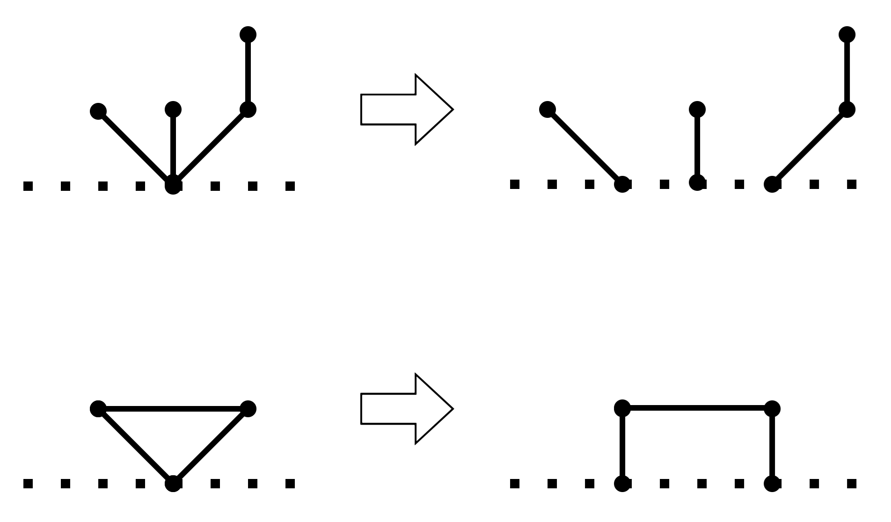
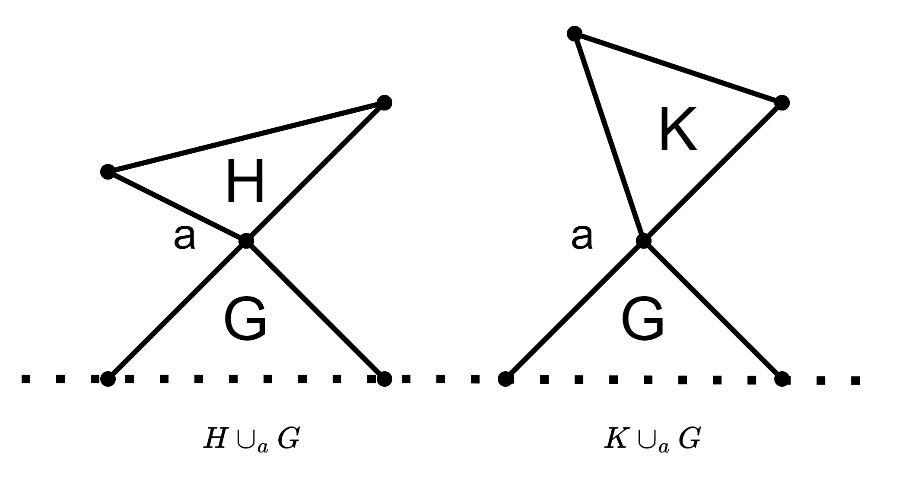
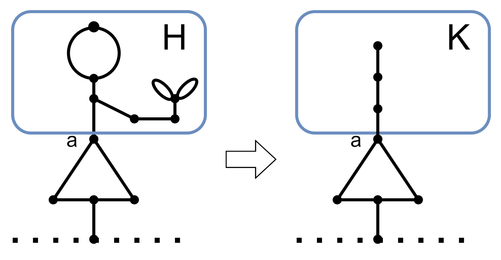
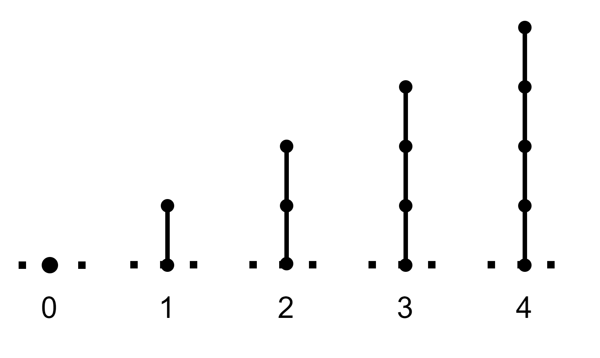
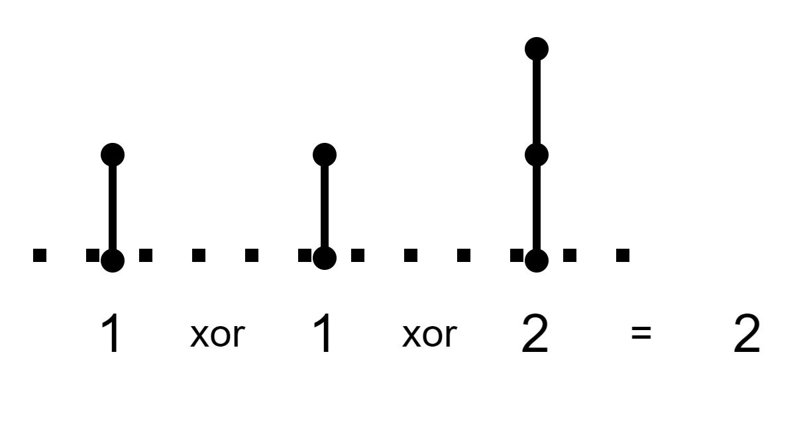
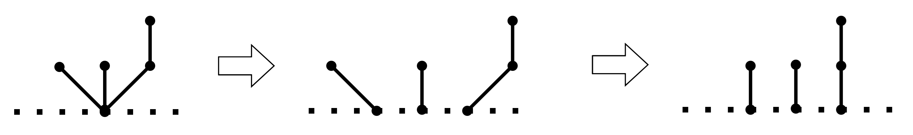
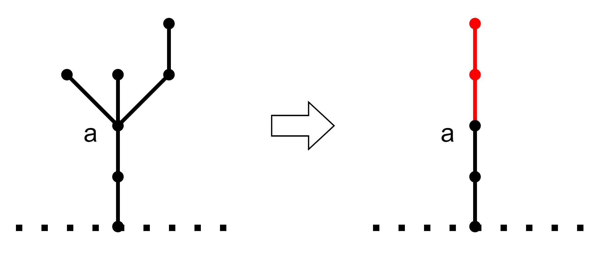
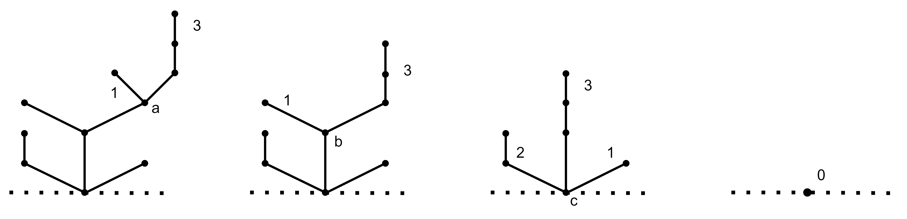

+++
title = "Green Hackenbush の木のグランディ数"
date = 2024-09-10T00:00:00+09:00
draft = false
image = "images/コロン原理の例.png"
categories= "組合せゲーム"
tags = ["競技プログラミング", "グランディ数", "Hackenbush"]
slug = "green-hackenbush-tree-grundy"
aliases = ["/post/green-hackenbush-の木のグランディ数/"]
+++

## 1. はじめに

Green Hackenbush は以下のルールをもつ有限型不偏ゲームです．

- 点線で表された地面，点，点と点を結ぶ有限個の辺からなる図形がある
- どの図形のどの部分も辺をたどると地面につながる
- 2 人のプレーヤーは交互に図形から 1 つの辺を選んで取り除く．選んだ辺を取り除くことで地面とつながらなくなってしまう部分は辺と同時に取り除かれる
- 最後の辺をとったプレーヤーの勝ち

Green Hackenbush は有限型不偏ゲームなので各図形のグランディ数を求めることができます．今回は木と呼ばれる図形のグランディ数を求めていきます．  
節 2 と 節 3 では Green Hackenbush で一般に適用できる性質を確認します．節 4 と 節 5 ではこの性質を利用し具体的な図形のグランディ数を求める方法を示します．  
最後に節 6 で Green Hackenbush の木のグランディ数を求める問題を紹介します．

## 2. 地面の点の移動

地面上にある点を移動してもゲームのグランディ数は変わらないので，自由に移動させることができます．

## 3. コロン原理(Colon Principle)

コロン原理  
図形 A のグランディ数を $g(A)$ とする．地面についている図形 $G$ と宙に浮いている図形 $H$ が 1 つの点 $a$ のみを共有してできる図形を $H \cup_a G$ と表す．このとき，宙に浮いている図形 $H$，$K$ が $g(H) = g(K)$ を満たすならば，$g(H \cup_a G) = g(K \cup_a G)$ となる．

証明

$g(H \cup_a G) = g(K \cup_a G)$ ということは，$g(H \cup_a G) \\ xor \\ g(K \cup_a G) = 0$ なので，$H \cup_a G と K \cup_a G$ の直和ゲームは後手必勝と言い換えることができます．よって，「$g(H) = g(K)$ を満たすならば後手必勝」を示します．
また，$H \cup_a G$ と $K \cup_a G$ は対称なので，$H \cup_a G$ から辺を取り除く場合のみ考えます．

先手の手は，「1. $G$ から辺を取り除く」，「2. $H$ から辺を取り除く」の 2 通りです．先手の各手について後手の必勝手を考えます．
グランディ数の定義より，グランディ数 g の局面からはグランディ数 g 未満の局面に遷移できることを利用します．

1. 先手が $H \cup_a G$ の $G$ から辺を取り除く場合

   - 後手は $K \cup_a G$ の $G$ から同じ辺を取り除けばいい

2. 先手が $H ∪_a G$ の $H$ から辺を取り除き，$H^\prime $ にした場合

   - $g(H^\prime) < g(H)$ の場合

     - 仮定より $g(H) = g(K)$ なので，$K$ から辺を取り除いて移行できる $K^\prime$ で，$g(K^\prime) = g(H^\prime)$ となるものがある．後手は $K → K^\prime$ となる辺を取り除けばいい．

   - $g(H^\prime) > g(H)$ の場合
     - $H^\prime$ から辺を取り除いて移行できる $H^{\prime \prime}$ で， $g(H^{\prime \prime}) = g(H) = g(K)$ となるものがある．後手は $H^\prime → H^{\prime \prime}$ となる辺を取り除けばいい．

コロン原理を使うことで，ある 1 つの点のみを共有している宙に浮いている図形は，同じグランディ数を持つより単純な図形に置き換えることができます．

## 4. 棒のグランディ数

まず，1 つの棒のみからなるゲームのグランディ数について考えます．  
長さ m の棒からは，長さ m 未満の棒に遷移できるため，長さ m の棒のグランディ数は m となります．

次に，複数の棒からなるゲームのグランディ数を考えます．  
各棒は独立したゲームの局面とみなすことができるので，複数の棒からなるゲームのグランディ数は各棒のグランディ数の xor で求めることができます．  
例えば，長さ 1, 1, 2 の棒からなるゲームのグランディ数は $1 \\ xor \\ 1 \\ xor \\ 2 = 2$ となります．

最後に，地面のある一点から複数の棒が伸びる図形のグランディ数を考えます．  
地面の点は自由に移動することができるため，地面のある一点から複数の棒が伸びる図形は，複数の棒からなるゲームに帰着することができます．  
よって，地面のある一点から複数の棒が伸びる図形のグランディ数は，各棒の長さの xor で求めることができます．

## 5. 木のグランディ数

コロン原理を順次適用していくことによって，木のグランディ数を求めることができます．  
地面のある一点から複数の棒が伸びている図形のグランディ数は，各棒の長さの xor で求めることができました．コロン原理により，ある一点から複数の棒が伸びているような木の点は，各棒の長さの xor をとった値の長さの棒に変換することができます．この操作を繰り返すことで木のグランディ数を求めることができます．

以下に例を示します．  
点 a からは，長さ 1 の棒と長さ 3 の棒が伸びています．よって，長さ 1 xor 3 = 2 の棒に置き換えることができます．  
点 b からは，長さ 1 の棒と長さ 3 の棒が伸びています．よって，長さ 1 xor 3 = 2 の棒に置き換えることができます．  
点 c からは，長さ 2 の棒と長さ 3 の棒と長さ 1 の棒が伸びています．よって，長さ 2 xor 3 xor 1 = 0 の棒に置き換えることができます．  
以上のことからこの木のグランディ数は 0 と求めることができました．

## 6. AGC017 D - Game on Tree

Green Hackenbush の木のグランディ数を求める問題として，[D - Game on Tree](https://atcoder.jp/contests/agc017/tasks/agc017_d) があります．  
ある頂点のグランディ数は，「自分の子のグランディ数 + 1」 の xor を使って求めことができるので，根から深さ優先探索をすることで木のグランディ数を求めることができます．  
[提出コード](https://atcoder.jp/contests/agc017/submissions/56666314)

## 参考

- [石取りゲームの数学](https://www.sugakushobo.co.jp/903342_76_mae.html)
- [Hackenbush](https://en.wikipedia.org/wiki/Hackenbush)
