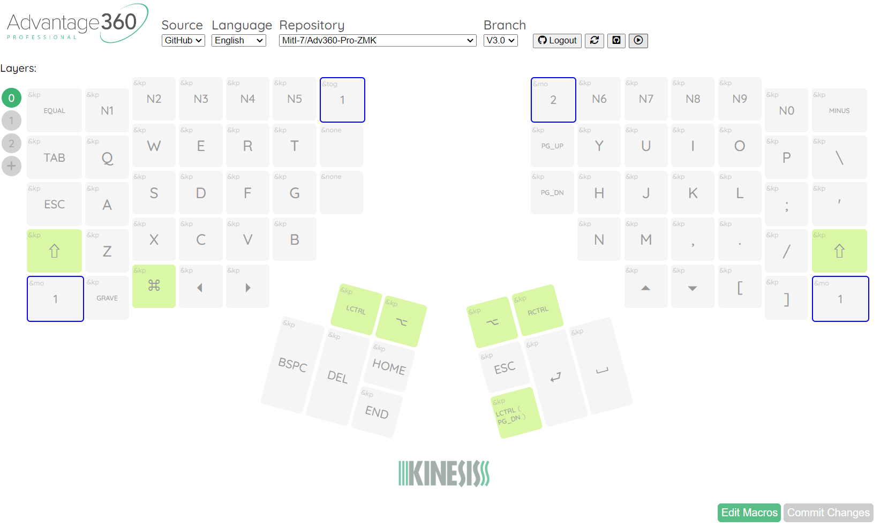
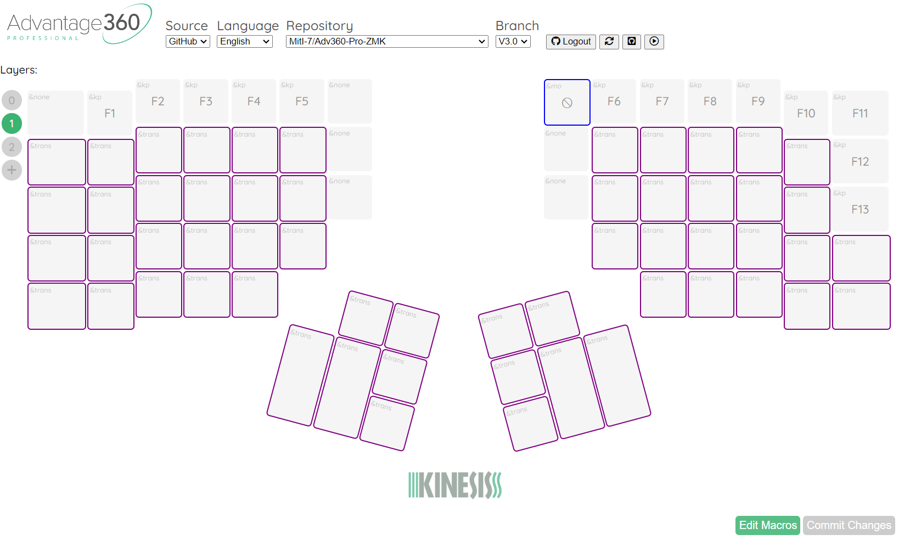

+++
title = "Kinesis Advantage 360 Pro の設定"
date = 2024-10-26T00:00:00+09:00
image = ""
categories= []
tags = ["keyboard"]
+++

## 設定

Kinesis Advantage 360 Pro の設定をメモしておきます

## バックライト

デフォルトだと「Mod + Enter」で on/off，「Mod + ↑/↓」で明るさの調整ができる  
バックライトをつけておくとすぐにバッテリーがなくなるらしいので off にした

## Keymap

[Kinesis ADV360 Pro Keymap Editor](https://kinesiscorporation.github.io/Adv360-Pro-GUI/) で設定できる．

- Windows キーはあまりつかわないので ALT を配置
  - 代わりに Caps を Windwos キーにした
- PgUp を ESC に，PgDn を 「CTRL + PG_DN」 にした
  - 「CTRL + PG_DN」 で IME の切り替えをしているので
  - 「LC」を選ぶと，LCTRL + PG_DN を選択できる
- ① と ② は迷い中
- ③ と ④ に PG_UP と PG_DN を配置

- キーキャップの数字とファンクションキーがずれていて迷うので数字と同じになるようにひとつずらした
  - F12 と F13 の位置がひどいことになった

## バッテリー

- バックライトをオフにしていると 数ヶ月はもつらしい
- 「Mod + ④」で充電レベルを確認できる
  - Green: 80% 以上
  - Yellow: 51% - 79%
  - Orange: 21% - 50%
  - Red: 20% 以下

## 高さ

LOW/MEDIUM/HIGH の 3 段階に調整できる  
今は MEDIUM を使っている

## Bluetooth の接続や遅延

特に問題なく使えている

## 参考

- [Advantage 360 Professional (ZMK Bluetooth) Support Resources](https://kinesis-ergo.com/support/kb360pro/)
