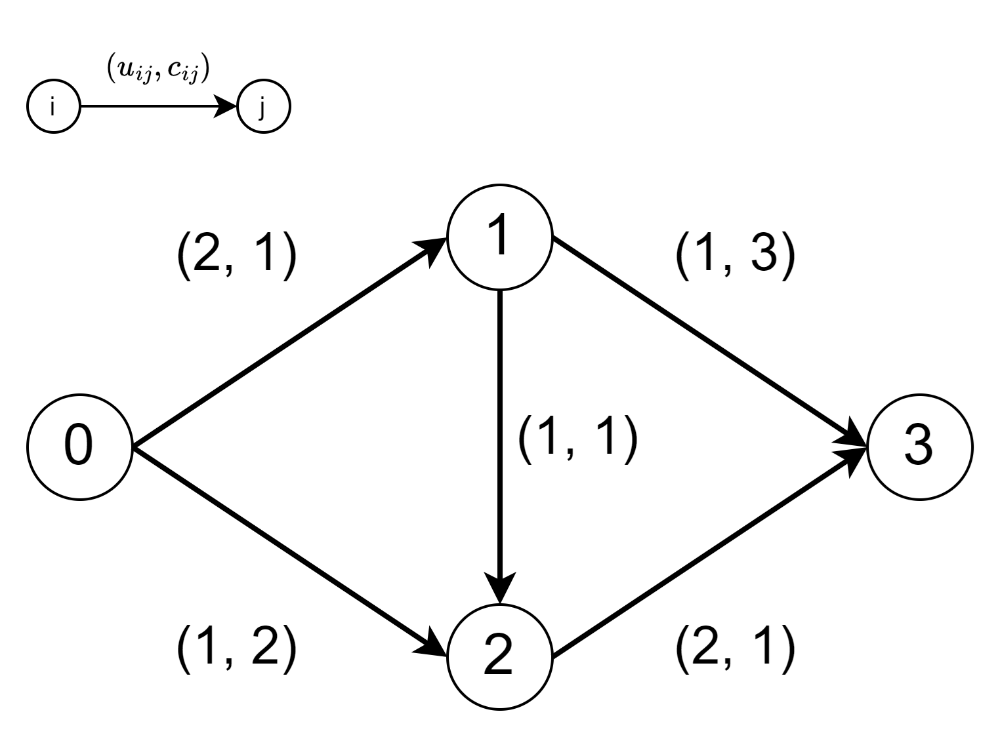
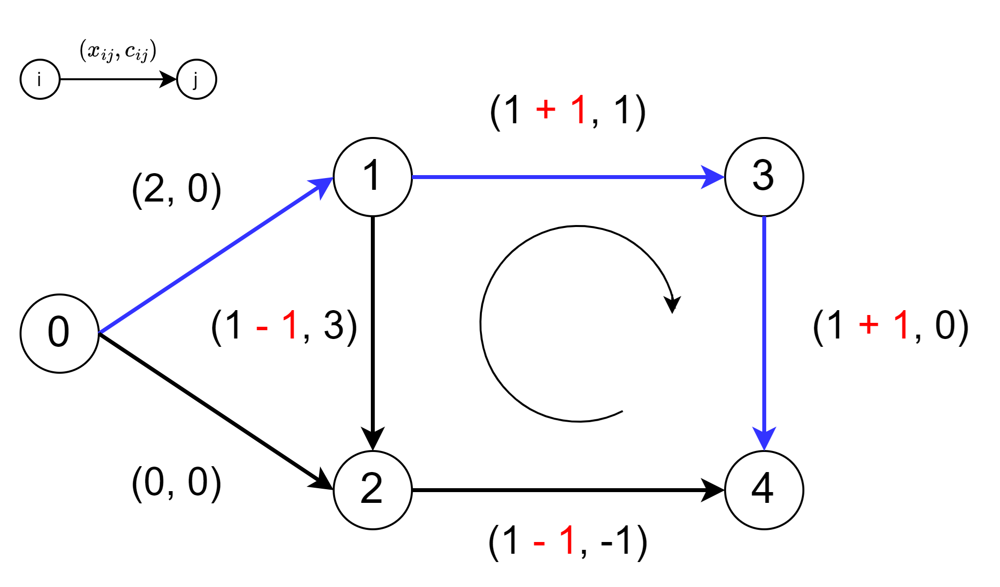

+++
title = "最小費用流問題の Primal Network Simplex 法"
date = 2024-09-11T00:00:00+09:00
draft = false
image = "images/ポテンシャルの更新.png"
categories= ["組合せ最適化", "グラフ", "アルゴリズム"]
tags = ["minimum cost flow"]
slug = "minimum-cost-flow-primal-network-simplex"
aliases = ["/post/最小費用流問題の-primal-network-simplex-法/"]
+++

## 最小費用流問題(Minimum Cost Flow Problem)

$N$ を頂点の集合，$A$ を辺の集合，$c_{ij}$ を辺 $(i, j)$ の単位流量あたりのコスト，$x_{ij}$ を辺 $(i, j)$ の流量，$b_i$ を頂点 i の需要/供給量，$l$ を辺の下限容量，$u$ を辺の上限容量としたとき，最小費用流問題（以下 MCFP）は以下のように定式化されます．  
1 つめの制約を流量保存則と呼び，第一項は頂点 i から出る流量，第二項は頂点 i に入る流量を表します．
2 つめの制約を容量制約と呼びます．

$$
\begin{aligned}
&\text{minimize} && \sum_{(i, j) \in A} c_{ij} x_{ij} \\
&\text{subject to}
&& \sum_{j:(i, j) \in A} x_{ij} - \sum_{j:(j,i) \in A} x_{ji} = b_i && \forall i \in N  \\
& && l_{ij} \le x_{ij} \leq u_{ij} && \forall (i, j) \in A
\end{aligned}
$$

以下ではコスト，流量，需要/供給，下限容量，上限容量はすべて整数とします．また，$\sum_{i \in N} b_i = 0$ を仮定します．

## Primal Network Simplex 法

primal network simplex 法は，ネットワーク構造を利用することで simplex 法を効率化させたアルゴリズムです．今回は primal network simplex 法で MCFP を解いていきます．  
MCFP が必ず 最適 spanning tree solution という解を持つことを利用し，spanning tree solution のみを探索することで効率的に最適解を見つけることができます[^1]．

primal network simplex 法は，simplex 法の観点と負閉路除去法の観点から説明することができますが，今回は負閉路除去法の観点で説明します．
節 1 で spanning tree solution の定義をします．節 2 で spanning tree solution は spanning tree structure として表せることと，spanning tree structure が最適解となる条件について示します．節 3 で primal network simplex 法の流れについて説明し，節 4 から 節 8 でアルゴリズムの各段階の詳細について述べます．節 9 から節 11 で退化について説明します．

## 1. spanning tree solution

ある実行可能解 $x$ に対して， $l_{ij} < x_{ij} < u_{ij}$ を満たす辺を free arc，$x_{ij} = l_{ij}$ か $x_{ij} = u_{ij}$ を満たす辺を restricted arc と呼びます．
解 $x$ とそれに関連する全域木が以下の条件を満たすとき，spanning tree solution と呼びます．特に，$x$ が 最適解であるとき最適 spanning tree solution と呼びます．

- $x$ が実行可能解である
- 全域木に含まれない辺（non-tree arc）がすべて restricted arc である

具体例を示します．簡単のため，辺容量の下限はすべて 0 としコストは省略します．$b(0) = 2$，$b(3) = -2$ とします．  
下の図のグラフでは辺 (0, 1)，(2, 3) が free arc，辺 (0, 2)，(1, 2)，(1, 3) が restricted arc です．  
解 $x$ は流量保存則と容量制約を満たすため実行可能解です．全域木として，青色の辺 (0, 1)，(0, 2)，(2, 3) を選ぶ[^2]と，non-tree arc は (1, 2) と (1, 3) となり，すべて restricted arc であるため spanning tree solution となります．

また，全域木として，青色の辺 (0, 1)，(1, 2)，(2, 3) を選んでも spanning tree solution となります．
このように，1 つの実行可能解に複数の spanning tree solution が対応することがあります．

## 2. spanning tree structure と最適性条件

spanning tree solution は辺集合を次の 3 つに分割します．

- T: 全域木の辺
- L: non-tree arc のうち，flow が下限の辺
- U: non-tree arc のうち，flow が上限の辺

この 3 つ組 (T, L, U) を spanning tree structure と呼びます．spanning tree structure は spanning tree solution から一意に構築されます．

頂点 i のポテンシャルを $\pi(i)$，辺 (i, j) の reduced cost を $c_{ij}^{\pi} = c_{ij} - \pi(i) + \pi(j)$ で表します．spanning tree structure が次の条件を満たすとき，spanning tree structure に対応する spanning tree solution は最適 spanning solution となります．このような，spanning tree structure を最適 spanning tree structure と呼びます．

$$
\begin{aligned}
c^{\pi}_{ij} = 0 && \forall (i, j) \in T \\
c^{\pi}_{ij} \ge 0 && \forall (i, j) \in L \\
c^{\pi}_{ij} \le 0 && \forall (i, j) \in U \\
\end{aligned}
$$

全域木の根のポテンシャルを 0 と固定すると $T$ に属する辺 (i, j) が $c^{\pi}_{ij} = 0$ を満たすように各頂点のポテンシャル $\pi$ を定めることができます．このとき，$-\pi(i)$ は根から頂点 i への木のパスの長さとみなすことができます．
具体例として，下の図の全域木について各頂点のポテンシャルを求めていきます．頂点 0 を根とします．

頂点 1 のポテンシャルを求めます．
辺 (i, j) の reduced cost は $c_{ij}^{\pi} = c_{ij} - \pi(i) + \pi(j)$ です．全域木の辺の reduced cost は 0，辺 (0, 1) のコストは 1，頂点 0 のポテンシャルは 0 であることから，$0 = 1 - 0 + \pi(1)$ となり，$\pi(1) = -1$と求められます．

頂点 2 のポテンシャルを求めます．
辺 (2, 1) のコストは 5 ，頂点 1 のポテンシャルは -1 なので，$0 = 5 - \pi(2) + (-1)$ となり，$\pi(2) = 4$ と求められます．

同様の計算を行うことで，全頂点のポテンシャルを計算することができます．

全頂点のポテンシャルを求めると，$L$ と $U$ に属する辺の reduced cost を計算することができます．すべての辺が最適性条件を満たすならば，最適 spanning tree structure と判定できます．

## 3. Network Simplex 法のアルゴリズムの流れ

spanning tree structure が与えられたとき，全域木の reduced cost が 0 となるように各頂点のポテンシャルを計算し，各辺の reduced cost を求めることで最適 spanning structure かどうか判定することができました．
最適 spanning tree structure でない場合， $L$ に属する $c_{ij}^{\pi} \lt 0$ である辺か，$U$ に属する $c_{ij}^{\pi} \gt 0$ である辺が 1 つ以上存在することになります．
これらの辺を $T$ に追加したときを考えます．

### $L$ に属する $c^{\pi}_{ij} \lt 0$ である辺を $T$ に追加

$L$ に属する $c_{ij}^{\pi} \lt 0$ である辺 (i, j) を $T$ に追加したとします．  
このとき，根から i，i から j，j から根をたどるパスの flow を 1 増加すると，目的関数値は $c^{\pi}_{ij}$ 増加します．

具体例を見てみます．下の図の全域木にコスト -8 の辺 (2, 4) を追加したとします．この辺の reduced cost は $-8 - 4 + (-3) = -15$ です．  
辺 (0, 1)，(2, 1)，(2, 4)，(3, 4)，(3, 0) の順に flow を 1 単位流すと，全体のコストの合計は，1 + (-5) + (-8) + (-5) + 2 = -15 となり，目的関数値が 15 減少する（-15 増加する）ことがわかります[^3]．

### $U$ に属する $c^{\pi}_{ij} \gt 0$ である辺を $T$ に追加

$U$ に属する $c_{ij}^{\pi} \gt 0$ である辺 (i, j) を $T$ に追加したとします．  
このとき，根から j， j から i，i から根をたどるパスの flow を 1 増加すると，目的関数値は $c^{\pi}_{ij}$ 減少します．

下の図の全域木にコスト -5 の辺 (6, 4) を追加したとします．この辺の reduced cost は $(-5) - (-11) + (-3) = 3$ です．  
辺 (3, 0)，(3, 4)，(6, 4)，(5, 6)，(3, 5)，(3, 0) の順に flow を 1 単位流すと，全体のコストの合計は，-2 + 5 + (-(-5)) + (-7) + (-6) + 2 = -3 となり，目的関数値が 3 減少することがわかります．  
また，辺 (0, 3) に対し，頂点 0 から 頂点 3 に flow を流し，頂点 3 から頂点 0 に flow を流すと flow は打ち消し合うため，追加した辺によって生じる閉路のみを考慮すればいいこともわかります．

以上のことから，spanning tree structure が最適でないとき，最適性条件に違反する辺を全域木に追加したことによって生じる閉路の flow を更新することで目的関数値を減少できることがわかりました．  
閉路の flow を限界まで増加させると，1 本以上の辺の flow が下限容量か上限容量に達するため，その辺を取り除くことによって新しい spanning tree solution を生成することができます．  
primal network simplex 法は これらの処理を最適性条件を満たすまで繰り返すことで最適解を求めます．

primal network simplex 法の流れは以下のようになります

- 初期 spanning tree structure を構築する
- spanning tree structure が最適性条件を満たさない間，以下を繰り返す
  - 最適性条件に違反する辺を $U$ か $L$ から選び，全域木に追加する
  - 閉路の flow を更新する
  - flow が下限容量か上限容量に達した辺を閉路から 1 つ取り除き新しく全域木を作成する

次節からアルゴリズムの各段階の詳細について説明していきます．

## 4. 初期 spanning tree structre の構築

初期 spanning tree structre (T, L, U) を構築します．  
まず，人工頂点 $s$ を作り，$s$ と既存の各頂点 $u$ の間に以下のように辺をはります．

- $b(u) \ge 0$ の場合，流量 $b(u)$ の辺 $(u, s)$ を加える
- $b(u) \lt 0$ の場合，流量 $-b(u)$ の辺 $(s, u)$ を加える

いずれの人工辺も容量とコストは十分大きい値とします．人工辺は $T$ に，もとからある辺は $L$ に，$U$ は空とします.  
このように作られた spanning tree structure は実行可能解です．今後はこの拡張された network 上で問題を解いていきます．人工辺のコストは十分大きいため最適解が得られたとき人工辺に flow は流れていません．

例として下のグラフの初期 spanning tree structure を構築します．  
$b(0) = 2$，$b(3) = -2$，他の頂点の需要/供給は 0 とします．また，すべての辺の下限容量は 0 とします[^4]．

まず，人工頂点として，$s$ を追加します．  
$b(u) \ge 0$ である頂点 0, 1, 2 から s に向けて辺を追加します．$b(0) = 2$ であるため，辺 (0, s)の flow は 2 とします．  
s から $b(u) \lt 0$ である頂点 3 に向けて辺を追加します．$b(3) = -2$ であるため，辺 (s, 3)の flow は 2 とします．

初期 spanning tree structure は以下のようになります．

- $T$ に属する辺：(0, s)，(1, s)，(2, s)，(s, 3)
- $L$ に属する辺：(0, 1)，(0, 2)，(1, 2)，(1, 3)，(2, 3)
- $U$ に属する辺：なし

## 5. entring arc の選択

$T$ に追加する辺（entring arc）を $U$ か $L$ から選びます．  
このとき，以下のような最適性条件を満たさない辺（eligible arc）を選びます．また，$|c^{\pi}_{ij}|$ を violation と呼びます．

$$
\begin{aligned}
c^{\pi}_{ij} \lt 0  && \forall (i, j) \in L \\
c^{\pi}_{ij} \gt 0  && \forall (i, j) \in U
\end{aligned}
$$

代表的な辺の選択方法は以下の 3 つです．

- Best eligible arc pivot rule(Dantzig's pivot rule)

  - violation の最も大きい eligible arc を entring arc とする
  - 1 flow 単位の改善が最も大きいため，イテレーションの回数は少なくなる
  - すべての non-tree arc を調べる必要があるため，1 回のイテレーションのコストが大きい

- First eligible arc pivot rule

  - 最初に見つけた eligible arc を entring arc とする．次のイテレーションでは，前回選択した辺の次から探索を開始する．最後の辺まで探索をしたら先頭に戻る
  - 1 回のイテレーションのコストが小さい
  - 1 flow 単位の改善が小さくなるので，イテレーションの回数が多くなる

- Block search pivot rule
  - 辺をブロックに分割し，ブロックの中で violation の最も大きい eligible arc を entring arc とする．ブロック内で見つからなかった場合，次のブロックを探索する
  - すべての辺を同じブロックにしたとき，Best eligible arc pivot rule と同じ挙動になる
  - すべての辺を違うブロックにしたとき，First eligible arc pivot rule と同じ挙動になる

## 6. flow の更新

全域木に辺を追加すると閉路 $W$ がちょうど 1 つできます．この閉路の flow を 1 単位増加するごとに，MCFP の目的関数値は $|c^{\pi}_{ij}|$ 減少するため，$W$ の flow を容量制約を満たす限界まで増加します．  
閉路 $W$ の向きを次のように定めます．

- $(k, l) \in L$ のとき，辺 (k, l) と同じ方向
- $(k, l) \in U$ のとき，辺 (k, l) と逆方向

閉路 $W$ の順辺の集合を $\bar W$，逆辺の集合を $\underbar W$ で表したとき，$W$ の各辺の flow の増加できる量は以下のようになります．

$$
\delta_{ij} = \left\{
\begin{array}{ll}
u_{ij} - x_{ij} & (i, j) \in \bar{W}\\
x_{ij} - l_{ij} & (i, j) \in \underbar{W}
\end{array}
\right.
$$

$\delta = min \lbrace \delta_{ij} : (i, j) \in W \rbrace$ とし，$W$ の各辺の flow を以下のように更新します．

$$
x_{ij} = \left\{
\begin{array}{ll}
x_{ij} + \delta & (i, j) \in \bar{W}\\
x_{ij} - \delta & (i, j) \in \underbar{W}
\end{array}
\right.
$$

具体例を見ます．すべての辺の下限は 0 とします．  
$U$ に属する辺 (6, 4) を $T$ に追加すると，辺 (6, 4)，(5, 6)，(3, 5)，(3, 4) からなる閉路ができます．  
辺 (6, 4) は $U$ に属するので，(6, 4) と逆方向である反時計回りを $W$ の向きとします．$\bar W$ に属する辺は，(3, 4)，$\underbar W$ に属する辺は，(6, 4)，(5, 6)，(3, 5) です．  
各辺の $\delta_{ij}$ と $\delta$ は以下の通りです．

- $\delta_{64} = 6 - 0 = 6$
- $\delta_{56} = 2 - 0 = 2$
- $\delta_{35} = 4 - 0 = 4$
- $\delta_{34} = 3 - 1 = 2$
- $\delta = min \lbrace 6, 2, 4, 2 \rbrace = 2$

閉路 $W$ の flow を 2 増加すると以下のようになります．

別の例をみます．
辺 (3, 4) の flow が 3 のとき，各辺の $\delta_{ij}$は以下のようになります．

- $\delta_{64} = 6 - 0 = 6$
- $\delta_{56} = 2 - 0 = 2$
- $\delta_{35} = 4 - 0 = 4$
- $\delta_{34} = 3 - 3 = 0$
- $\delta = min \lbrace 6, 2, 4, 0 \rbrace = 0$

このように全域木に $x_{ij} = l_{ij}$ や $x_{ij} = u_{ij}$ の辺があると flow が更新できないことがあります．

## 7. leaving arc の選択

閉路の flow を限界まで増加したとき 1 本以上の辺が $\delta = \delta_{ij}$ となります．この辺を blocking arc と呼びます．  
blocking arc を取り除く辺（leaving arc）として選びます（複数ある場合は任意の辺を選びます）．  
辺 (i, j) が $x_{ij}$ = $l_{ij}$ になったときは $L$ に，$x_{ij} = u_{ij}$ になったときは $U$ に入ります．

閉路 $W$ の flow を更新した結果，辺 (5, 6) の flow が下限容量に，辺 (3, 4) の flow が上限容量になった場合を考えます．

辺 (5, 6) と辺 (3, 4) のどちらかを取り除くことができます．辺 (5, 6) を取り除き $L$ に追加すると下の全域木 $T$ が得られます．

## 8. ポテンシャルの更新

辺 (p, q) を削除したとき，木は 2 つの部分木に分割されます．根がある方の部分木を $T_1$，ない方の部分木を $T_2$ とします．  
木の根のポテンシャルを 0 に固定し， 辺の reduced cost が 0 になるようにポテンシャルを算出していたことを考えると，$T_1$ に含まれる頂点のポテンシャルは変化せず，$T_2$ に含まれる頂点のポテンシャルのみ変化することがわかります．

全域木に辺 (k, l) が追加され，頂点 k が $T_1$ に，頂点 l が $T_2$ に含まれる場合を考えます．  
$T_2$ は頂点 q を根とする部分木から頂点 l を根とする部分木に変化するため，$T_2$ に属する頂点のポテンシャルを更新する必要があります．  
木のすべての頂点のポテンシャルに定数を加算しても reduced cost は保たれるため，新しい $\pi(l)$ と現在の $\pi(l)$ の差分 $d$ が求められれば，$T_2$ に属するすべての頂点に $d$ を加算することでポテンシャルを正しい値に更新できます．  
頂点 k のポテンシャルは変化しないことから，頂点 l の新しいポテンシャル $\pi^{\prime}(l)$ は $0 - c_{kl} + \pi(k)$ となります．  
よって，頂点 l の新しいポテンシャルとの現在のポテンシャルの差は $\pi^{\prime}(l) - \pi(l) = 0 - c_{kl} + \pi(k) - \pi(l) = -(c_{kl} - \pi(k) + \pi(l))$ となり，これは $-c_{kl}^{\pi}$ です．  
以上のことから，$T_2$ に属するすべての頂点に $-c_{kl}^{\pi}$ を加算することでポテンシャルを正しい値に更新できることがわかりました．  
頂点 l が $T_1$ に，頂点 k が $T_2$ に含まれる場合も同様の議論により，$c_{kl}^{\pi}$ 増加することが示せます．

まとめると，辺 (k, l)を追加したとき $T_2$ に含まれる頂点のポテンシャルは以下のように更新されます．

- 頂点 k が $T_1$ に，頂点 l が $T_2$ に含まれる場合
  - $T_2$ に含まれる頂点のポテンシャルは $-c^{\pi}_{kl}$ 増加
- 頂点 l が $T_1$ に，頂点 k が $T_2$ に含まれる場合
  - $T_2$ に含まれる頂点のポテンシャルは $c^{\pi}_{kl}$ 増加

## 9. Strongly Feasible Spanning Tree

primal network simplex 法が有限回で終了するのかを考えます．  
アルゴリズムの各イテレーションでは，全域木に辺を追加するこことで閉路を作り，この閉路の flow を更新することで目的関数値を減少させます．  
目的関数値は flow 1 単位あたり $|c^{\pi}_{ij}|$ 減少するため，常に正の量の flow を流せるならアルゴリズムは有限回で終了します．  
しかし，節 6 の最後の例のように閉路に restricted arc があると flow が増加できないイテレーションが発生することがあります．このイテレーションを degenerate iteration といいます．  
実は primal network simplex 法は entring arc と leaving arc を任意に選ぶと degenerate iteration が無限に発生しアルゴリズムが有限回で終了しないことがあります．

そこで，strongly feasible spanning tree という概念を導入します．  
常に strongly feasible spanning tree を維持することによって，アルゴリズムが有限回で終了することが保証できます．

### strongly feasible spanning tree

次の条件を満たす spanning tree を strongly feasible spanning tree と呼びます．

- 任意の頂点から正の量の flow を容量制約に違反することなく木に沿って根に送ることができる

下の図は strongly feasible spanning tree の例です．  
すべての頂点から頂点 0 に向かって 1 以上の flow を送ることができます．  
strongly feasible spanning tree は flow が下限の辺のは根に向いていて，flow が上限の辺は根と反対を向いている全域木とみなすこともできます．

下の図は strongly feasible spanning tree ではない例です．  
辺 (2, 1) の flow は上限容量であるため，頂点 2 から根に flow を送ることはできません．また，辺 (3, 4) の flow は下限容量であるため，頂点 4 から根に flow を送ることはできません．

節 4 の「初期 spanning tree structure の構築」は strongly feasible spanning tree を構築します．次の節で leaving arc をどのように選べば strongly feasible spanning tree を維持できるのか見ていきます．

## 10. Strongly Feasible Spanning Tree を保つ leaving arc の選び方

辺 (k, l) を entring arc とします．頂点 k と l の最小共通祖先を頂点 w とします．  
このとき閉路 $W$ に沿って，頂点 w から開始して最後に見つけた blocking arc を leaving arc とすると，spanning tree は strongly feasible を維持できます．

具体例をみます．  
$L$ に属する辺 (k, l) が追加され閉路 $W$ が生成されたとします．閉路の向きは辺 (k, l) と同じ向きです．  
この閉路には flow を流すことができず，辺 (w, 1) と辺 (p, q) が blocking arc になります．  
頂点 w から閉路の向きに沿って探索し，最後に見つかる blocking arc は辺 (p, q) であるため，この辺を leaving arc とします．

strongly feasible spanning tree から上記の方法で leaving arc を選んだとき，strongly feasible spanning tree が維持されることを示します．pivot 操作の直前は strongly feasible spanning tree であるという前提を利用します．

頂点 w から頂点 q のパスを $W_1$，頂点 p から頂点 w のパスを $W_2$ とします．  
「$W_1$」，「$W_2$」，「閉路以外の頂点」の 3 つについて，「任意の頂点から正の量の flow を容量制約に違反することなく木に沿って根に送ることができる」という条件を満たすか確認します．

- $W_1$ 内の頂点

  - 直前が non-degenerate pivot[^5] の場合
    - $\delta \gt 0$ であるため，頂点 w から$W_1$ 内の頂点に flow が送られている．$W_1$ の各頂点からは頂点 w まで $\delta$ の flow を押し戻すことができるため条件を満たす
  - 直前が degenerate pivot[^6] の場合
    - 前提から，pivot の直前では頂点 l から頂点 w のパスで flow を送れていたため，このパス内に blocking arc は存在しない．よって $W_1$ は頂点 w と頂点 k の間にある
    - $\delta = 0$ であり，頂点 w から頂点 k のどの辺の flow にも変化はないため条件を満たす

- $W_2$ 内の頂点

  - leaving arc の選び方を考えると，$W_2$ 内に blocking arc はないため条件を満たす

- $W$ 以外の頂点
  - 頂点 u から根へのパスに閉路 $W$ が含まれないとき
    - 前提から，閉路以外の flow に変化はないため，条件を満たす
  - 頂点 u から根へのパスに閉路 $W$ が含まれるとき
    - u から閉路までのパスは，flow に変化がないため条件を満たす．閉路に到達したとき閉路から根まで条件を満たすので全体として条件を満たす

以上のことから，leaving arc に $W$ に沿って最後に見つけた blocking arc を選ぶことで，常に strongly feasible spanning tree を維持できることがわかりました．

## 11. アルゴリズムが有限回で終了することの証明

2 つの non-degenerate pivot の間の連続する degenerate pivot が有限回であることを示します．

degenerate pivot が発生したとき，ノードのポテンシャルが単調減少することを示します．$n$ を頂点の数，$C$ をコストの絶対値の最大値としたとき，ノードのポテンシャルの下界は $-nC$ であるため連続する degenerate pivot は有限回で終了します．

- entring arc (k, l) が $L$ に属していた場合

  - 辺 (k, l) は $L$ に属し，最適性条件に違反するため，reduced cost は $c^{\pi}_{kl} \lt 0$ です．
  - 全域木は常に strongly feasible spanning tree を維持していることを考えると，degenerate pivot の場合は頂点 l から頂点 w の間に blocking arc は存在しないため，新しく作成される木は頂点 l に 頂点 k がぶら下がる形になります．
  - 頂点 k を根とする部分木のポテンシャルは $c^{\pi}_{kl} \lt 0$ 増加するため，ノードのポテンシャルは単調減少します

- entring arc (k, l) が $U$ に属していた場合
  - 辺 (k, l) は $U$ に属し，最適性条件に違反するため，reduced cost は $c^{\pi}_{kl} \gt 0$ です．
  - 新しく作成される木は頂点 k に 頂点 l がぶら下がる形になります．
  - 頂点 l を根とする部分木のポテンシャルは $c^{\pi}_{kl} \gt 0$ 減少するため，ノードのポテンシャルは単調減少します

以上のことから 2 つの non-degenerate pivot の間の連続する degenerate pivot が有限回であることがわかりました．
non-degenerate pivot は目的関数値を厳密に減少させるため，アルゴリズムは有限回で終了します．

## 補足 1. 最適 spanning tree solution が必ず存在することについて

### cycle free solution

free arc のみからなる閉路を持たないような実行可能解 $x$ を cycle free solution といいます．

下の図は cycle free solution の例です．辺の上に (流量，コスト) を示し，下限容量は 0，上限容量は無限とします．  
青色の辺 (0, 1)，(1, 3)，(3, 4) が free arc です．free arc のみからなる閉路がないため cycle free solution です．この解の目的関数値は $(2 \times 0) + (2 \times 1) + (2 \times 0) = 2$ です．

下の図は cycle free solution ではない例です．  
青色の辺 (0, 1)，(1, 2)，(1, 3)，(2, 4)，(3, 4) が free arc です．free arc のみからなる閉路があるため cycle free solution ではありません．この解の目的関数値は $(2 \times 0) + (1 \times 3) + (1 \times 1) + (1 \times -1) + (1 \times 0) = 3$ です．

cycle free solution でない解が与えられたとき，閉路の flow を操作することで，目的関数値が大きくならないように cycle free solution にすることができます．  
この解の場合，時計回りに flow を 1 増加すると，辺 (2, 4)，(1, 2) の flow が 1 減り，辺(1, 3)，(3, 4) の flow が 1 増えます．結果，この解の目的関数値は $(2 \times 0) + (0 \times 3) + (2 \times 1) + (0 \times -1) + (2 \times 0) = 2$ と 1 小さくなり，さらに cycle free solution になりました．

このように，cycle free でない解は閉路の flow を操作することで目的関数値が大きくならないように cycle free solution にできるため，MCFP に最適解があるとき，常に同じ目的関数値である cycle free solution を持つことがわかります．

### cycle free solution から spanning tree solution を求める

cycle free solution は辺を適切に選ぶことで spanning tree solution を求めるとができます．  
下の図では，青色の辺(0, 1)，(1, 2)，(1, 3)，(3, 4) を全域木として選んでいます．

以上のことから，MCFP に最適解があるとき，常に同じ目的関数値である最適 spanning tree solution を持つことがわかりました．

## 補足 2. Spanning Tree Structure の最適性条件

spanning tree structure が次の条件を満たすとき，spanning tree structure に対応する spanning tree solution は最適 spanning solution となることを示します．

$$
\begin{aligned}
c^{\pi}_{ij} = 0 && \forall (i, j) \in T \\
c^{\pi}_{ij} \ge 0 && \forall (i, j) \in L \\
c^{\pi}_{ij} \le 0 && \forall (i, j) \in U \\
\end{aligned}
$$

まず，$\sum_{(i, j) \in A} c_{ij} x_{ij}$ を最小化することは $\sum_{(i, j) \in A} c_{ij}^{\pi} x_{ij}$ を最小化することと等しいことを示します．

$z(\pi) = \sum_{(i, j) \in A} c_{ij}^{\pi} x_{ij}$ とします．$c_{ij}^{\pi} = c_{ij} - \pi(i) + \pi(j)$ なので，$z(0) = \sum_{(i, j) \in A} c_{ij} x_{ij}$ です．  
頂点 k のポテンシャルを $0$ から $\pi(k)$ まで増加したとします．  
$c_{ij}^{\pi} = c_{ij} - \pi(i) + \pi(j)$ なので，reduced cost は頂点 k から流出する flow 1 単位あたり $\pi(k)$ 減少し，頂点 k に流入する flow 1 単位あたり $\pi(k)$ 増加します．よって，全体の reduced cost は $ - \pi(k) \times k$ からの流出量 + $\pi(k) \times k$ への流入量だけ変化します．

MCFP の制約条件から，各頂点 i の流出量と流入量の関係は $\sum_{j:(i, j) \in A} x_{ij} - \sum_{j:(j,i) \in A} x_{ji} = b_i$ です．  
よって，頂点 k のポテンシャルを $\pi(k)$ 増加すると，目的関数値は $\pi(k)b(k)$ 減少することになります．  
すべての頂点に同様のことがいえるので，$z(0) - z(\pi) = \sum_{i \in N} \pi(i)b(i) = \pi b$ となります．  
$\pi b$ は定数のため，$z(\pi)$ を最小化する flow は $z(0)$ を最小化することがわかりました．

次に，$x^{\ast}$ を上の最適性条件を満たす (T, L, U) に対応する解としたとき，これが最適解であることを示します．  
最適性条件を満たすポテンシャルを $\pi$ としたとき，$\sum_{(i, j) \in A} c_{ij}^{\pi} x_{ij}$ の最小化を考えます．  
$\sum_{(i, j) \in A} c_{ij}^{\pi} x_{ij}$ を最小化することは $\sum_{(i, j) \in L} c_{ij}^{\pi} x_{ij} - \sum_{(i, j) \in U} |c_{ij}^{\pi}| x_{ij}$ を最小化すること等しいです．

$\forall (i, j) \in L$ に対して $x_{ij} \ge x_{ij}^{\ast} = l_{ij}$ であり，$\forall (i, j) \in U$ に対して $x_{ij} \le x_{ij}^{\ast} = u_{ij}$ であるため，$x^{\ast}$ の目的関数値は $x$ の目的関数値以下となります．  
以上のことから，最適性条件を満たす spanning tree structure は最適解となることがわかりました．

## 参考

- [Network Flows: Pearson New International Edition](https://www.amazon.co.jp/dp/1292042702)
- [The network simplex algorithm](https://homes.di.unimi.it/righini/Didattica/OttimizzazioneCombinatoria/MaterialeOC/9b%20-%20NetworkSimplex.pdf)
- [IE 411: Graphs and Network Flows (Python)](https://coral.ise.lehigh.edu/~ted/teaching/ie411/)

[^1]: 正確には，実行可能領域に下界が存在するならば最適 spanning tree solution が少なくとも 1 つ存在します．
[^2]: 全域木の辺として restricted arc を選ぶこともできます
[^3]: 辺 (i, j) に対し頂点 j から頂点 i に flow を流すと，辺 (i, j) の flow を減らすことになります．例えば，辺 (2, 1) に対して頂点 1 から頂点 2 に flow を流すと，辺 (2, 1) の flow は 1 減り，コストは 5 下がります．
[^4]: 辺の lower が 0 でない場合，先に lower 分の flow を流しておきます．
[^5]: $\delta \gt 0$ である pivot
[^6]: $\delta = 0$ である pivot
