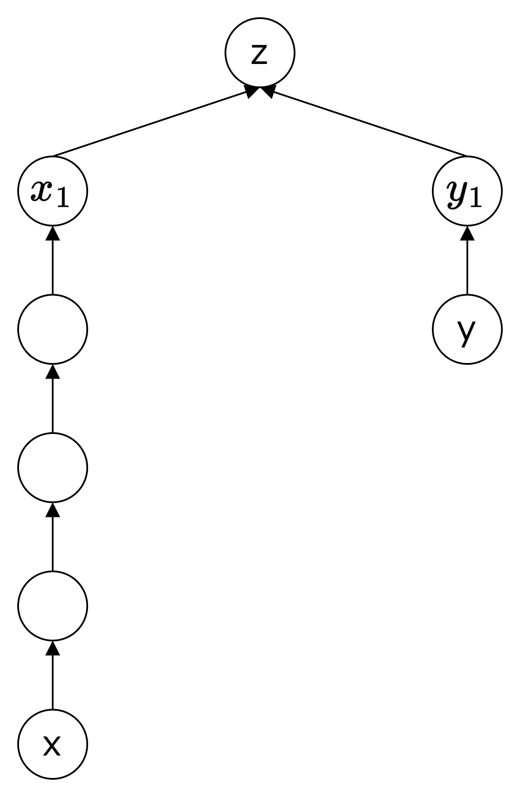

+++
title = "フロー等価木と Gusfield のアルゴリズム"
date = 2025-12-23T00:01:00+09:00
draft = false
image = "images/example.png"
categories = ["組合せ最適化", "アルゴリズム"]
tags = ["グラフ", "木", "劣モジュラ"]
slug = "flow-equivalent-tree-gusfield"
+++

## はじめに

この記事は[木 Advent Calendar 2025](https://adventar.org/calendars/12007) の 23 日目の記事です．  
この記事では無向グラフのすべての頂点対の最大流の情報を持つ木であるフロー等価木を紹介します．  
まず，フロー等価木の説明をします．次に，フロー等価木を構築するアルゴリズムの説明とその証明を行います．最後にフロー等価木を実装し，例として競プロの問題を解きます．  

無向グラフや最小カットなどの用語については[Gomory-Hu 木](https://miti-7.github.io/post/gomory-hu-tree/)を参照してください．

## フロー等価木

同じ頂点集合 $V$ をもつ $2$ つの重み付き無向グラフ $G(V, E)$ と $H(V, F)$ を考えます．ただし，$F \subset E$ とは限りません．  
$G$ と $H$ の s - t 間の最大流の値をそれぞれ $f_{s, t; G}$，$f_{s, t; H}$ と表記します[^1]．  
任意の $2$ 頂点 $s, t \in V$ に対し $f_{s, t; H} = f_{s, t;G}$ が成り立つとき，$H$ は $G$ にフロー等価（flow equivalent）であるといいます．  
特に，木 $T$ がグラフ $G$ にフロー等価であるとき，$T$ をフロー等価木（flow equivalent tree）とよびます．

フロー等価木と似た概念に Gomory-Hu 木があります[^2]．  
Gomory-Hu 木は，$G$ の任意の $2$ 頂点 $s, t \in V$ に対し，木の最小 s - t カット $S$ が $G$ の最小 s - t カットとなるような木です[^3]．  
Gomory-Hu 木は常にフロー等価木ですが，フロー等価木であっても Gomory-Hu 木でない場合があります．

下の図はグラフ $G$ とそれに対応するフロー等価木 $T$ です．
各 s - t 間の最大流の値は $G$ と $T$ で一致します．  
一方，$T$ の最小 1-3 カットは $\{1, 2, 4\}$ なのに対し，$G$ のカット $\{1, 2, 4\}$ の容量は $11$ となり，一致しない最小 s - t カットが存在することがわかります．

<div style="display: flex; gap: 20px;">
<div>

| $s, t$ | $G$ の s - t 間の最大流の値 | $T$ の s - t 間の最大流の値 |
| ------ | --------------------------- | --------------------------- |
| $1, 2$ | $6$                         | $6$                         |
| $1, 3$ | $9$                         | $9$                         |
| $1, 4$ | $6$                         | $6$                         |
| $2, 3$ | $6$                         | $6$                         |
| $2, 4$ | $12$                        | $12$                        |
| $3, 4$ | $6$                         | $6$                         |

</div>
</div>


## フロー等価木を構築するアルゴリズム

- 変数と関数

  - $n$: $G$ の頂点の数
  - $p[i]$: 頂点 $i$ の親の頂点
  - $fl[i]$: 辺 $(i, p[i])$ の重み

- step1: 初期化
  1. 各頂点 $s$ について $p[s] \coloneqq 1$
- step2: $2$ から $n$ の頂点 $s$ について以下を行う

  1. $t \coloneqq p[s]$
  2. $G$ 上で最小 s - t カット $X$ を求める．$s \in X$ とする
  3. $fl[s] \coloneqq f_{s, t; G}$
  4. $s + 1$ から $n$ の頂点 $i$ について以下を行う
     - $i \in X$ かつ $p[i] = t$ なら $p[i] \coloneqq s$ とする

## 準備

アルゴリズムがフロー等価木を構築する証明をする前にいくつかの補題を導入します．

### 補題 1

$(X, Y)$ を $x \in X, y \in Y$ であるような最小 x - y カットとする．$u, v \in X$ であるような任意の最小 u - v カットを $(U, V)$ とする．$y \in U$ のとき，$(U^{\prime}, V^{\prime}) = (U \cup Y, V \cap X)$ は最小 u - v カットとなり，$y \in V$ のとき，$(U^{\prime}, V^{\prime}) = (U \cap X, V \cup Y)$ は最小 u - v カットとなる．

### 系 1

$(X, Y), (U, V), (U^{\prime}, V^{\prime})$ を補題 1 と同様にとる．最小 u - v カット $(U^{\prime}, V^{\prime})$ は $(X, Y)$ と交差せず，$X$ を $(U, V)$ と同様に分割する

### 補題 2

長さ $k \ge 2$ の互いに異なる頂点列 $v_1, v_2, v_3, \cdots, v_k$ について，$f_{v_1, v_k} \ge \min \limits_{1 \le i \le k - 1} f_{v_i, v_{i + 1}}$ が成り立つ

[Gomory-Hu 木の補題 1](https://miti-7.github.io/post/gomory-hu-tree/#%E8%A3%9C%E9%A1%8C-1)を参照してください．

### 系 2

$G$ の $3$ つの頂点 $i, j, k$ について，$f_{i, j}, f_{i, k}, f_{j, k}$ のうち少なくとも $2$ つは最小値である

系 2 を示します．  
補題 2 により，$i, j, k$ に対して，$f_{i, k} \ge \min(f_{i, j}, f_{j, k})$ が成立します．  
$f_{i, j}, f_{i,k}, f_{j,k}$ のうち，$1$ つだけが最小値であると仮定し，矛盾を導きます．  
$f_{i, k}$ が唯一の最小値だとします．すると，$f_{i, k} \lt \min(f_{i, j}, f_{j, k})$ となり，矛盾します．  
$f_{i, j}, f_{j, k}$ についても同様に示せるため，系 2 が示せました．

### 補題 3

アルゴリズムによって構築される最終的な $T$ で，ある頂点 $i$ からある頂点 $j$ へ向かう有向パス $P_{i, j}$ があるとする．さらに，$j$ に入る有向辺 $(k, j)$ があって，$k$ は $P_{i, j}$ 上の $j$ 以外のどの頂点よりも頂点番号が小さいとする．このとき以下が成立する．

- アルゴリズムが最小 k - j カット $C$ を計算したとき，（構築途中の）$T$ 上で $i$ は $j$ の隣接頂点だった
- 「最小カット $C$ において $i$ が $k$ 側にいる」と「最終的な $T$ で $k$ がパス $P_{i, j}$ 上にいる」は同値

## アルゴリズムの証明

アルゴリズムが最終的に構築した木を $T$ とします．  
アルゴリズムは木の各辺 $(x, y)$ の重みを $f_{x, y}$ としているので，木の辺 $(x, y)$ となるような頂点 $x, y$ について $G$ の x - y 間の最大流の値と $T$ の x - y 間の最大流の値は一致します．  
任意の頂点対 $(x, y)$ についても，$G$ 上の最大流の値 $f_{x, y}$ と $T$ 上の x - y パスの辺のうち重みが最小の辺の重みが一致することを示します．  
これは，x - y パスを $P_{x,y}$，x - y パスの辺の重みの集合を $P[x, y]$ と表記することにすると，$f_{x, y} = \min(P[x, y])$ を示すと言い換えることができます．  
$f_{x, y} \ge \min(P[x, y])$ と $f_{x, y} \le \min(P[x, y])$ をそれぞれ示します．

### $f_{x, y} \ge \min(P[x, y])$

$T$ の x - y パスの頂点列 $x = v_1, v_2, \cdots, v_k = y$ を考えます．  
補題 2 から $f_{x, y} \ge \min \limits_{1 \le i \le k - 1} f_{v_i, v_{i+1}}$ が成り立ちます．  
アルゴリズムは木の各辺 $(v_i, v_{i + 1})$ の重みを $f_{v_i, v_{i + 1}}$ としているので，$\min \limits_{1 \le i \le k - 1} f_{v_i, v_{i+1}} = \min(P[x, y])$ となります．  
よって，$f_{x, y} \ge \min(P[x, y])$ が示せました．

### $f_{x, y} \le \min(P[x, y])$

背理法で示します．  
$f_{x, y} \gt \min(P[x, y])$ となるような頂点対 $(x, y)$ があると仮定して矛盾を導きます．  
まず，この不等式を満たす頂点対の中から「$T$ 上の x - y パスの辺数が最も短い」パスを $1$ つ選び $P$ とします．この仮定とさきほど証明した「$f_{x, y} \ge \min(P[x, y])$」から，$P$ より短いパス $P_{a,b}$ については $f_{a, b} = \min(P[a, b])$ が成り立つことに注意します．

アルゴリズムで作られる辺 $(s, t)$ を $s$ から $t$ への有向辺とみなします．すると，すべての辺は番号の大きい頂点から小さい頂点へ向くので，$T$ は有向木になります．  
このとき，パス $P$ が直線のときと V 字のときのそれぞれの場合について矛盾が生じることを示します．

#### Case1: パス $P$ が直線のとき

パス $P$ が $x \rightarrow \cdots \rightarrow v \rightarrow y$ のように，すべて同じ向きの有向パスになっている場合を考えます．


まず，$\min(P[x, y]) = f_{x, v} = f_{v, y}$ を示します．  
パス $P$ は $P_{x, y} = P_{x, v} + (v, y)$ という形であるため，パス上の最小重みは
$$\min(P[x, y]) = \min(\min(P[x, v]), f_{v, y})$$
と表わせます．  
また，$P_{x, v}$ は $P$ より短いため $\min(P[x, v]) = f_{x, v}$ といえ，これを代入することにより
$$\min(P[x, y]) = \min(f_{x, v}, f_{v, y})$$
を得ます．  
$3$ つの頂点 $x, v, y$ を考えたとき，系 2 より $f_{x, v}, f_{v, y}, f_{x, y}$ のうち少なくとも最小値が 2 つあるといえますが，背理法の仮定により $f_{x, y} \gt \min(P[x, y])$ であるため，$f_{x, y}$ が最小値であることはありえません．  
よって，$\min(P[x, y]) = f_{x, v} = f_{v, y}$ が示せました．

$T$ の辺 $(v, y)$ を作ったとき，アルゴリズムは最小 v - y カットを計算しています．  
ここで補題 3 を $i = x, j = y, k = v$ と対応させると，このカットは x - y カットでもあるため
$$f_{x, y} \le f_{v, y} = \min(P[x, y])$$
となります．  
これは，$f_{x, y} \gt \min(P[x, y])$ というような頂点対 $(x, y)$ があるという仮定と矛盾します．

#### Case2: パス $P$ が V 字のとき

パス $P$ が $x \rightarrow \cdots \rightarrow x_1 \rightarrow z \leftarrow y_1 \leftarrow \cdots y$ のように，$z$ で折り返す形になっている場合を考えます．頂点番号について $x_1 \lt y_1$ を仮定し，$y_1$ - $z$ カットを計算する前に $x_1$ - z カットが計算されたとします．



まず，$m = \min(P[x, y])$ としたとき，$f_{x, z} = f_{y, z} = m$ となることを示します．  
$P$ が最短という仮定から，$f_{x,z} = \min(P[x, z])$，$f_{y,z} = \min(P[y, z])$ を得ます．  
$P[x, y]$ の最小重み $m$ は 2 つの部分パスの最小値の最小なので以下が成り立ちます．

$$
\begin{alignedat}{2}
m &= \min(P[x, y])  \\
  &= \min(\min(P[x, z]), \min(P[y, z])) \\
  &= \min(f_{x, z}, f_{y, z}) \\
\end{alignedat}
$$

系 2 によると $f_{x,z}, f_{x, y}, f_{z, y}$ のうち，少なくとも $2$ つが最小値です．  
いま，背理法の仮定により頂点対 $(x, y)$ は $f_{x, y} \gt \min(P[x, y]) = m$ です．  
よって，$f_{x, z} = f_{y, z} = m$ が示せました．

x - z パスの中で，重みが $m$ かつ $z$ に最も近い辺を $(u, v)$ とし，$v$ が $z$ 側の頂点とします．


アルゴリズムがグラフ $G$ 上で最小 $x_1$ - z カット $(X_1, Z)$ と最小 u - v カット $(U, V)$ を作ったときを考えます．  
補題 3 によって以下がいえます．

- 最小 $x_1$ - z カットでは，$x, u, v \in X_1$，$y, z \in Z$ となる
- 最小 u - v カットでは，$x, y, u \in U$，$v \in V$ となる．$z$ が $U$ と $V$ のどちらに入るかは定まらない

ここで，補題 1 を使い最小 $x_1$ - z カットに交差しない u - v カット $C^{\star}$ を作ります．  
このとき，$z \in U$ の場合には，$C^{\star} = (U \cup Z, V \cap X_1)$ ととります．  
$z \in V$ の場合には，$C^{\star} = (U \cap X_1, V \cup Z)$ ととります．

1. $z \in U$ のとき，$C^{\star}$ は $v$ と $z$ を分割します  
   この場合，$C^{\star}$ は容量 $m$ で $v$ と $z$ を分けるカットであるため，$f_{v, z} \le m = \min(P[x, y])$ となります．  
   $P_{v, z}$ は $P$ より短いため $f_{v, z} = \min(P[v, z])$ となります．  
   これは，$m$ 以下の重みをもつ辺が $z$ よりに存在することになり矛盾します．
2. $z \in V$ のとき，$C^{\star}$ は $x$ と $y$ を分割します  
   この場合，$C^{\star}$ は容量 $m$ で $x$ と $y$ を分けるカットであるため，$f_{x, y} \le m = \min(P[x, y])$ となります．これは背理法の仮定に矛盾します．

## 問題

例として[パ研合宿 2024 第 1 日「SpeedRun」R - Maximum Water Flow](https://atcoder.jp/contests/pakencamp-2024-day1/tasks/pakencamp_2024_day1_r)を解きます．

問題概要  
$N$ 頂点 $M$ 辺の容量付き無向連結グラフが与えられる．任意の異なる頂点 $i, j$ について，最大流の値を $f(i, j)$ とする．  
$(1, 2, \cdots, N)$ の順列 $P = (P_1, P_2, \cdots, P_N)$ のうち，すべての $1$ 以上 $N$ 以下の整数について $P_i \ne i$ を満たすものについて $\sum_{i = 1}^{N} f(i, P_i)$ の最大値を求めよ．

解法  
$\text{cost}[i][j]$ を $i$ から $j$ への最大流の値とします．$N \le 100$ なので $N \times N$ 行の行列 cost を作ることができます．  
今回はフロー等価木の木構造は不要なので，cost 行列を直接構築します．cost 行列がつくれればハンガリアン法を使うことで割当の最大値が求まります．  
コードの主要な部分を解説します．記事や問題概要は one-based だったのに対し，コードは zero-based であることに注意してください．  
$5$ 行目で，s - t 間の最大流をもとめ，$6$ 行目で s - t 最小カットを求めています．  
$13$ 行目は $s$ とその親 $t$ の最大流の値をそのまま表に書くだけです．  
$14 - 18$ 行目では $s$ と $i \lt s$ となる頂点の最大流の値を設定します．  
頂点番号が $s$ 以下の頂点はすでに木の位置が決まっているため，s - i パスの最小重みとすることができます．

```cpp
auto parent = vector(N, 0);
auto cost = vector(N, vector<long long>(N));
for (int s = 1; s < N; ++s) {
    const auto t = parent[s];
    const auto f = dinic.solve(s, t);
    const auto cut = dinic.minimum_cut(s);
    for (int i = s + 1; i < N; ++i) {
        if (parent[i] == t and cut[i]) {
            parent[i] = s;
        }
    }

    cost[s][t] = cost[t][s] = f;
    for (int i = 0; i < s; ++i) {
        if (i != t) {
            cost[s][i] = cost[i][s] = min<long long>(f, cost[t][i]);
        }
    }

    dinic.clear();
}
```

[提出コード](https://atcoder.jp/contests/pakencamp-2024-day1/submissions/71715567)

## 参考

- [Very simple methods for all pairs network flow analysis](https://dl.acm.org/doi/abs/10.1137/0219009)
- [基礎数理講座 5 グラフ理論](https://www.asakura.co.jp/detail.php?book_code=11780)
- [ネットワークフローアルゴリズム](https://www.maruzen-publishing.co.jp/book/b10122539.html)

[^1]: 文脈からグラフが明らかなときは，$f_{s, t}$ と表記します
[^2]: Gomory-Hu 木は cut equivalent tree ともよばれます
[^3]: 詳しくは[Gomory-Hu 木](https://miti-7.github.io/post/gomory-hu-tree/#gomory-hu-木)を参照してください
