+++
title = "Gomory-Hu 木"
date = 2025-12-23T00:00:00+09:00
draft = false
image = "images/t4.png"
categories = ["組合せ最適化", "アルゴリズム"]
tags = ["グラフ", "木", "最小カット", "劣モジュラ"]
slug = "gomory-hu-tree"
+++

## はじめに

この記事は[数理最適化 Advent Calendar 2025](https://qiita.com/advent-calendar/2025/mathematical-optimization) の 23 日目の記事です．  
この記事では Gomory-Hu 木を紹介します．Gomory-Hu 木とは無向グラフのすべての頂点対の最小カットの情報を持つ木のことです．  
まず，無向グラフの s - t カットを紹介し，カット関数が対称劣モジュラ関数であることを示します．次に，Gomory-Hu 木の定義といくつかの補題を示します．最後に Gomory-Hu 木を構築するアルゴリズムの説明とその証明を行います．  
実装は今回紹介するアルゴリズムより Gusfield によって提案されたアルゴリズムの方が簡単です．こちらについては別の記事で扱います．

## 無向グラフの s - t カット

頂点集合 $V$ と無向辺 $E$ からなる無向グラフ $G(V, E)$ が与えられます．辺 $(u, v)$ には容量 $c_{uv} \ge 0$ が定まっているものとします．  
任意の頂点集合 $S \subseteq V$ に対し，辺の一方の端点のみが $S$ に属する辺集合を $\delta(S)$ とします．  
このときカット関数を以下のように定義し，この値をカットの容量と呼びます．

$$c(S) = \sum_{(u, v) \in \delta(S)} c_{uv}$$

ただし，$\emptyset \subsetneq S \subsetneq V$ を満たす頂点集合 $S$ をカットと呼ぶことにします．
今回は無向グラフを扱っているため $c(S) = c(V \setminus S)$ が成り立ちます．  
また，2 つの異なる頂点 $s$ と $t$ について $|S \cap \{s, t\}| = 1$ となるカット $S$ を s - t カットと呼びます．そのうち容量が最小のものを最小 s - t カットと呼び，その容量を $\lambda_{s, t}$ で表します．

下のグラフを例に，$s$ に $1$，$t$ に $6$ を選んだときの s - t カットをいくつか見ていきます．

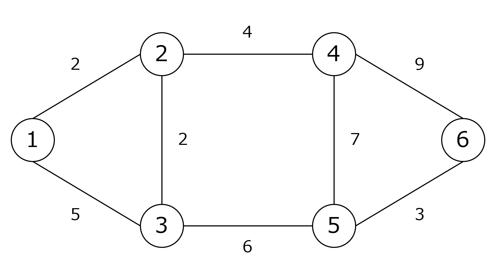

---

$S = \{1, 2, 3 \}$ は s - t カットのうちの 1 つです．
$S$ に属する頂点を赤，$V \setminus S$ に属する頂点を青で示します．  
辺の一方の端点のみが $S$ に属する辺は $(2, 4)$ と $(3, 5)$ です．よって，このカットの容量は $4 + 6 = 10$ となります．

---

$S = \{1, 3, 4 \}$ も s - t カットです．  
このカットの容量は $2 + 2 + 6 + 4 + 7 + 9 = 30$ となります．

---

$S = \{1 \}$ も s - t カットです．  
このカットの容量は $2 + 5 = 7$ となります．  
$s$ に $1$，$t$ に $6$ を選んだとき $7$ より容量の小さい s - t カットは存在しないためこのカットは最小 s - t カットです．

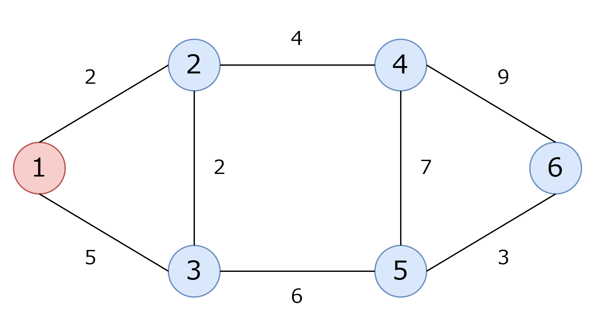

## カット関数の劣モジュラ性

関数 $f: 2^V \rightarrow \mathbb R$ は，任意の $A, B \subseteq V$ で以下の不等式が成立するとき劣モジュラであると呼ばれます．
$$f(A) + f(B) \ge f(A \cap B) + f(A \cup B)$$

また，関数 $f$ は任意の $S \subseteq V$ について $f(S) = f(V \setminus S)$ が成り立つとき対称であると呼ばれます．  
対称で劣モジュラな関数は対称劣モジュラ関数と呼ばれます．

無向グラフのカット関数 $c(S)$ が対称劣モジュラ関数であることを示します．  
頂点集合 $V$ を $V_1 = A \setminus B, V_2 = B \setminus A, V_3 = A \cap B, V_4 = V \setminus (A \cup B)$ の $4$ つに分割します．

辺の $2$ つの端点がそれぞれ $V_a$，$V_b$ に属する辺集合の容量の和を $\mathrm{cap}(a, b)$ とします．今回は無向辺を扱っているため $\mathrm{cap}(a, b) = \mathrm{cap}(b, a)$ となります．  
このとき，以下の式が成り立ちます．

- $c(A) = \mathrm{cap}(3, 4) + \mathrm{cap}(3, 2) + \mathrm{cap}(1, 4) + \mathrm{cap}(1, 2)$
- $c(B) = \mathrm{cap}(3, 4) + \mathrm{cap}(3, 1) + \mathrm{cap}(2, 4) + \mathrm{cap}(2, 1)$
- $c(A \cup B) = \mathrm{cap}(3, 4) + \mathrm{cap}(1, 4) + \mathrm{cap}(2, 4)$
- $c(A \cap B) = \mathrm{cap}(3, 1) + \mathrm{cap}(3, 2) + \mathrm{cap}(3, 4)$

これらを整理すると

$$c(A) + c(B) - c(A \cup B) - c(A \cap B) = \mathrm{cap}(1, 2) + \mathrm{cap}(2, 1) = 2\mathrm{cap}(1, 2) \ge 0$$

となり，関数 $c(S)$ は劣モジュラ関数であることがわかります．  
また，関数 $c(S)$ は $c(S) = c(V \setminus S)$ が成り立つため対称です．  
以上により，無向グラフのカット関数が対称劣モジュラ関数であることが示せました．

## Gomory-Hu 木

木から辺 $(u, v)$ を取り除いたときにできる $u$ を含む連結成分の頂点集合を $C_{uv}$ とします．  
Gomory-Hu 木は以下のように定義されます．

- 無向グラフ $G(V, E)$ の Gomory-Hu 木 $T(V, F)$ は，木のすべての辺 $(u, v) \in F$ について，$C_{uv}$ が $G$ の最小 u - v カットとなるような木である．つまり，$c(C_{uv}) = \lambda_{u, v}$ となる[^1]．
- 各辺 $(u, v) \in F$ の重みを $w(u, v)$ とすると，$w(u, v) = \lambda_{u, v}$ が成り立つ．

Gomory-Hu 木の定義では，木の辺となるような頂点対が $G$ の最小カットとなることのみを要求しています．  
あとで示しますが，この定義は任意の頂点対に拡張することができ，結果として Gomory-Hu 木は次の性質を持つといえます．

- $V$ 上の全域木 $T(V, F)$ である（ただし，$F \subseteq E$ とは限らない）．
- 任意の異なる $2$ 頂点 $s, t \in V$ について，$T$ 上の最小 s - t カットは $G$ 上の最小 s - t カットとなり，その容量は一致する．

以下の図を例に Gomory-Hu 木の性質を確認します．

- グラフの頂点 $1$ と頂点 $6$ の最小カットは $\{1\}$ でその容量は $7$ です．一方，木の頂点 $1$ と頂点 $6$ の最小カットは $\{1\}$ でその容量は $7$ です．
- グラフの頂点 $3$ と頂点 $5$ の最小カットは $\{1, 3\}$ でその容量は $10$ です．一方，木の頂点 $3$ と頂点 $5$ の最小カットは $\{1, 3\}$ でその容量は $10$ です．

このように，任意の異なる 2 頂点 $s$，$t$ について，木の最小 s - t カットはグラフの最小 s - t カットになり，その容量は一致します．  
木の最小 s - t カットは，頂点 $s$ から頂点 $t$ へのパスのうち最も重みの小さい辺 $e$ を削除したときの一方の連結成分となり，カットの容量は辺 $e$ の重みとなるため簡単に求めることができます．

Gomory-Hu 木は $n - 1$ 回の最小 s - t カット計算で求めることができます．  
Gomory-Hu のアルゴリズムを紹介する前に，準備としていくつかの補題を導入し，Gomory-Hu 木の性質が定義から導けることを示します．

### 補題 1

長さ $k \ge 2$ の互いに異なる頂点列 $v_1, v_2, v_3, \cdots, v_k$ について，$\lambda_{v_1, v_k} \ge \min \limits_{1 \le i \le k - 1} \lambda_{v_i, v_{i + 1}}$ が成り立つ．

補題 1 を示します．  
$U$ を最小 $v_1$ - $v_k$ カットとし，$v_1 \in U$，$v_k \notin U$ とします．  
このとき，頂点列のどこかに $v_i \in U$，$v_{i + 1} \notin U$ であるような $i$ が存在します．

直観的には，次のように考えることができます．  
$U$ に属する頂点を $\circ$，属さない頂点を $\times$，不明な頂点を $?$ とします．  
このとき，頂点列の所属は $(\circ, ?, ?, \cdots, ?, \times)$ と表せますが，$?$ がどのように決められようとどこかに $\circ, \times$ というペアが現れます．これは，$v_i \in U$，$v_{i + 1} \notin U$ であるような $i$ が存在しているということです．

よって，$U$ は $v_i$ - $v_{i+1}$ カットでもあります．ただし，$U$ は最小 $v_i$ - $v_{i+1}$ カットとは限らないため，$\lambda_{v_i, v_{i + 1}} \le c(U) = \lambda_{v_1, v_k}$ となります．  
以上により，$\lambda_{v_1, v_k} \ge \min_{1 \le i \le k - 1} \lambda_{v_i, v_{i + 1}}$ が示せました．

### 補題 2

$s, t \in V$ を異なる 2 頂点とし，最小 s - t カットを $A$ とする．任意の異なる 2 頂点 $u, v \notin A$ について，$A \subseteq B$ か $A \cap B = \emptyset$ となるような最小 u - v カット $B$ が存在する．

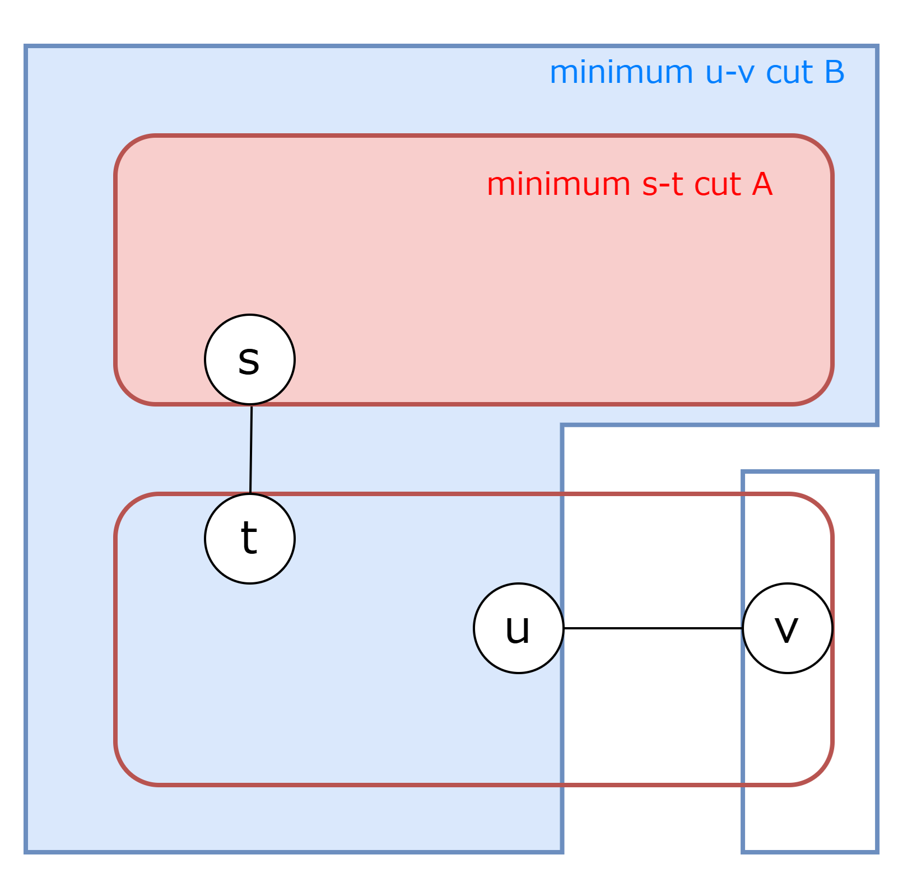

この補題は，すでに存在する最小 s - t カット $A$ と交差しないように最小 u - v カット $B$ をとることができることを意味します．図は $A \subseteq B$ の場合を表しています．

補題 2 を示します．  
最小 s - t カットを $A$，最小 u - v カットを $B$ とします．$A \subseteq B$ か $A \cap B = \emptyset$ の場合は補題が成立しているので，$A \nsubseteq B$ かつ $A \cap B \ne \emptyset$ を仮定します．
$s \in A$，$s, u \in B$ であるとします[^2]．  
このとき，$A \cup B$ が最小 u - v カットとなることを示します．

- $A \cup B$ は u - v カット  
  $u \in B$ であるため $u \in A \cup B$ であり，$v \notin A$ かつ $v \notin B$ であるため $v \notin A \cup B$ です．  
  よってこのカットは u - v カットです．

- $c(A \cup B) = c(B)$
  - $c(A \cup B) \le c(B)$  
    仮定より，$s \in A \cap B$，$t \notin A \cap B$ であるため，$A \cap B$ は s - t カットです．  
    $A$ は最小 s - t カットで $A \cap B$ も s - t カットであるため，$c(A \cap B) \ge c(A)$ となります．  
    この不等式をカットの劣モジュラ性である $c(A) + c(B) \ge c(A \cap B) + c(A \cup B)$ に代入することで，$c(A \cup B) \le c(B)$ を得ます．
  - $c(A \cup B) \ge c(B)$  
    $B$ は最小 u - v カットで $A \cup B$ も u - v カットであるため，$c(A \cup B) \ge c(B)$ を得ます．

以上により，$A \cup B$ は最小 u - v カットといえます．$A \cup B$ を新しく $B$ ととることで，$A \subseteq B$ であるような最小 u - v カット $B$ とすることができます．

### Gomory-Hu 木の性質

Gomory-Hu 木の定義から Gomory-Hu 木の性質が導かれることを示します．

$T$ の s - t パス上の最小重みの辺を $(a, b) \in F$ とします．このとき，$C_{ab}$ は s - t カットとなり，最小 s - t カットの容量 $\lambda_{s, t}$ が $w(a, b)$ と一致することを示します．

- $\lambda_{s, t} \ge w(a, b)$  
  s - t パスの頂点列を考えます．  
  $v_1 = s$，$v_k = t$ とすると，補題 1 より $\lambda_{s, t} \ge \min \limits_{1 \le i \le k - 1} \lambda_{v_i, v_{i + 1}}$ が成り立ちます．  
  Gomory-Hu 木の定義より $\min \limits_{1 \le i \le k - 1} \lambda_{v_i, v_{i + 1}} = \lambda_{a, b} = w(a, b)$ なので，$\lambda_{s, t} \ge w(a, b)$ が成り立ちます．

- $\lambda_{s, t} \le w(a, b)$  
  $\lambda_{s, t}$ は定義より最小 s - t カットの値です．  
  辺 $(a, b) \in F$ は $s$ から $t$ への唯一のパス上に存在するため，$C_{ab}$ は s - t カットでもあります．このカットの容量は Gomory-Hu 木の定義から $w(a, b)$ です．よって，$\lambda_{s, t} \le c(C_{ab}) = w(a, b)$ が成り立ちます．

以上により，$C_{ab}$ が s - t カットであり，$\lambda_{s, t} = w(a, b)$ となることが示せました．

## Gomory-Hu のアルゴリズム

Gomory-Hu 木 $T$ を構築するアルゴリズムを説明します．  
Gomory-Hu 木は，木の各辺がある頂点対の最小カットを表し，その結果として任意の $2$ 頂点間の最小カットが木上で読み取れるという形になっていました．  
そこで直感的には，最初に $G$ のすべての頂点を $1$ つの縮約頂点として持ち，辺がある頂点対の最小カットとなるように縮約頂点を分割していくことで木を構築すればよさそうです．  
ただし，適当に分割してしまうと以前の分割と交差してしまいすでに作った構造を壊してしまうことがあります．  
Gomory-Hu のアルゴリズムはこの問題に対処するために，すでにできている縮約頂点をそれぞれ 1 頂点に縮約したグラフの上で最小カットを計算し，その結果を使って縮約頂点を分割します．  
こうすると新しい分割は以前の分割を壊さない形で実行することができるため，分割を積み重ねながら木を安全に構築できます．  
具体的なアルゴリズムは以下の通りです．

1. 初期化

   - $V(T) = \{V(G)\}$
   - $E(T) = \emptyset$

2. 要素数が $2$ 以上の $X \in V(T)$ がある間以下を行う．

   - $X$ の中から異なる $2$ 頂点 $s, t \in X$ を選ぶ．
   - 縮約グラフ $H$ を構築する．
     - $T$ から $X$ を削除したときの連結成分を $C_1, C_2, \cdots, C_k$ とし，$C_i$ のすべての要素の和集合を $S_i$ とする．
     - $G$ 上で各 $S_i$ を $1$ つの頂点に縮約したグラフを $H$ とする．縮約で生じる並行辺は維持し，同一成分内の辺を除去する．
   - $H$ 上で最小 s - t カット $S$ を求め，$A = X \cap S$，$B = X \setminus S$ とする．
   - $X$ を $A$ と $B$ に分割する．
     - $V(T) = (V(T) - \{ X\}) \cup \{A, B\}$ と更新する．
     - 新しい辺 $AB$ を $T$ に追加し，その重みを先程求めた最小 s - t カットの値とする．
   - 既存の辺を置き換える．
     - $X$ に接続する辺 $XY \in E(T)$について以下を行う．
       - $XY$ を $E(T)$ から削除する．
       - $Y$ が属する側の縮約頂点 $v_{S_i}$ について，$v_{S_i} \in S$ なら $AY$ を，そうでないなら $BY$ を追加する．追加する辺の重みは $XY$ と同じとする．

3. 単一集合となったすべての頂点 $\{v\}$ について以下を行う．
   - 頂点 $\{v\}$ を $v$ に，辺 $(\{u\}, \{v\})$ を $(u, v)$ に置き換える．
   - Gomory-Hu 木 $(V(T), E(T))$ を返す．

## アルゴリズムの実行例

下のグラフの Gomory-Hu 木を求めます．  

### Phase 1

はじめ，$V(T) = \{ \{1, 2, 3, 4, 5, 6\} \}$ です．  
$X$ として $\{1, 2, 3, 4, 5, 6\}$ を選び，縮約グラフ $H$ を構築します．  
今回は $X$ に接続する辺はないので，$H = G$ となります．  
下の左の図が $T$ で，右の図が $H$ です．

- 最小 s - t カットの計算  
  $s$ と $t$ は任意に選べます．今回は $s = 3$，$t = 5$ として，$H$ での最小 s - t カットを求めると，$S = \{1, 3\}$ となり，その容量は $10$ です．
- $X$ の分割  
  $X$ を $A = X \cap S = \{1, 3\}$ と $B = X \setminus S = \{2, 4, 5, 6\}$ に分割し，重み $10$ の辺を張ります．

これらの操作により，$T$ は以下のようになります．

---

### Phase 2

$X$ として $\{2, 4, 5, 6\}$ を選び，縮約グラフ $H$ を構築します．  
$G$ について，$T$ から $X$ を削除したときの連結成分 $C_1$ の展開 $S_1$ を $1$ つの頂点 $v_{S_1}$ として縮約します．

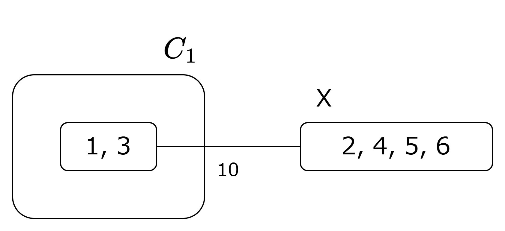

- 最小 s - t カットの計算  
  $s = 5, t = 4$ とすると，$H$ での最小 s - t カットは $S = \{\{1, 3\}, 2, 5\}$ となり，その容量は $14$ です．
- $X$ の分割  
  $X$ を $A = \{2, 5\}$ と $B = \{4, 6\}$ に分割し，重み $14$ の辺を張ります．
- 既存の辺の付け替え  
  $X$ の分割後，更新前の $T$ の辺 $(\{1, 3\}, X)$ がどうなるか考えます．$v_{S_1} \in S$ であるため，この辺は $A$ と接続します．  
  よって辺 $(\{1, 3\}, X)$ は辺 $(\{1, 3\}, A)$ に付け替えられます．

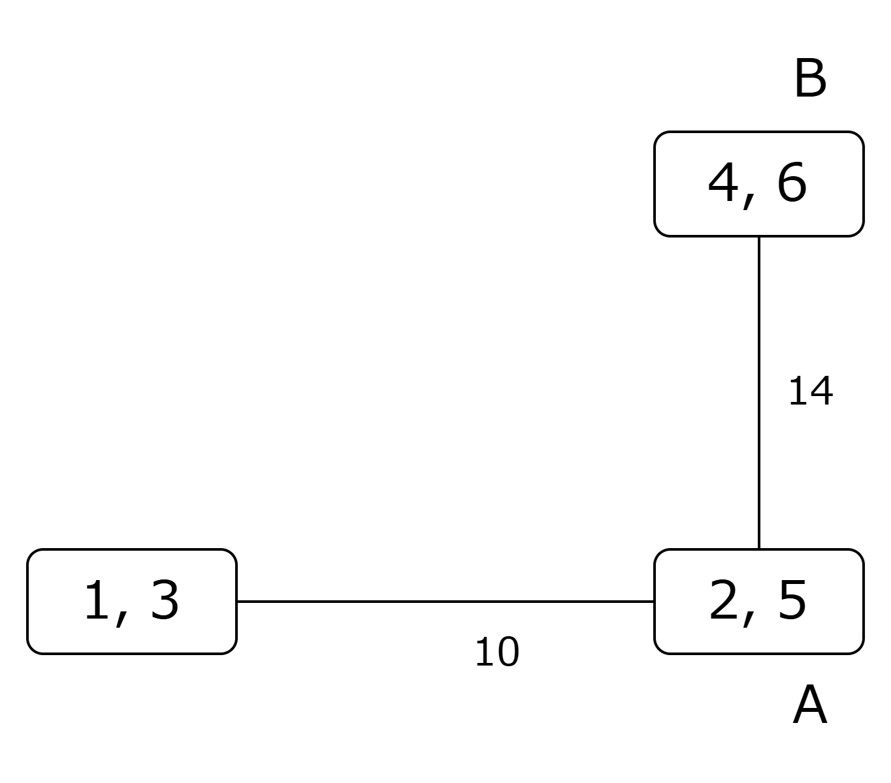

---

### Phase 3

$X$ として $\{1, 3\}$ を選び，縮約グラフ $H$ を構築します．  
$S_1$ を $1$ つの頂点 $v_{S_1}$ として縮約します．

- 最小 s - t カットの計算  
  $s = 1, t = 3$ とすると，グラフ $H$ での最小 s - t カットは $S = \{1\}$ となり，その容量は $7$ です．
- $X$ の分割  
  $X$ を $A = \{1\}$ と $B = \{3\}$ に分割し，重み $7$ の辺を張ります．
- 既存の辺の付け替え  
  $X$ の分割後，更新前の $T$ の辺 $(X, \{2, 5\})$ がどうなるか考えます．$v_{S_1} \notin S$ であるため，この辺は $B$ と接続します．  
  よって辺 $(X, \{2, 5\})$ は辺 $(B, \{2, 5\})$ に付け替えられます．

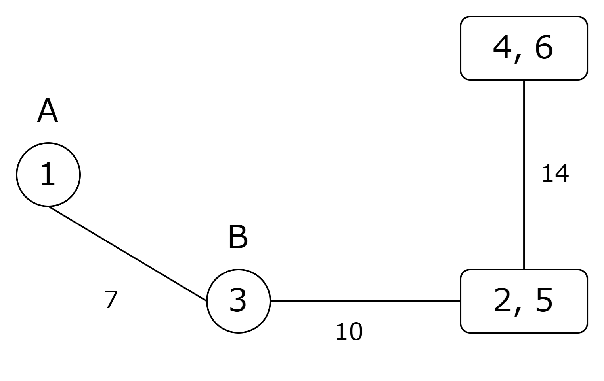

---

### Phase 4

$X$ として $\{2, 5\}$ を選び，縮約グラフ $H$ を構築します．  
$S_1$ と $S_2$ をそれぞれ $1$ つの頂点 $v_{S_1}, v_{S_2}$ として縮約します．

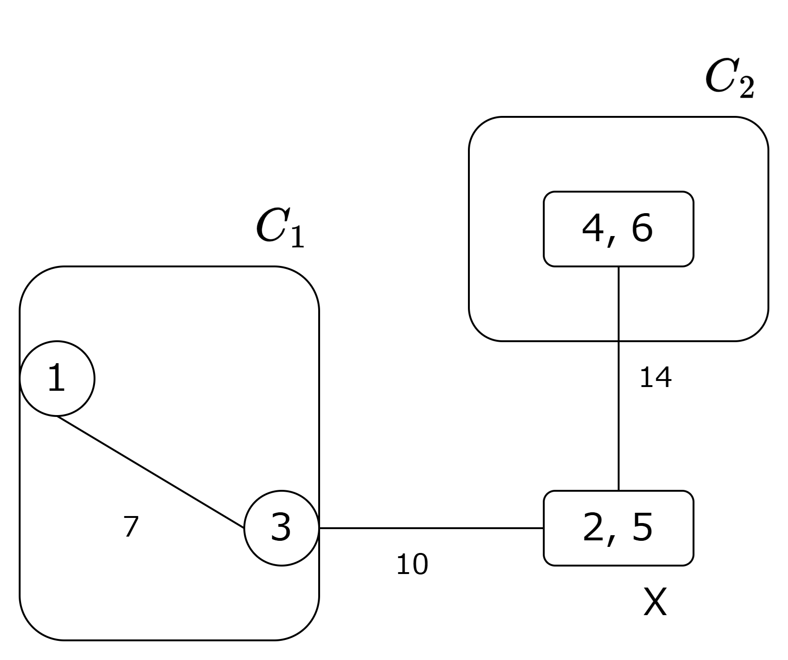

- 最小 s - t カットの計算  
  $s = 2, t = 5$ とすると，グラフ $H$ での最小 s - t カット $S$ は $\{2\}$ となり，その容量は $8$ です．
- $X$ の分割  
  $X$ を $A = \{2\}$ と $B = \{5\}$ に分割し，重み $8$ の辺を張ります．
- 既存の辺の付け替え  
  $X$ の分割後，更新前の $T$ の辺 $(\{3\}, X)$ がどうなるか考えます．  
  $v_{S_1} \notin S$ であるため，この辺は $B$ と接続します．
  また，更新前の $T$ の辺 $(X, \{4, 6\})$ は $v_{S_2} \notin S$ であるため，この辺も $B$ と接続します．  
  よって辺 $(\{3\}, X)$ は辺 $(\{3\}, B)$ に，辺 $(X, \{4, 6\})$ は $(B, \{4, 6\})$ に付け替えられます．

---

### Phase 5

$X$ として $\{4, 6\}$ を選び，縮約グラフ $H$ を構築します．  
$S_1$ を $1$ つの頂点 $v_{S_1}$ として縮約します．

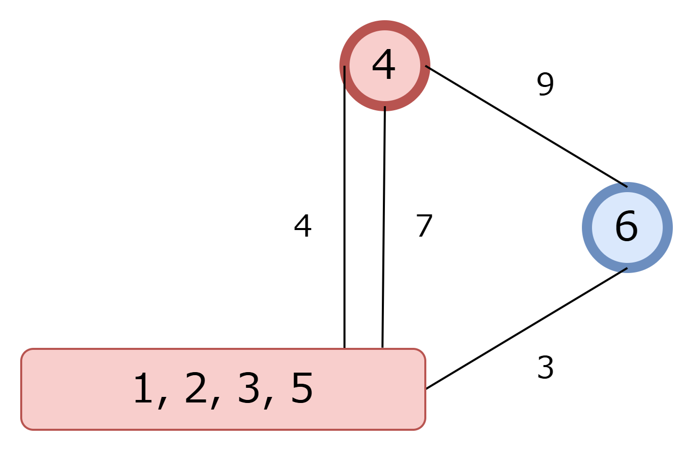

- 最小 s - t カットの計算  
  $s = 4, t = 6$ とすると，グラフ $H$ での最小 s - t カット $S$ は $\{4, \{1, 2, 3, 5\}\}$ となり，その容量は $12$ です．
- $X$ の分割  
  $X$ を $A = \{4\}$ と $B = \{6\}$ に分割し，重み $12$ の辺を張ります．
- 既存の辺の付け替え  
  $X$ の分割後，更新前の $T$ の辺 $(5, X)$ がどうなるか考えます．$v_{S_1} \in S$ であるため，この辺は $A$ と接続します．  
  よって辺 $(5, X)$ は辺 $(5, A)$ に付け替えられます．

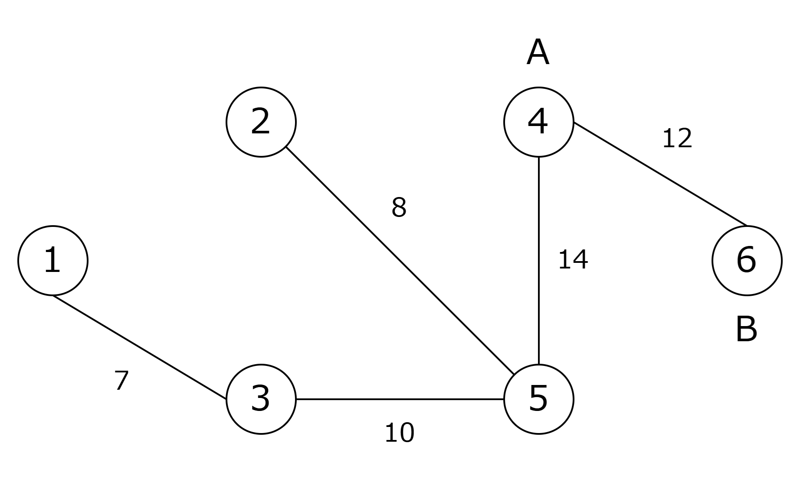

---

### Phase 6

$T$ のすべての頂点の要素数が $1$ なので Step 2 を終了します．  
Step 3 は省略します．

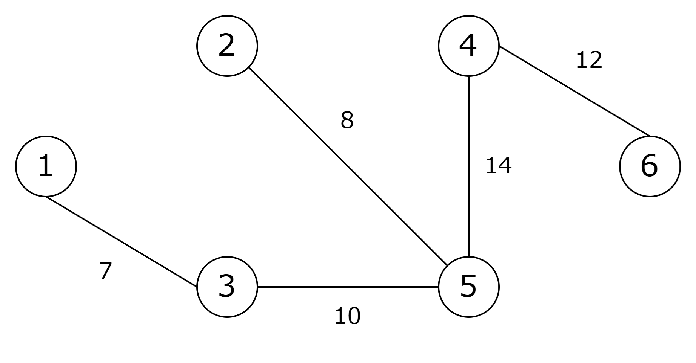

## 証明

アルゴリズムが Gomory-Hu 木を構築する証明をします．  
表記を整理しておきます．

- $\lambda_{s,t;G}$：グラフ $G$ の最小 s - t カットの容量
- $\lambda_{s,t;H}$：縮約グラフ $H$ の最小 s - t カットの容量
- $w(YZ)$：木 $T$ の辺 $YZ$ の重み
- $C^{\prime}_{YZ}$：木 $T$ から辺 $YZ$ を削除したときにできる 2 つの連結成分のうち，$Y$ に属する連結成分をすべて展開したもの

アルゴリズムの開始時と各イテレーション終了時に，次の不変条件が成り立つことを示します．

- 木 $T$ の任意の辺 $YZ$ に対してある頂点 $s \in Y, t \in Z$ が存在し，$C^{\prime}_{YZ}$ は元のグラフ $G$ における最小 s - t カットであり，$\lambda_{s, t;G} = w(YZ)$ となる

まず，アルゴリズムの開始時には辺がないので不変条件は成り立ちます．  
このあとで，各イテレーション時に以下の $3$ つの辺について不変条件が成り立つことを示します．

<ol type="a">
  <li>新しく追加される辺 $AB$</li>
  <li>既存の辺 $XY$ から付け替えられた辺</li>
  <li>その他の辺</li>
</ol>

アルゴリズムの終了時には縮約頂点はすべて展開され，木 $T$ は Gomory-Hu 木の定義を満たしているため，アルゴリズムは Gomory-Hu 木を構築するといえます．

### a. 新しく追加される辺 $AB$

アルゴリズムは縮約グラフ $H$ 上で $s, t \in X$ について最小 s - t カット $S$ を求め，$A = X \cap S$，$B = X \setminus S$ と分割します．その上で，辺 $AB$ の重み $w(AB)$ を $\lambda_{s,t;H}$ とします．

辺 $AB$ が不変条件を満たすことを示すため，以下を確認します．

1. $H$ 上の最小 s - t カットを展開した頂点集合は $G$ 上の最小 s - t カットとなりその容量は一致する．つまり，$\lambda_{s, t;G} = w(AB) = \lambda_{s,t;H}$ となる
2. $H$ 上の最小 s - t カットを展開した頂点集合は $C^{\prime}_{AB}$ となる

#### 1. $H$ 上の最小 s - t カットを展開した頂点集合は $G$ 上の最小 s - t カットとなりその容量は一致する

アルゴリズムのあるイテレーションで，$S_1, \cdots, S_k$ を順番に縮約していくことを考えます．$S_i$ までを縮約したグラフを $H_i$ とします．$H_0$ はグラフ $G$ に，$H_k$ はアルゴリズムで述べられている縮約グラフ $H$ に一致します．

不変条件より，木の各辺 $YZ$ に対してある頂点対 $(s_{YZ}, t_{YZ})$ が存在し，$C^{\prime}_{YZ}$ は $G$ 上の最小 $s_{YZ}$ - $t_{YZ}$ カットになっています．頂点 $X \in T$ を削除したときの連結成分 $C_i$ と $X$ を結ぶ辺を $Y_i X$ とおくと，$S_i = C^{\prime}_{Y_i X}$ が成り立ちます．  
よって，各 $S_i$ はある頂点対 $(s_i, t_i)$ に対する最小 $s_i$ - $t_i$ カットです．  
また，$S_i$ は $T \setminus X$ の連結成分から構成されているので，$s, t \notin S_i$ です．

各ステップ $i$ について，$H_i$ には $G$ における最小 s - t カットの容量である $\lambda_{s, t;G}$ と同じ容量の s - t カットが存在することを帰納法で示します．  
$i = 0$ のとき，$H_0 = G$ なので自明です．  
帰納法の仮定より，$H_i$ には容量 $\lambda_{s, t;G}$ の s - t カット $C$ があります．このとき，$S_{i + 1}$ を縮約して得られる $H_{i + 1}$ にも容量 $\lambda_{s, t;G}$ の s - t カットが存在することを示します．  
補題 2 により $H_i$ の s - t カット $C$ は $S_{i + 1}$ を交差しないようにとりなおすことができます．よって，$S_{i + 1}$ を縮約して $H_{i + 1}$ を構築しても，容量 $\lambda_{s, t;G}$ の s - t カットが存在するといえます．  
よって，$H$ には容量 $\lambda_{s, t;G}$ の s - t カットが存在することが示せました．

任意の $H$ 上の s - t カットは，縮約を展開すれば $G$ 上の s - t カットになります．縮約は辺の容量を変えないので，カットの容量も維持されます．  
したがって，任意の $H$ 上の s - t カットの容量 = 対応する $G$ 上の s - t カットの容量 $\ge \lambda_{s, t;G}$ となり，$H$ の最小 s - t カットの容量は $\lambda_{s, t;G}$ となります．

#### 2. $H$ 上の最小 s - t カットを展開した頂点集合は $C^{\prime}_{AB}$ となる

$H$ の最小 s - t カット $S$ を展開して得られる頂点集合は，アルゴリズムにおける辺の付け替え規則から，更新後の木 $T^{\prime}$ で辺 $AB$ を削除したときの $A$ 側成分 $C^{\prime}_{AB}$ と一致します．  
これは，$X$ 内の頂点のうち $S$ に属するものは $A$ に，また各連結成分 $C_i$ に対応する縮約頂点 $v_{S_i}$ が $S$ に属する場合に限り，その成分は $A$ 側に接続されるように付け替えられているためです．

以上のことから辺 $AB$ が不変条件を満たすことがわかりました．

---

### b. 既存の辺 $XY$ から付け替えられた辺

アルゴリズムは，縮約グラフ $H$ 上で $s, t \in X$ について最小 s - t カット $S$ を見つけ，$X$ を $A = X \cap S$ と $B = X \setminus S$ に分割します．もともと $X$ と $Y$ の間に張られていた辺 $XY$ は $A$ に付け替えられて $AY$ になるか，$B$ に付け替えられて $BY$ になります．  
以降は $A$ に付け替えられた場合を考えますが $B$ でも同じことがいえます．

$p \in X$，$q \in Y$ であり，XY の重みは $\lambda_{p, q}$ であったとします．  

$X$ の最小 s - t カットを求め，$A$ と $B$ に分割したとき，$s \in A$，$t \in B$ であるとします．  
$A$ と $B$ は $X$ を分割したものであるため，$C^{\prime}_{AY} = C^{\prime}_{XY}$ とみなすことができます．  
辺 $AY$ の重みが $\lambda_{p, q}$ であることを $p \in A$ の場合と $p \notin A$ の場合について示します．

$p \in A$ の場合  
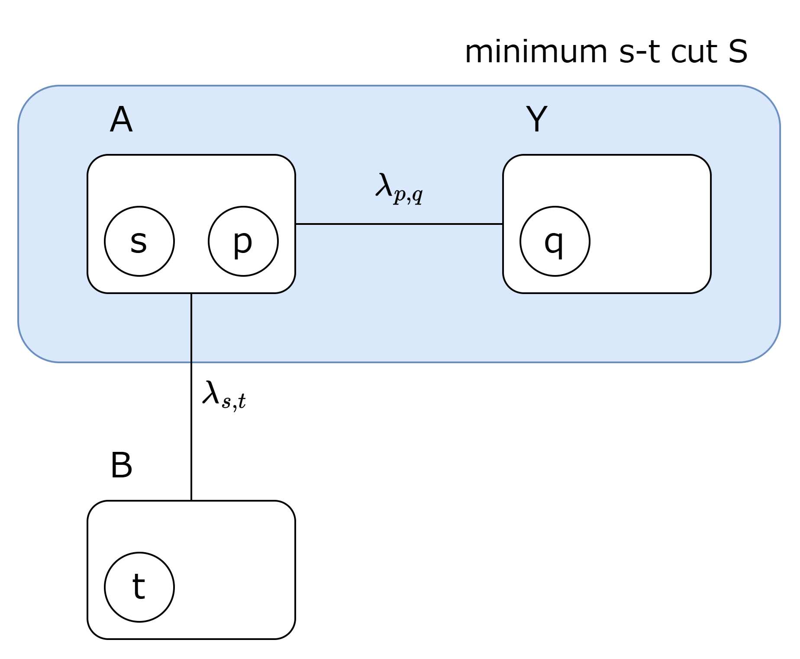

辺 $AY$ の重みは $\lambda_{p, q}$ なので，不変条件を満たします．

$p \notin A$ の場合  
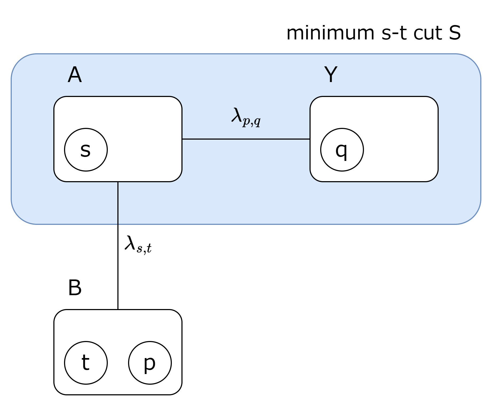

$\lambda_{s, q} = \lambda_{p, q}$ であることを示します．

- $\lambda_{s, q} \ge \lambda_{p, q}$  
  頂点列 $s, t, p, q$ を考えると補題 1 より $\lambda_{s, q} \ge \min \{\lambda_{s, t}, \lambda_{t, p}, \lambda_{p, q} \}$ が言えます．  
  $H$ 上の最小 s - t カットを展開したものを $\bar S$ とします．  
  このとき，$s, q \in \bar S$，$t, p \in B \subseteq V \setminus \bar S$ です．

  カット関数は対称なので $V \setminus \bar S$ も最小 s - t カットです．  
  そこで，補題 2 を $A = V \setminus \bar S$，$(u, v) = (s, q)$ に適用します（このとき $s, q \notin A$ が成り立ちます）．  
  すると，ある最小 s - q カット $C^{\prime}$ が存在して

  $$(V \setminus \bar S) \subseteq C^{\prime} \text{または} (V \setminus \bar S) \cap C^{\prime} = \emptyset$$

  が成り立ちます．  
  前者なら無向グラフなので $V \setminus C^{\prime}$ も最小 s - q カットであり，こちらは $(V \setminus \bar S) \cap (V \setminus C^{\prime}) = \emptyset$ となるので，$C = V \setminus C^{\prime} \subseteq \bar S$ とできます．  
  後者ならそのまま $C = C^{\prime}$ とおけば $C \subseteq \bar S$ です．  
  よって，ある最小 s - q カット $C$ は，$C \subseteq \bar S$ であるようにとることができます．  
  つまり，最小 s - q カットは $t, p \in B$ となるようにとれるので，$\lambda_{s, q}$ は 辺 $(t, p)$ の容量に依存しないことがわかります．  
  よって，大きな容量をもつ辺 $(t, p)$ を追加したとしても不等式が成り立ち，$\lambda_{s, q} \ge \min \{\lambda_{s, t}, \lambda_{p, q} \}$ が成立します．  
  また，最小 s - t カットは p-q カットでもあるため，$\lambda_{s, t} \ge \lambda_{p, q}$ が成り立ちます．  
  よって，$\lambda_{s, q} \ge \lambda_{p, q}$ が示せました．

- $\lambda_{s, q} \le \lambda_{p, q}$  
  $C^{\prime}_{XY}$ は $X$ と $Y$ を分けるカットであり，$p \in X$ と $q \in Y$ を分離していて，重みは $\lambda_{p, q}$ でした．  
  $s \in A \subset X$ なので，$C^{\prime}_{XY}$ は s - q カットでもあります．  
  よって，$\lambda_{s, q} \le \lambda_{p, q}$ が示せました．

以上より，$\lambda_{s, q} \ge \lambda_{p, q}$ と $\lambda_{s, q} \le \lambda_{p, q}$ の両方が示せたので，$\lambda_{s, q} = \lambda_{p, q}$ が成り立ちます．したがって $w(AY)=w(XY)=\lambda_{p,q}=\lambda_{s,q}$ であり，$s \in A,\, q \in Y$ をとれば辺 $AY$ も不変条件を満たします．

### c. その他の辺

アルゴリズムで選んだ $X$ に接続していない辺 $YZ$ は，木 $T$ 上での位置も対応するカット $C^{\prime}_{YZ}$ も変化しないため，不変条件を満たします．

## 参考

- [Multi-Terminal Network Flows](https://doi.org/10.1137%2F0109047)
- [Lecture 5 (Sept. 16): Undirected Cuts and Gomory-Hu Trees](https://webdocs.cs.ualberta.ca/~zacharyf/courses/combopt_2016/notes/lec5.pdf)
- [Lecture 6 (Sept. 19): Gomory-Hu Trees](https://webdocs.cs.ualberta.ca/~zacharyf/courses/combopt_2016/notes/lec6.pdf)
- [Iterative Methods in Combinatorial Optimization](https://www.contrib.andrew.cmu.edu/~ravi/book.pdf)

[^1]: カット関数は $G$ に対して定義されています
[^2]: 必要に応じて，$B$ を $V \setminus B$ に置き換える操作と名前の付け替えを行います
