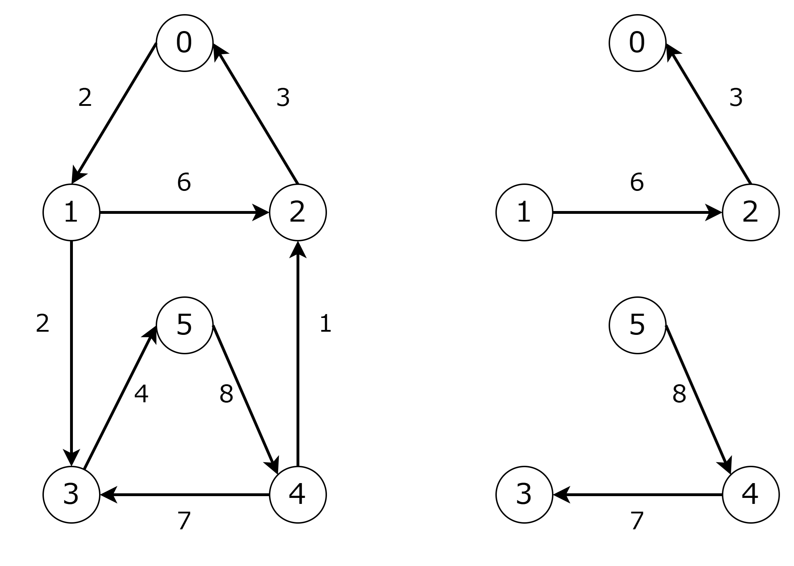
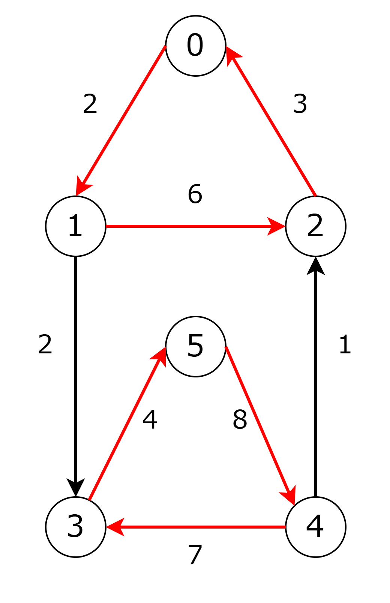
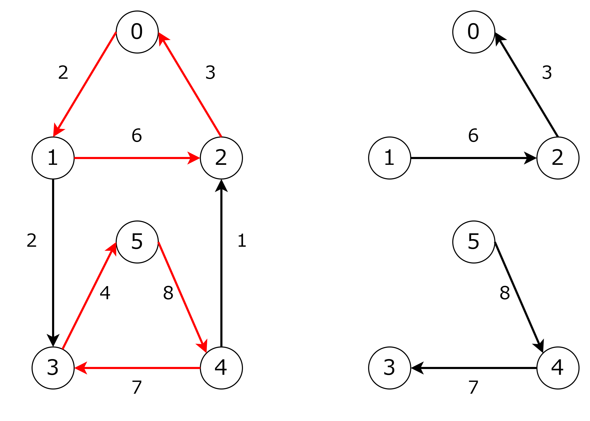
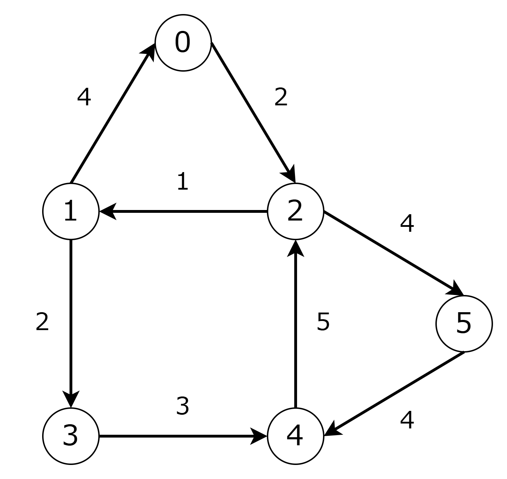
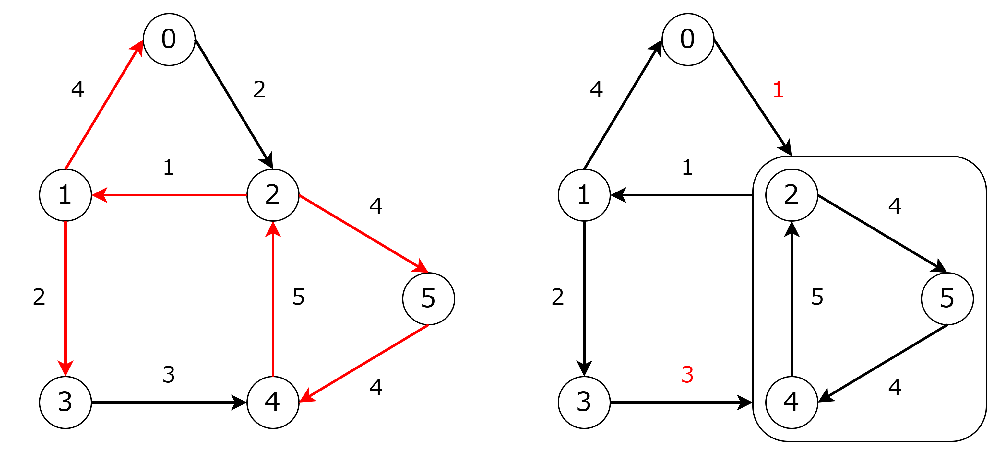
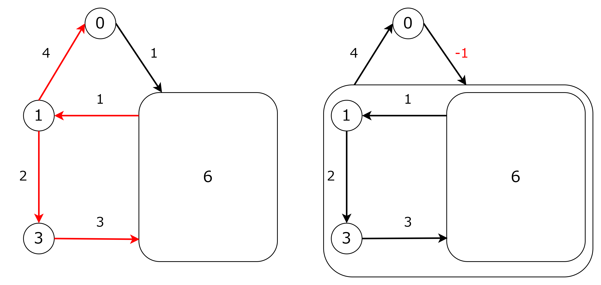
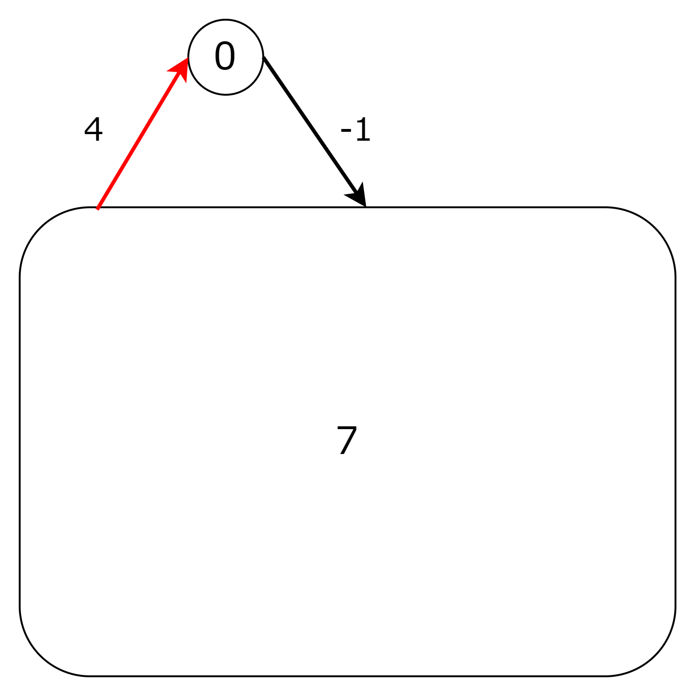
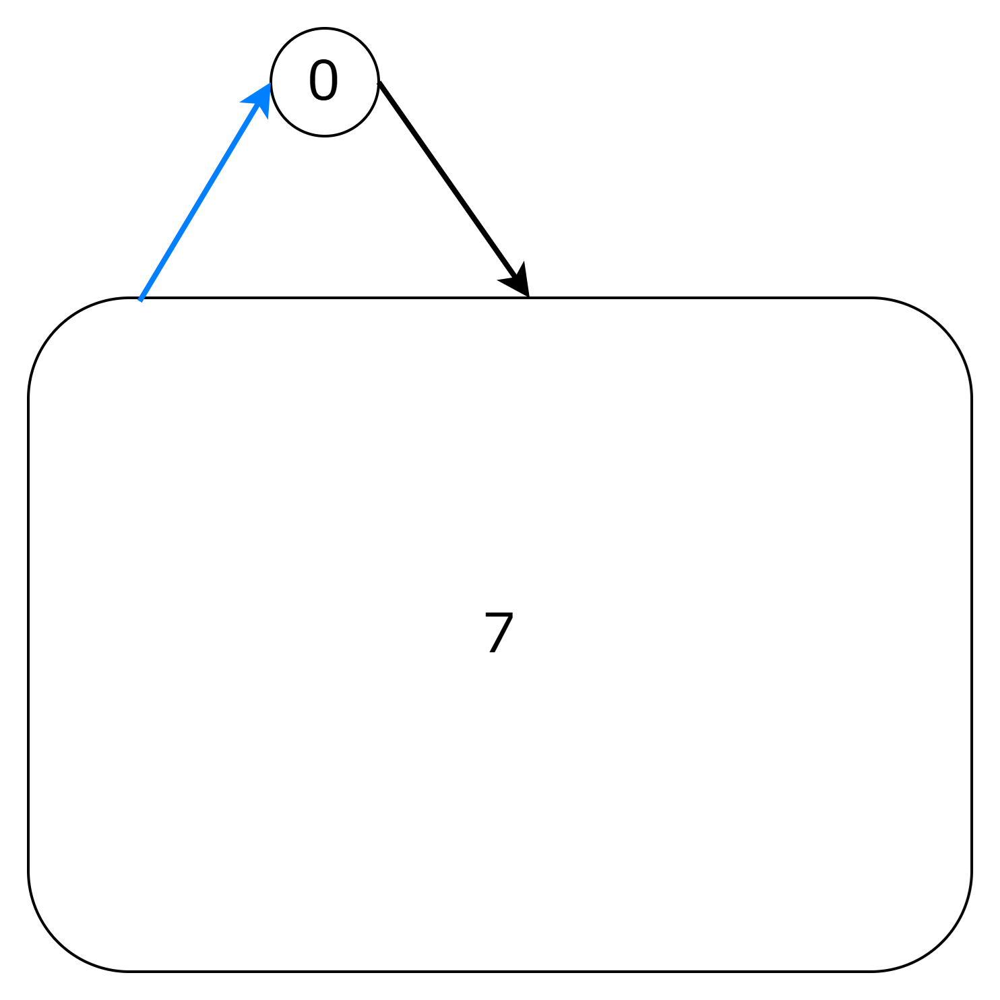
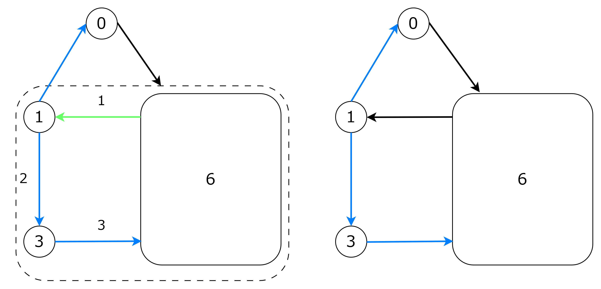
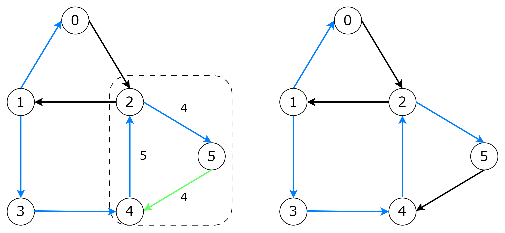

+++
title = "Optimum Branchings と Edmonds のアルゴリズム"
date = 2025-06-20T00:00:00+09:00
image = "images/branchingの例.png"
categories= ["組合せ最適化", "アルゴリズム"]
tags = ["グラフ"]
slug = "optimum-branchings-edmonds"
aliases = [ "/post/optimum-branchings-%E3%81%A8-edmonds-%E3%81%AE%E3%82%A2%E3%83%AB%E3%82%B4%E3%83%AA%E3%82%BA%E3%83%A0/" ]
+++

## Optimum Branchings

有向グラフ $G = (V, E)$ が与えられます．各辺には重みが与えられ，辺 $e$ の重みと辺集合の重みをそれぞれ $w(e)$, $w(E)$ で表します．  
$G$ の部分グラフ $G^{\prime} = (V, E^{\prime})$ のうち以下の 2 条件を満たすものを branching とよびます．

- 閉路を含まない
- 同じ頂点に入る辺は高々 $1$ 本

すべての branching の中で $w(E^{\prime})$ が最大のものを 最適 branching（optimum branching）とよびます[^1][^2]．  
この問題は，最小全域木問題の有向辺バージョンである最小全域有向木問題と等価の問題で，互いに線形時間で変換することができます．  
下の図は有向グラフと対応する 最適 branching の例です．$G^{\prime}$ の各コンポーネントは有向木なので，$G^{\prime}$は有向森になります．

以下ではいくつかの定義，補題，定理を確認したのち，最適 branching を求める Edmonds のアルゴリズムを説明します．  
このアルゴリズムの計算量は $O(|E||V|)$ です．他にも $O(|E| \log |V|)$ の Tarjan の実装や $O(|E| + |V| \log |V|)$ の Gabow のアルゴリズムなどがあります．  
また，最小重み有向木問題などのバリエーションを最適 Branching に帰着する方法と説明します．  
最後に実装例として[AOJ - 最小全域有向木](https://judge.u-aizu.ac.jp/onlinejudge/description.jsp?id=GRL_2_B)の提出コードへのリンクをはっておきます．

## 定義

### critical

辺 $e = (u, v)$ が以下の 2 条件を満たすとき critical という．

- $w(e) \gt 0$
- $v$ に接続するすべての辺 $e^{\prime}$ に対して，$w(e) \ge w(e^{\prime})$

$G$ の全域部分グラフ $H$ が以下の条件を満たすとき critical subgraph という．特にそれ以上辺を追加できない critical subgraph を maximal critical subgraph という．

- $H$ のすべての辺は critical
- $H$ の各頂点の入次数は高々 $1$

下の図は maximal critical subgraph の例です．critical な辺を赤線で示しています．

### eligible

辺 $e$ が入る頂点を $head(e)$ と表す．$G = (V, E)$ の branching $B$ に対して，$(B \backslash \lbrace (u, v) \in B : v = head(e) \rbrace) \cup \lbrace e \rbrace$ も branching になるとき，$e$ を eligible という．

## 補題 1

maximal critical subgraph $H$ は以下の性質を持ちます．

1. 各コンポーネントは高々 1 つの閉路をもち，閉路は互いに素
2. $H$ に閉路がなければ最適 branching

証明

---

1. 頂点 $v$ が $2$ つの有向閉路上にあるとします．このとき，次数が少なくとも $2$ 以上の頂点が存在します．これは critical subgraph の条件に反します．

2. $H$ に閉路がなければ $H$は branching です．任意の branching $B$ のすべての頂点 $v$ について以下が成り立ちます．  
   $w(B \cap \lbrace e | head(e) = v \rbrace) \le w(H \cap \lbrace e | head(e) = v \rbrace)$  
   これらをすべての頂点について足し合わせると $w(B) \le w(H)$ となり，$H$ が最適となります．

---

## 補題 2

辺 $e = (u, v) \in E \backslash B$ が eligible なことと，$B$ 上に $v$ から $u$ への有向パスがないことは同値

証明

---

- 「辺 $e = (u, v) \in E \backslash B$ が eligible」なら「$B$ 上に $v$ から $u$ への有向パスがない」  
  対偶として，$v$ から $u$ への有向パスがあるなら，$e$ は eligible ではないことを示します．  
  $v$ から $u$ への有向パスがあるため，$(u, v)$ を追加すると閉路が発生します．  
  これは eligible の定義に反するため，$e$ は eligible ではありません．

- 「$B$ 上に $v$ から $u$ への有向パスがない」なら「辺 $e = (u, v) \in E \backslash B$ が eligible」  
  $e$ を $B$ に追加したとき，$(x, head(e)) \in B$ の辺を削除すれば $v$ へ入る辺は高々 $1$ 本です．  
  また，$B$ には $v \rightarrow u$ パスがないので，$e$ を追加しても閉路は発生しません．  
  よって，$e$ は eligible です．

---

## 補題 3

$B$ を $G = (V, E)$ の branching，$C$ を $G$ の有向サイクルとする．$C \backslash B$ に eligible な辺がなければ， $|C \backslash B| = 1$ となる

証明

$C \backslash B$ に eligible な辺がないとき，$|C \backslash B|$ は 1 以外にならないことを示します．

- $|C \backslash B| = 0$ にならない  
  $B$ は branching なので起こりません

- $|C \backslash B| = 2$ にならない  
  $C \backslash B = \lbrace (s_1, t_1), (s_2, t_2) \rbrace$ と仮定します．  
  どちらの辺も eligible でないので，$B$ に $t_1$ から $s_1$ への有向パスと $t_2$ から $s_2$ への有向パスが存在します．  
  $C$ は閉路なので，$t_2$ から $s_1$ への有向パスと $t_1$ から $s_2$ への有向パスは $C$ 上に存在します．  
  よって，$B$ には，$t_2 \rightarrow \cdots \rightarrow \cdots s_1 \rightarrow t_1 \rightarrow \cdots \rightarrow s_2 \rightarrow t_2$ のようなパスができます．  
  これは，$B$ の中に閉路があるということになり，$B$ が branching という仮定に矛盾します．

- $|C \backslash B| = k \gt 2$ にならない  
  $|C \backslash B| = 2$ に帰着します．

## 定理 1

$G$ の maximal critical subgraph $H$ に対し，以下の最適 branching $B$ が存在する．

- $H$ に含まれるすべての有向閉路 $C_i$ について，$| C_i \backslash B| = 1$．

つまり，$H$ の各有向閉路からちょうど $1$ 本だけ辺が取り除かれているような最適 branching が存在するということです．  
下の図は $G$ に対する maximul critical subgraph $H$ と最適 branching です．  
$H$ の閉路から $(0, 1)$ と $(3, 5)$ を取り除いた最適 branching が存在することがわかります．

証明

---

最適 branching のうち，$H$ の辺を最も多く含んでいるものを $B$ と仮定します．  
補題 2 により，$C \backslash B$ に eligible な辺がなければ，$|C \backslash B| = 1$ となるので，各 $C_i \backslash B$ のすべての辺が eligible でないことを示します．  
$e \in H \backslash B$ が eligible であると矛盾が起きることを示します．  
$e$ は eligible なので，新しい branching $B^{\prime} = \lbrace B \backslash \lbrace e^{\prime} \rbrace \rbrace \cup \lbrace e \rbrace$ を作ることができます．ここで $e^{\prime}$ は，$head(e)$ に入る $B$ 上の辺です．  
このとき，$e \in H$ であり，$e^{\prime} \notin H$ であるため，$B^{\prime}$ は $B$ より多くの $H$ の辺を含みます．  
また，$e$ は critical なので，$B^{\prime}$ は最適 branching です．  
よって，$B$ より$H$ の辺を多く含む最適 branching $B^{\prime}$ ができることとなり，これは仮定に矛盾します．

---

## 定理 2

定理 1 を満たすような最適 branching $B$ に，以下の条件を満たす解が存在する．ここで $e^{0}_i$ は $C_i$ で最も重みの小さい辺である．

1. 各有向閉路 $C_i$ で $|C_i \backslash B| = 1$
2. もし有向閉路 $C_i$ へ外部から入る辺が $B$ に存在しないなら，$C_i \backslash B = \lbrace e^{0}_i \rbrace$ である．

証明

---

1.を満たす最適 branching の中で，$\lbrace e^{0}_0, e^{1}_0, \cdots, e^{0}_k \rbrace$ が含まれる数がもっとも多いものを $B$ とします．  
$B$ には $C_i$ に外部から入る辺が存在しないにも関わらず，$C_i$ に $e^{0}_i$ が含まれていると仮定します．  
$C_i \backslash B = \lbrace e \rbrace$ とします．  
$B^{\prime} = (B \backslash \lbrace e^{0}_i \rbrace) \cup \lbrace e \rbrace$ とします．  
この $B^{\prime}$ は $\lbrace e^{0}_i \rbrace$ を含む最適 branching です．
これは仮定と矛盾します．

---

## Edmonds のアルゴリズム

グラフ $G = (V, E)$ の最適 branching を求める方法を考えます．表記上の都合のため多重辺はないものとします[^3]．

まず，maximal critical subgraph を求め，この辺集合を $H$ とします．  
補題 1 により $(V, H)$ が branching なら $(V, H)$ は最適 branching です．

$(V, H)$ が branching でない場合を考えます．  
この場合，$(V, H)$ には有向閉路が 1 つ以上存在します．  
定理 1 により，各閉路から 1 本辺を削除した辺集合を含む最適 branching $B^{\star}$ が存在することがわかります．今後はこの $B^{\star}$ を求めていきます．

$B^{\star}$ を求めるためには maximal critical graph の各閉路のどの辺を削除すればいいのかを考ます．  
もし，$B^{\star}$ に（閉路の）外部から閉路に入る辺 $(u, v)$ がある場合，$v$ の入次数が $2$ になるのを避けるために閉路内で $v$ に入る辺を削除することになります．反対に，外部から閉路に入る辺がない場合，定理 2 より閉路内で最小の辺を削除することになります．  
つまり，閉路のどの辺を削除するかは閉路外部の辺構造によって決めることができます．そこで，閉路内部の辺構造（つまり，どの辺を削除するのか）を決めるより先に外部の辺構造を決めてしまいます．  
そのために，閉路外部の重みを適切に調整した上で閉路を $1$ つの超頂点に縮約します．この手続きによって得られるグラフを $G^{\prime} = (V^{\prime}, E^{\prime})$ とします．  
この $G^{\prime}$ の最適 branching に超頂点に入る辺があるかどうかによって，$H$ の閉路のどの辺を削除するかを決めることができます．

$G^{\prime}$ の辺の重み $w^{\prime}$ をどう設定するかを考えます．  
$G^{\prime}$ の最適 branching から構成した $G$ の branching も最適 branching であるという条件を満たす必要があります．  
このためには，任意の branching について，$w(B) = w^{\prime}(B^{\prime}) + const$ であることを示せればいいです．$B^{\prime}$ と $B$ の重みの差は定数なので，$B^{\prime}$ が最適なら $B$ も最適といえるためです．  
外部から閉路に入る辺を $e = (u, v)$，$v$ に入る閉路内唯一の辺を $\tilde e$，閉路の最小の重みを持つ辺を $e^{0}$ とします．
この条件を満たすためには，閉路に入る辺 $e$ の重みを $w^{\prime}(e) = w(e) - w(\tilde e) + w(e^{0})$ と設定すればいいです．  
閉路に入る辺以外の重みは $w$ のままとします．

証明

---

$w(B) = w^{\prime}(B^{\prime}) + const$ となることを示します．  
$B^{\prime}$ の超頂点を展開したときの重みの増加分を考えます．

- 超頂点に入る辺 $e$ がないとき

  - $e^{0}_i$ 以外の辺を採用するので，$w(C_i) - w(e^{0}_i)$ だけ増加します．

- 超頂点に入る辺 $e$ があるとき
  - $w(\tilde e)$ 以外の辺を採用するので，$w(C_i) - w(\tilde e)$ だけ増加します．  
     ただし，$e$ の重みを $w^{\prime}(e) = w(e) - w(\tilde e) + w(e^{0}_i)$ と調整していたので，この調整を打ち消すと $w(C_i) - w(\tilde e) - (- w(\tilde e) + w(e^{0}_i)) = w(C_i) - w(e^{0}_i)$ となります．  
     結局，$w(C_i) - w(e^{0}_i)$ だけ増加します．

よって，どちらも $w(C_i) - w(e_i^{0})$ だけ増加するので，すべての閉路についてこの和をとると $w(B) = w^{\prime}(B^{\prime}) + \sum_{i} w(C_i) - \sum_{i} w(e_i^{0})$ となります．  
$\sum_{i} w(C_i) - \sum_{i} w(e^{0}_i)$ の部分は branching のとり方に依存しないため定数とみなすことができ，$w(B) = w^{\prime}(B^{\prime}) + const$ となります．

---

このように重みを設定した $G^{\prime}$ に対し，最適 branching を求める手続きを再帰的に実行します．  
$G^{\prime}$ は元のグラフより厳密に頂点数が少なくなるため，この手続きは有限回で終了します．

$G$ の最適 branching $B$ は，この再帰呼び出しから返される $G^{\prime}$ の最適 branching $B^{\prime}$ に対して，閉路の $1$ 本を除いた残りすべての辺を加えることにより構築することができます．

最後に計算量について考えます．  
1 回の手続きで少なくとも 1 つの頂点が減ります．1 回の手続きには $O(|E|)$ かかるので，このアルゴリズムの計算量は $O(|E||V|)$ です．

## Edmonds のアルゴリズムまとめ

- step 1: maximal critical subgraph の構築
  maximal critical subgraph を求めます．この辺の集合を $H$ とします．

- step 2: 閉路のチェック  
  $(V, H)$ が branching を形成する場合，$(V, H)$ が最適 branching であるため，これを返します．

- step 3: 閉路の縮約  
  $H$ が $1$ つ以上の閉路を含む場合，任意の閉路 $C$ を選び，$C$ を $1$ つの超頂点 $a$​ に縮約します．  
  この操作によってできたグラフを $G^{\prime} = (V^{\prime}, E^{\prime})$とします．ここで，$V^{\prime} = (V \backslash C) \cup a$ です．

- step 4: $G^{\prime}$ における辺の重みの変更

  - $C$ に入る辺：
    - 辺 $(u \notin C, v \in C)$ に対して、$G^{\prime}$ 内の新しい辺 $(u, a​)$ の重み $w^{\prime}(u, a)$ を $w(u, v) - w(\tilde e) + w(e^{0})$ とします．ここで，$w(\tilde e)$ は $C$ に存在する頂点 $v$ に入る辺の重み，$w(e^{0})$ は $C$ に存在する辺の最小の重みです．
  - $C$ から出る辺：
    - 辺 $(u \in C, v \notin C)$ に対して、$G^{\prime}$ 内の新しい辺 $(a, v)$ の重み $w^{\prime}(a​, v)$ を $w(u, v)$ とします．
  - $C$ に無関係な辺：
    - 辺 $(u \notin C,v \notin C)$ に対して、$(u, v​)$ の重み $w^{\prime}(u, v​)$ を $w(u, v)$ とします．

- step 5: 再帰呼び出し  
  $G^{\prime}$ の最適 branching を再帰的に見つけます．

- step 6: 展開  
  $G^{\prime}$ の最適 branching が，閉路の外から超頂点 $a$​ に入る辺を持つ場合

  - 超頂点を展開します．$a$ に入る辺が展開後 $(u, v)$ であったとします．$C$ に含まれる辺のうち $v$ に入る辺以外の $|C| - 1$ 本を採用します．このようにして選んだ辺集合は最適 branching であるため，これを返します．

  $G^{\prime}$ の最適 branching が，閉路の外から超頂点 $a$​ に入る辺を持たない場合

  - 超頂点を展開します．$C$ に含まれる辺のうち，最小の重みの辺以外の $|C| - 1$本を採用します．このようにして選んだ辺集合は最適 branching であるため，これを返します．

## アルゴリズムの実行例

下のグラフの branching を求めます．

---

### phase1

- maximal critical subgraph を求めます．図では赤色の辺が対応します．
- 閉路のチェック
  - $(2, 5), (5, 4), (4, 2)$ によって閉路が生じます．
- 閉路の縮約
  - 閉路に属する頂点 $\lbrace 2, 4, 5 \rbrace$ を超頂点 $6$ に縮約します．
- 辺の重みの変更
  - 超頂点に入る辺 $(0, 2)$ の重みを変更します．$2$ に入る閉路の辺の重みは $5$，閉路最小の重みは $4$ なので，$2 - 5 + 4 = 1$ となります．
  - 超頂点に入る辺 $(3, 4)$ の重みを変更します．$4$ に入る閉路の辺の重みは $4$，閉路最小の重みは $4$ なので，$3 - 4 + 4 = 3$ となります．
- 再帰呼び出し
  - 新しくできたグラフの最適 branching を求めます．

---

### phase2

- maximal critical subgraph を求めます．
- 閉路のチェック
  - $(1, 3), (3, 6), (6, 1)$ によって閉路が生じます．
- 閉路の縮約
  - 閉路に属する頂点 $\lbrace 1, 3, 6 \rbrace$ を超頂点 $7$ に縮約します．
- 辺の重みの変更
  - 超頂点に入る辺 $(0, 6)$ の重みを変更します．$6$ に入る閉路の辺の重みは $3$，閉路最小の重みは $1$ なので，$1 - 3 + 1 = -1$ となります．
- 再帰呼び出し
  - 新しくできたグラフの最適 branching を求めます．

---

### phase3

- maximal critical subgraph を求めます．
- 閉路のチェック
  - 閉路が存在しないため，これは最適 branching です．

---

### phase4

ここからは閉路の展開をしていきます．  
現在は，$(7, 0)$ が branching の辺として選ばれています．  
branching として選ばれた辺は青色の辺で示していきます．  

---

### phase5

超頂点 $7$ を展開します．超頂点 $7$ は $(1, 3), (3, 6), (6, 1)$ からなる閉路でした．  
この閉路に入る辺はないので，閉路のなかで最小の辺 $(6, 1)$ を除外し，$(1, 3), (3, 6)$ を採用します．

---

### phase6

超頂点 $6$ を展開します．超頂点 $6$ は $(2, 5), (5, 4), (4, 2)$ からなる閉路でした．  
この閉路には $(3, 4)$ が入るので，閉路の中で $4$ に入る $(5, 4)$ を除外し，$(2, 5), (4, 2)$ を採用します．  
すべての閉路を展開をしたので，アルゴリズムを終了します．  

## 問題のバリエーション

以下の問題は，optimal branching と等価の問題であり，最適 branching のアルゴリズムを使って解くことができます．

### 最小重み有向木問題（Minimum Weight Arborescence Problem）

$G = (V, E)$ の全域有向森ではなく，全域有向木を求める問題です．木の根は任意になります．  
$G$ に全域有向木が存在すると仮定します．  
$G = (V, E)$ に対し，$K = 1 + \sum_{e \in E} |w(e)|$ とします．  
$w^{\prime}(e) = K - w(e)$ と重みを変更した $G$ で最適 branching 問題を解きます．

木 $B$ の辺の数を $|B|$ と表します．$|B| \gt |B^{\prime}|$ である任意の $2$ つの有向木 $B$，$B^{\prime}$ に対して，$w^{\prime}(B) - w^{\prime}(B^{\prime}) = (|B| - |B^{\prime}|)K - (w(B) - w(B^{\prime})) \ge 0$ が成り立ちます．  
よって，$|B| \gt |B^{\prime}|$ ならば $w^{\prime}(B) \gt w^{\prime}(B^{\prime})$ であるため，最小重み有向木問題の解を求めることができます．

### 最小重み根指定有向木問題（Minimum Weight Rooted Arborescence Problem）[^4]

最小重み有向木問題で，全域木の根 $r$ が指定されている問題です．  
$G$ に $r$ を根とする全域有向木が存在すると仮定します．  
超頂点 $s$ を用意し，$G^{\prime} = (V(G) \cup \lbrace s \rbrace, E \cup \lbrace (s, r) \rbrace)$，$w(s, r) = 0$ とします．  
$G^{\prime}$ に対し，最小重み有向木問題の解を求め，$s$ を削除することで，最小重み根指定有向木問題の解を得ることができます．

## 問題

- [AOJ - 最小全域有向木](https://judge.u-aizu.ac.jp/onlinejudge/description.jsp?id=GRL_2_B)
  - [提出コード](https://judge.u-aizu.ac.jp/onlinejudge/review.jsp?rid=10616122#1)

## 参考

- [Edmonds' algorithm](https://en.wikipedia.org/wiki/Edmonds%27_algorithm)
- [Lecture notes: Graph Theory 2](https://users-math.au.dk/jensen/teaching/2018GraphTheory2/notes.pdf)
- [GRAPH THEORY 3. Trees](https://faculty.fiu.edu/~ramsamuj/graphtheory/chap3.pdf)
- [Handbook of Graph Theory, Combinatorial Optimization, and Algorithms](https://www.taylorfrancis.com/books/mono/10.1201/b19163)
- [組合せ最適化](https://www.maruzen-publishing.co.jp/book/b10121874.html)

[^1]: [組合せ最適化](https://www.maruzen-publishing.co.jp/book/b10121874.html)では最大重み有向森問題（Maximum Weight Branching Problem）と表記されています
[^2]: 重みが最小の branching を求めたいときは重みの正負を反転します
[^3]: 辺を $(u, v)$ と表記したときに，一意に定めるためです
[^4]: 最小全域有向木問題，最小有向木問題とも
