+++
title = "Optimum Branchings の Tarjan の実装"
date = 2025-07-04T00:00:00+09:00
image = "images/実行例_4_f.png"
categories= ["組合せ最適化", "アルゴリズム"]
tags = ["グラフ"]
slug = "optimum-branchings-tarjan"
+++

## Optimum Branchings の Tarjan の実装

[Optimum Branchings と Edmonds のアルゴリズム](https://miti-7.github.io/post/optimum-branchings-edmonds/)の続きです．  
Tarjan の実装は Edmonds のアルゴリズムを改良し，適切なデータ構造を用いることで計算量を $O(|E| \log |V|)$ に改善したものです．ここで $|E|$ はグラフの辺の数を，$|V|$ は頂点の数を表します．

Edmonds のアルゴリズムは，クリティカルグラフを作り，クリティカルグラフに閉路が形成されたらその閉路を $1$ つの超頂点に縮約し，縮約したグラフを再帰的に処理していくという流れでした．縮約グラフの最適 branching をもとに，元のグラフ上での対応する辺集合を復元することで最終的な最適 branching を構築します．

これに対し，Tarjan の実装はおおむね以下のような流れになります．  
まだ処理されていない頂点について，その頂点に入る最大の重みを持つ辺を採用します．この辺は最適 branching の構築に必要な構造（森）に記録していきます．もし採用した辺によって閉路が形成された場合，閉路を $1$ つの超頂点に縮約します．その際，閉路の外から閉路に入る辺の重みを修正します．最終的な最適 branching は森から $O(|V|)$ で構築することができます．  
Tarjan の実装は，縮約のたびにグラフを再構築することを避け，閉路の展開処理を主アルゴリズムから切り離したことで，計算量を改善しているといえます．

Tarjan の実装では，「閉路の検出」，「超頂点の管理」，「各頂点に入る辺の管理」が必要です．
これらを効率的に行うために，Union Find と 遅延伝播マージ可能ヒープを使います．

- 閉路の検出

  - アルゴリズムでは各頂点についてその頂点に入る重み最大の辺を採用していきます．頂点を Union Find で管理し，辺が採用されるたびにその端点をマージしていきます．各頂点は最大でも 1 本の入力辺しかもたないため，採用された辺 $(u, v)$ の $u$ と $v$ が同じ集合なら閉路が形成されたことになります．

- 超頂点の管理

  - 閉路が超頂点に縮約されたとき，各頂点がどの超頂点に所属しているかを管理する必要があります．これは，Union Find で管理することができます．ただし，この Union Find は閉路の検出用の Union Find とは別でもつ必要があります．

- 各頂点に入る辺の管理
  - 各頂点に入る辺を管理するデータ構造には，以下の $4$ つの操作が必要です．
    1. 要素の追加
    2. 最大要素の抽出
    3. $2$ つの集合のマージ
    4. 集合内の全要素の重みの定数変更
  - これらの操作がすべて対数時間で実行できる場合，Tarjan の実装は $O(|E| \log |V|)$ で動作します．  
    [Skew Heap](https://en.wikipedia.org/wiki/Skew_heap) は操作 1, 2, 3 を償却 $O(\log |N|)$ で実行できます．これに遅延伝播機能をつけることで操作 4 を定数時間で実行できます．
  - 密グラフの場合は，隣接行列を使うことで操作 2, 3, 4 を $O(|V|)$ で実行できます．この場合 Tarjan の実装は $O(|V|^2)$ で動作します．

## Tarjan の実装

アルゴリズムは，森 $F$ を構築する Algorithm BRANCH と，森 $F$ から branching を構築する Algorithm LEAF の $2$ つからなります．  
森 $F$ は採用された $G$ の辺を頂点とし，縮約過程を親子関係として記録するデータ構造です．

### Algorithm BRANCH

このアルゴリズムは，森 $F$ を構築します．

- 変数

  - S: 強連結成分を管理．はじめ，各頂点がそれぞれ自分だけを要素としてもつ強連結成分となる．
  - W: 弱連結成分を管理．はじめ，各頂点がそれぞれ自分だけを要素としてもつ弱連結成分となる．
  - $min[v]$: 超頂点 $v$ 内で最終的に根に選ばれる頂点
  - $roots$: 入辺のない強連結成分の集合
  - $rset$: 正の重みを持つ入辺がない（超）頂点の集合

- $roots$ に要素がある間，以下の処理を繰り返す
  - $roots$ から任意の（超）頂点 $r$ を取り出す
  - $r$ に入る重みが $0$ より大きい辺がなければ，$r$ を $rset$ に格納する
  - そうでなければ，$r$ に入る重み最大の辺 $(u, v)$ を選ぶ
  - $(u, v)$ を表す頂点を $F$ に追加する
    - $r$ が超頂点なら，$F$ の $r$ が属する閉路の各頂点を $(u, v)$ の子とする
  - $u$ と $v$ が異なる弱連結成分に属していれば，$S$ の $2$ つの弱連結成分を結合する
  - そうでなければ閉路が発生する
    - $C$ を $(u, v)$ を含む閉路とする
    - $W$ で $C$ に含まれるすべての強連結成分を $1$ つの超頂点 $r^{\prime}$ に縮約する
    - $C$ に含まれる最小重みの辺の行き先を $m$ とし，$min[r^{\prime}] = m$ とする
    - $r^{\prime}$ に外部から入る辺の重みを更新する
    - $r^{\prime}$ を $roots$ に追加する

### Algorithm LEAF

Algorithm LEAF は $F$ から最適 branching $B$ を構築します．  
$R = \lbrace min(i) | i \in rset  \rbrace$，$N$ を $F$ の根の集合とします．

- $R$ が空でないなら，$R$ から $v$ を 1 つ取り出す  
  $R$ が空の場合は，$N$ から任意の根 $(u,v)$ を選び $B$ に追加し，$v$ を処理対象とする

- $F$ の $v$ に入る辺を表す頂点から根までのパス $P$ を特定する
- $F$ からパス $P$ 上のすべての頂点およびそれらから出る全ての辺を削除する  
  この削除操作により，$N$ も更新される

この一連の処理を $R$ と $N$ がともに空になるまで繰り返すと，最適 branching $B$ が構築されます．

## アルゴリズムの実行例

下のグラフの branching を求めます．  
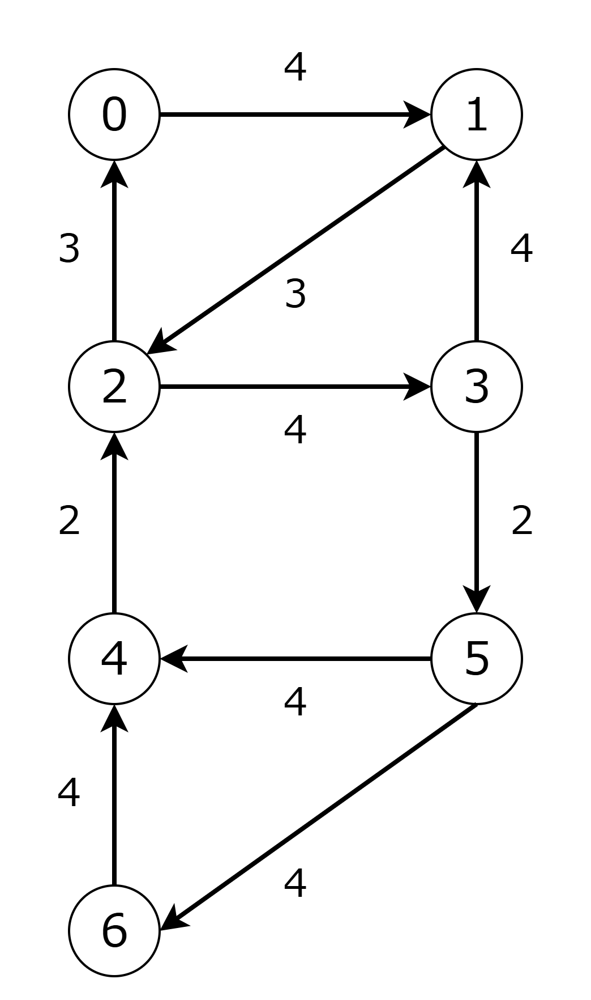

---

### phase1

- 頂点 $0$ に入る重み最大の辺 $(2, 0)$ を選びます．森 $F$ に $2 \rightarrow 0$ を表す頂点を追加します．
- 同様に，頂点 $1$，$2$ に入る重み最大の辺 $(0, 1), (1, 2)$ を $F$に追加します[^1]．
  閉路 $0 \rightarrow 1 \rightarrow 2 \rightarrow 0$ が見つかったので，これを超頂点 $A$ に縮約します．
  $(3, 1)$ の重みを $4 - 4 + 3 = 3$ に変更します．

## 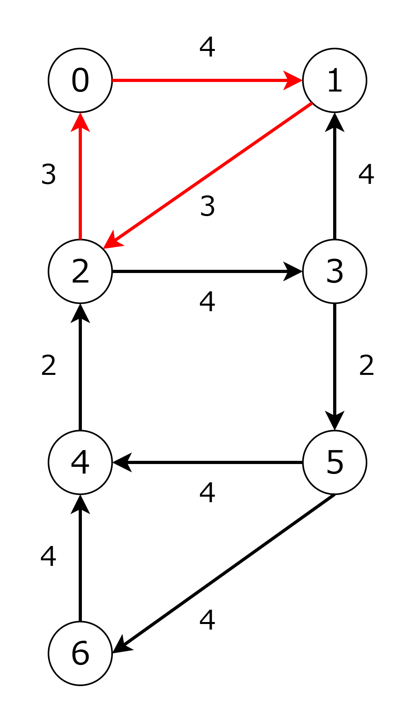 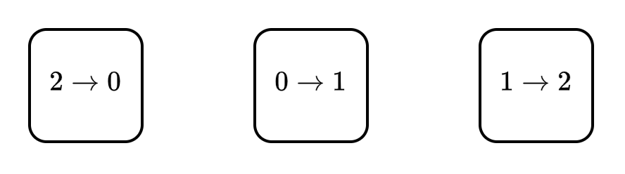

---

### phase2

- 頂点 $A$ に入る重み最大の辺 $(3, A)$ を選びます．$F$ に $3 \rightarrow A$ を追加します．  
  $(3, A)$ は超頂点 $A$ に入る辺なので，$3 \rightarrow A$ が親となるように $2 \rightarrow 0$，$0 \rightarrow 1$，$1 \rightarrow 2$ に辺をはります．
- 頂点 $3$ に入る重み最大の辺 $(A, 3)$ を選び，$F$ に追加します．  
  閉路 $A \rightarrow 3 \rightarrow A$ が見つかったので，これを超頂点 $B$ に縮約します．  
  $(4, A)$ の重みを $1 - 3 + 3 = 1$ に変更します．

## 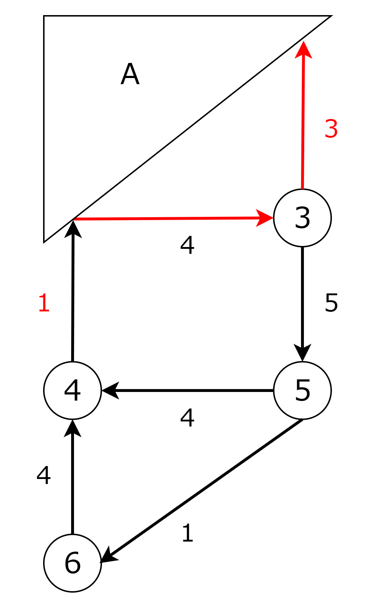 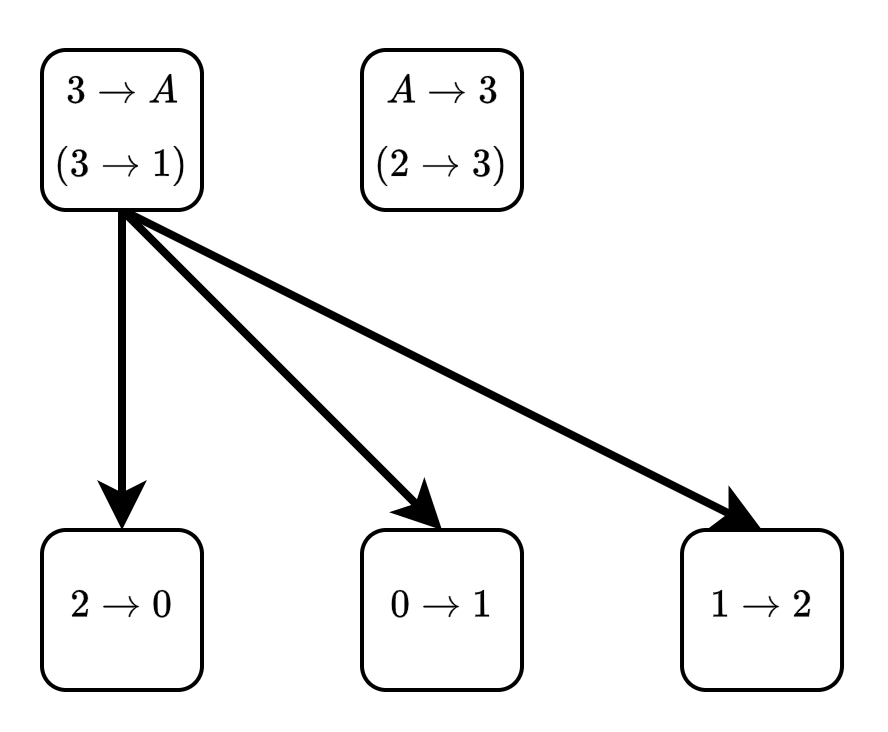

---

### phase3

- 頂点 $B$ に入る重み最大の辺 $(4, B)$ を選びます．$F$ に $4 \rightarrow B$ を追加します．  
  $(4, B)$ は超頂点 $B$ に入る辺なので，$4 \rightarrow B$ から $3 \rightarrow A$，$A \rightarrow 3$ に辺をはります．
- 頂点 $4$，$5$ に入る重み最大の辺 $(5, 4)$，$(B, 5)$ を選び，$F$ に追加します．  
  閉路 $B \rightarrow 5 \rightarrow 4 \rightarrow B$ が見つかったので，これを超頂点 $C$ に縮約します．  
  $(6, 4)$ の重みを $4 - 4 + 1 = 1$ に変更します．

## 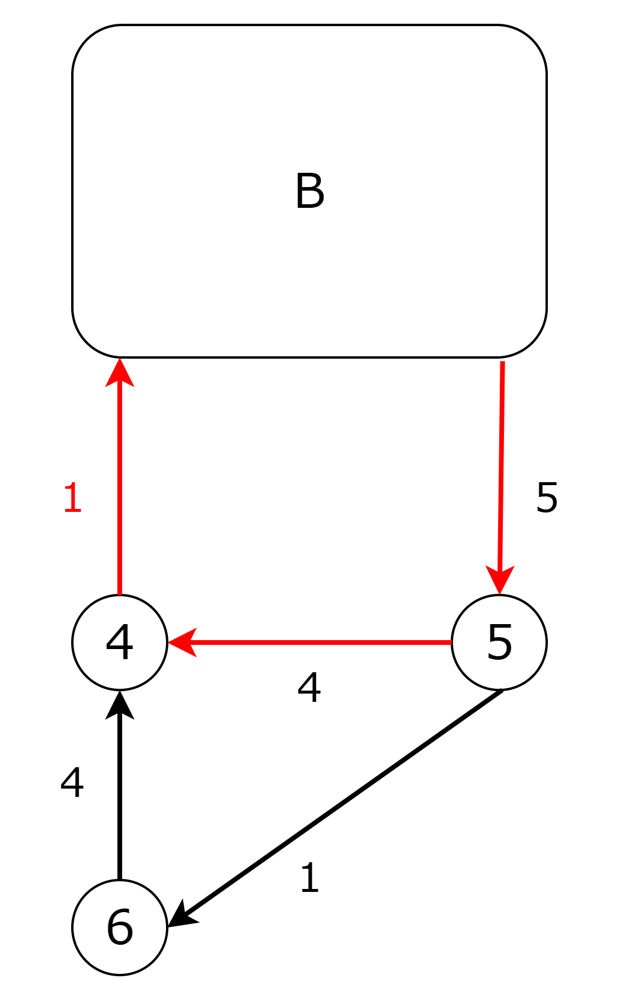 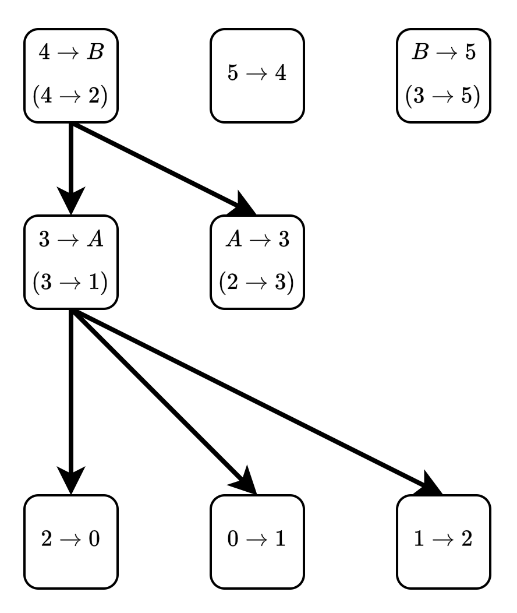

---

### phase4

- 頂点 $C$ に入る重み最大の辺 $(6, C)$ を選びます．$F$ に $6 \rightarrow C$ を追加します．  
  $(6, C)$ は超頂点 $C$ に入る辺なので，$6 \rightarrow C$ から $4 \rightarrow B$，$5 \rightarrow 4$，$B \rightarrow 5$ に辺をはります．
- 頂点 $6$ に入る重み最大の辺 $(C, 6)$ を選び，$F$ に追加します．  
  閉路 $C \rightarrow 6 \rightarrow C$ が見つかったので，これを超頂点 $D$ に縮約します．

## 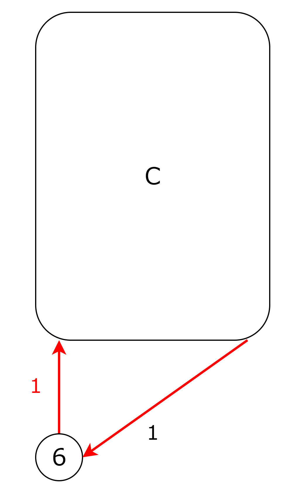 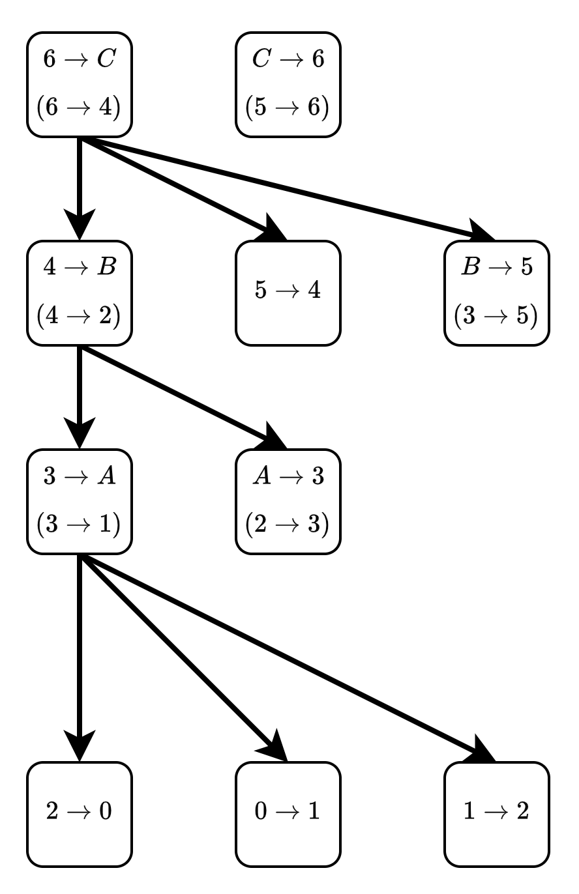

---

### phase5

- 頂点 $D$ に入る辺はないので，Algorithm BRANCH は終了します．

## 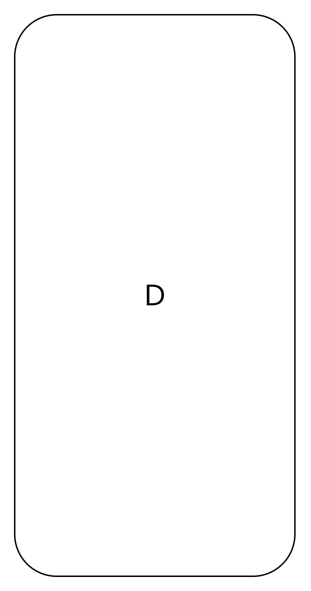 

---

### phase6

- 森 $F$ が求められたので，最適 branching $B$ を構築していきます．
- $R = \lbrace 5 \rbrace$ から $5$ を取り出します．
- $5$ に入る辺である $B \rightarrow 5$ から根までのパス $P$ を求め，これを削除します．

## 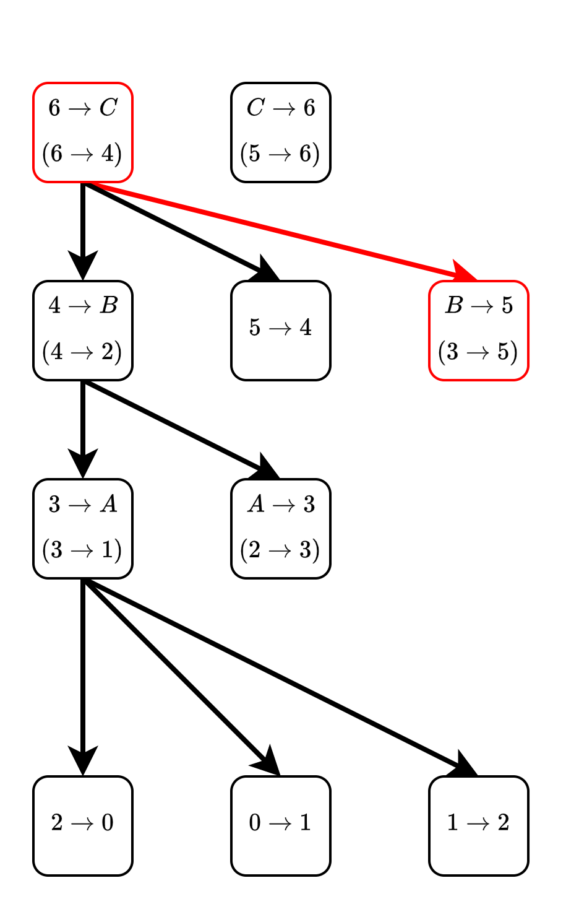

---

### phase7

- 森の根である $C \rightarrow 6$ を取り出し，$B$ の辺として採用します．$C \rightarrow 6$ は実際には，$5 \rightarrow 6$ なので，$B$ では $(5, 6)$ を採用しています．  
  $6$ に入る辺は森にないので，パス $P$ の削除は行われません．
- 森の根である $5 \rightarrow 4$ も同様に処理をします．

## 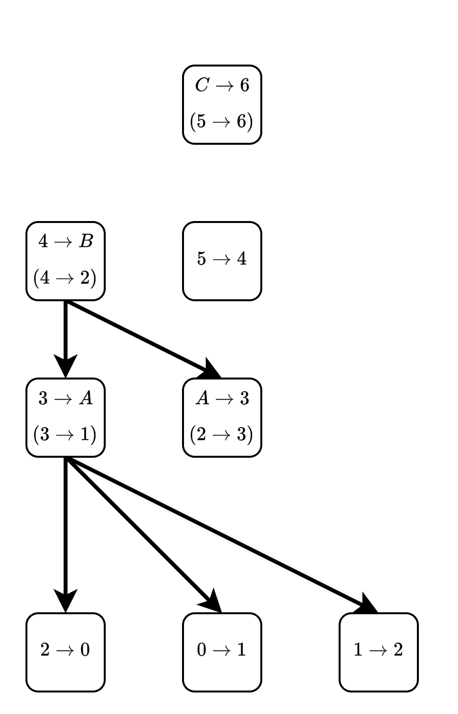 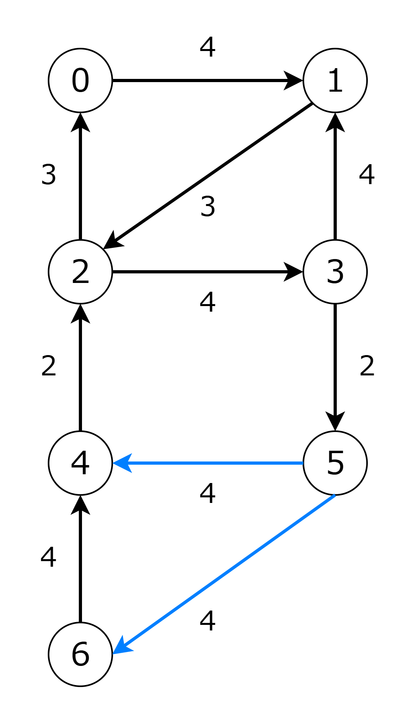

---

### phase8

- 森の根である $4 \rightarrow B$ を取り出し，$B$ の辺として採用します．$4 \rightarrow B$ は実際には，$4 \rightarrow 2$ なので，$B$ では $4 \rightarrow 2$ を採用しています．  
  根から $2$ に入る辺である $1 \rightarrow 2$ までのパスを求め削除します．

## 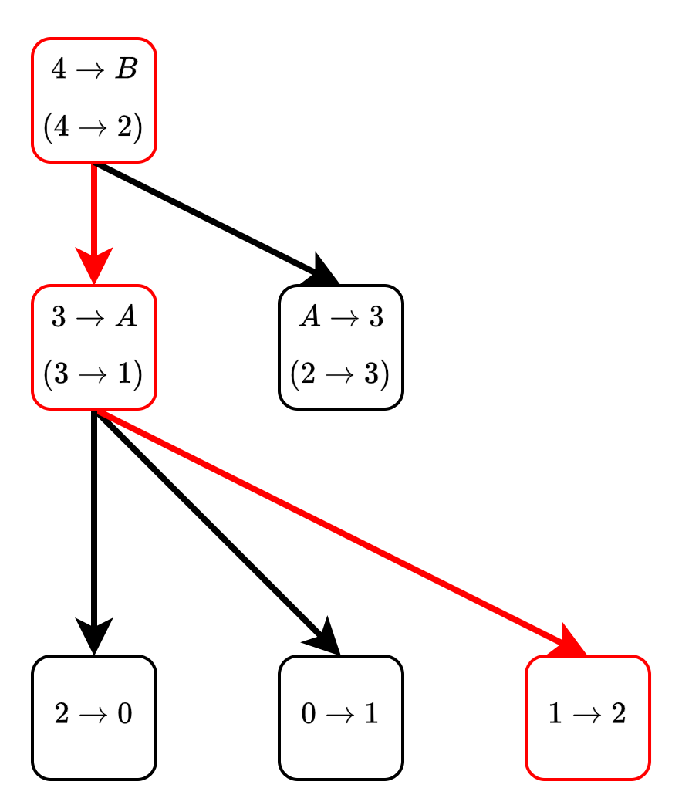 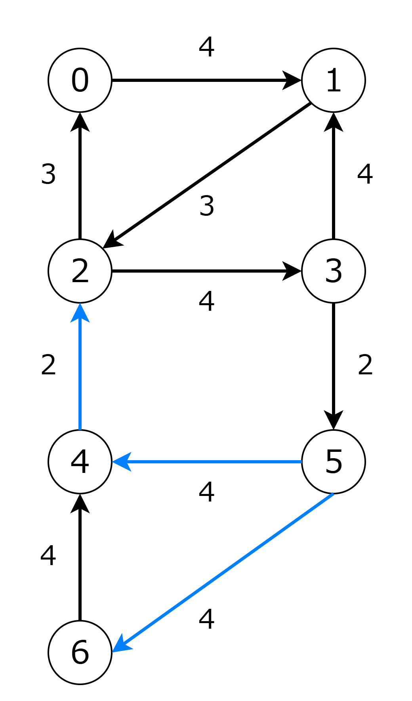

---

### phase9

- 森の根である $A \rightarrow 3$，$2 \rightarrow 0$，$0 \rightarrow 1$ を処理します．
- 森のすべての要素を処理したのでアルゴリズムを終了します．

## 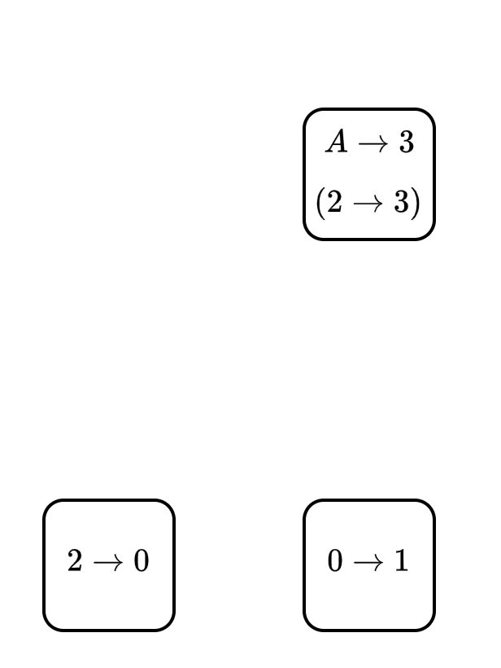 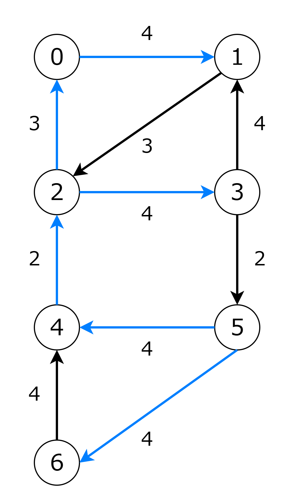

---

## 問題

- [Directed MST](https://judge.yosupo.jp/problem/directedmst)
  - [提出コード](https://judge.yosupo.jp/submission/296045)

## 参考

- [Finding optimum branchings](https://onlinelibrary.wiley.com/doi/10.1002/net.3230070103)
- [A note on finding optimum branchings](https://onlinelibrary.wiley.com/doi/10.1002/net.3230090403)
- [Optimum Branchings and Spanning Aborescences](https://cw.fel.cvut.cz/old/_media/courses/a4m33pal/cviceni/algorithm-description.pdf)
- [Efficiently Computing Directed Minimum Spanning Trees](https://arxiv.org/abs/2208.02590)

[^1]: $(3, 1)$ も $1$ に入る重み最大の辺ですが，ここでは $(0, 1)$ を選んだとします．
