+++
title = "Quadratic Pseudo-Boolean Optimization"
date = 2025-01-09T00:00:00+09:00
draft = false
image = "images/general_sample_ab_1.png"
categories = "組合せ最適化"
tags = ["QPBO", "最小カット", "劣モジュラ", "競技プログラミング", "ライブラリ"]
slug = "quadratic-pseudo-boolean-optimization"
+++

## Quadratic Pseudo-Boolean Optimization

次の関数 $E(\bold x)$ を最小化する問題を考えます．$x_{p} \in \lbrace 0, 1 \rbrace$ とし，$\theta_{const}$ は定数を表します．この問題を [Quadratic Pseudo-Boolean Optimization](https://en.wikipedia.org/wiki/Quadratic_pseudo-Boolean_optimization)(以下 QPBO)と呼びます．

$$
\begin{equation}
E(\bold x) = \theta_{const} + \sum_p \theta_{p}(x_p) + \sum_{p \lt q} \theta_{pq}(x_p, x_q)
\end{equation}
$$

競プロ界隈で「燃やす埋める」や「Project Selection Problem」などと言われる問題は QPBO に帰着することができます[^1]．  
これらの問題は minimum s-t cut に帰着して解くことができますが，どのように辺を張るかなど混乱しがちです．本記事の目的は QPBO を解くアルゴリズムをライブラリ化することで，問題を解くときに辺の張り方や変数のフリップ操作などを考えなくてすむようにすることです．実装は [QPBO.hpp](https://github.com/MitI-7/CompetitiveProgrammingLibrary/blob/1c8b83e0e54a6729cce7cf2c7eee09d1de0e4c05/library/cpp/optimization/QPBO.hpp) にあります．

記事の構成は以下の通りです．  
[節 1](#1-s-t-cut) では s-t cut と minimum s-t cut の説明をします．minimum s-t cut は多項式時間で求めることができます．

[節 2](#2-単純な関数の場合) では関数 $E(\bold x)$ が $\theta_{pq}(0, 0) = \theta_{pq}(1, 1) = 0$ であり，どの関数も $0$ 以上の値を返すという単純な関数の場合について考えます．
この場合は minimum s-t cut を見つける問題にそのまま帰着できます．

[節 3](#3-劣モジュラ関数の場合) では節 2 の仮定を排除し，関数 $E(\bold x)$ が劣モジュラ関数であるという仮定のみをおいた場合について考えます．  
この場合は再パラメータ化という操作を行うことで単純な関数の場合に帰着させることができます．

[節 4](#4-一般の関数の場合) では関数 $E(\bold x)$ が一般の関数の場合について考えます．  
$E(\bold x)$ が一般の関数の場合，これを最小化する問題は NP-hard であり，多項式時間で解くことは(今のところ)できそうもありません．この場合は問題を緩和することで劣モジュラ関数の場合に帰着させ近似解を得ることができます．さらに，ここで得られた解は最適解の一部となることが保証されます．

[節 5](#5-問題) では競プロの問題をいくつか解いていきます．

## 1. s-t cut

頂点集合 $V$ と 有向辺 $E$ からなる有向グラフ $G = (V, E)$ が与えられます．辺 $(i, j)$ には容量 $c_{ij} \ge 0$ が定まっているものとします．  
頂点集合 $V$ を 2 つの部分集合 $S$ と $T = V \backslash S$ に分割します．2 つのノード $s$ と $t$ について $s \in S$，$t \in T$ となるような分割を s-t cut と呼びます．  
$S$ から出て $T$ に入るような辺の容量の総和を s-t cut の容量と呼び，以下で定義されます．すべての s-t cut のうち最小のものを minimum s-t cut と呼びます．

$$
\begin{aligned}
c(S) = \sum_{(i, j) \in (S, T)} c_{ij}
\end{aligned}
$$

下のグラフの s-t cut の例をいくつか見ていきます [^2]．

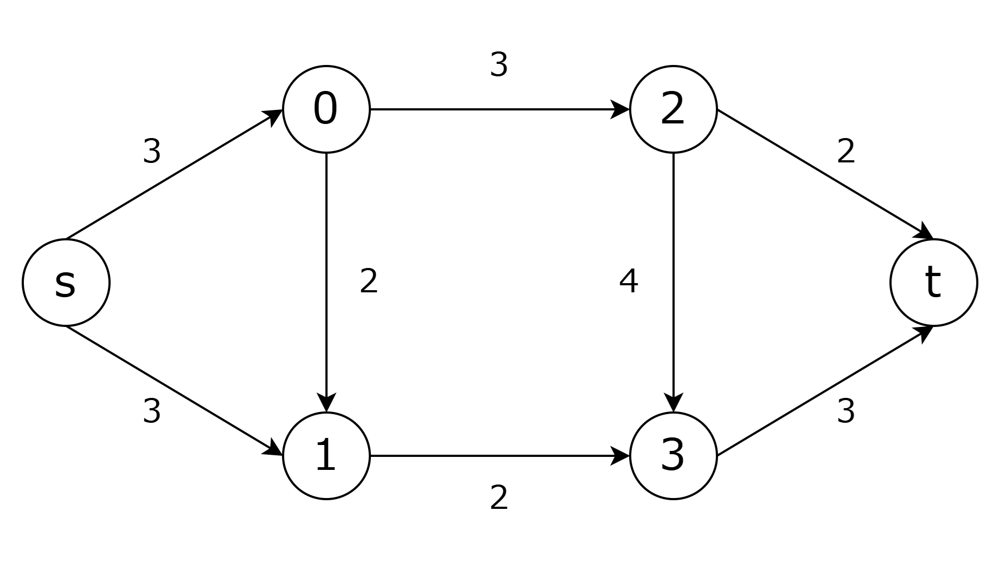

頂点の部分集合として，$S = \lbrace s, 0, 1 \rbrace$ を選んだとします．  
$S$ に属する頂点を赤，$T = V \backslash S$ に属する頂点を青で示します． $S$ から出て $T$ に入るような辺は辺 (0, 2) と辺 (1, 3) です．よって，この s-t cut の容量は 3 + 2 = 5 となります．  
すべての s-t cut の中でこのカットより容量の小さい s-t cut は存在しないのでこれは minimum s-t cut です．

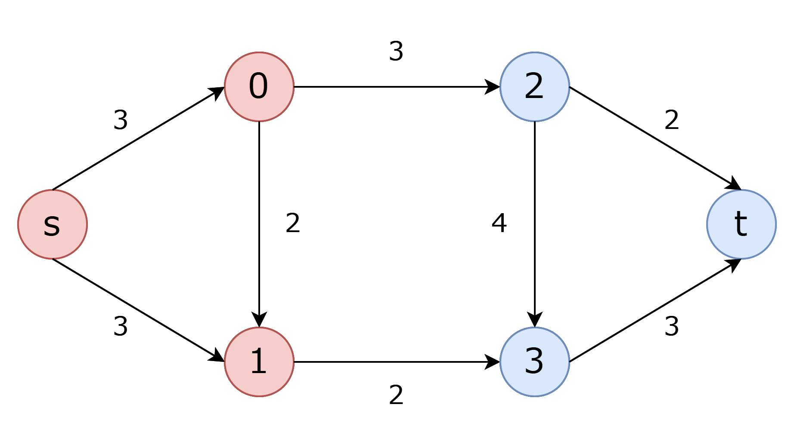

頂点の部分集合として $S = \lbrace s, 0, 1, 2, 3 \rbrace$ を選んだとします．  
この s-t cut の容量は 2 + 3 = 5 となります．  
このカットも minimum s-t cut です．このように minimum s-t cut は複数存在することがあります．

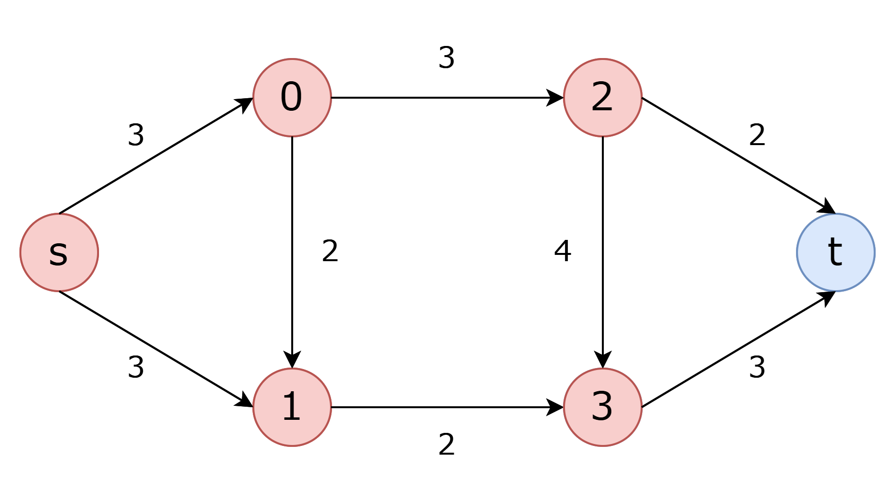

頂点の部分集合として $S = \lbrace s, 1, 2 \rbrace$ を選んだとします．  
この s-t cut の容量は，3 + 2 + 4 + 2 = 11 となります．  
辺 (0, 1) や辺 (0, 2) は $T$ から $S$ に入る辺なので含まれません．

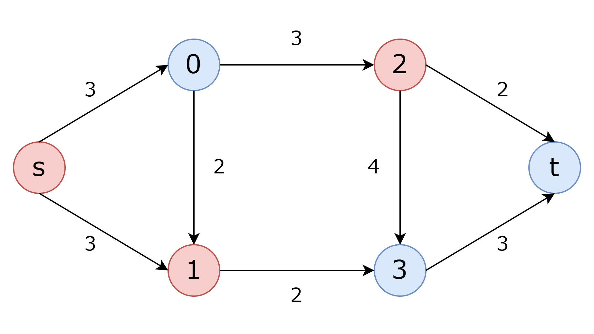

minimum s-t cut は最大流問題を解き，残余ネットワーク上で頂点 $s$ から到達できる頂点集合を $S$ とすることで求められます．詳しくは [最大フロー最小カット定理](https://ja.wikipedia.org/wiki/%E6%9C%80%E5%A4%A7%E3%83%95%E3%83%AD%E3%83%BC%E6%9C%80%E5%B0%8F%E3%82%AB%E3%83%83%E3%83%88%E5%AE%9A%E7%90%86) などを参照してください．  
次節から s-t cut を使って $E(\bold x)$ を最小化する方法を見ていきます．

## 2. 単純な関数の場合

関数 $E(\bold x)$ を最小化する方法を考えていきます．$x_{p} \in \lbrace 0, 1 \rbrace$ なので，変数の個数が $n$ 個のとき解は $2^n$ 個存在します．この $2^n$ 個の解のなかから最小のものを見つけるのが目標です．

$$
\begin{equation}
E(\bold x) = \theta_{const} + \sum_{p} \theta_{p}(x_p) + \sum_{p \lt q} \theta_{pq}(x_p, x_q) \tag {1}
\end{equation}
$$

単純な関数の場合を考えたいので，$\theta_{pq}(0, 0) = \theta_{pq}(1, 1) = 0$ であり，すべて 0 以上の値を返すと仮定します．  
この仮定を満たす関数の場合は $E(\bold x)$ の解と s-t cut の解が 1 対 1 対応するようなグラフを作成することができます．よって，グラフの最小 s-t cut がわかれば $E(\bold x)$ の最小値（= 最適解）を求めることができます．

グラフは各変数を頂点とし，これに特別な頂点 $s$ と $t$ を加えた $n + 2$ 個の頂点から構成されます．辺は下記のルールにしたがって張ります．

| 関数                | 辺                | 容量                |
| ------------------- | ----------------- | ------------------- |
| $\theta_{p}(0)$     | $p \rightarrow t$ | $\theta_{p}(0)$     |
| $\theta_{p}(1)$     | $s \rightarrow p$ | $\theta_{p}(1)$     |
| $\theta_{pq}(0, 1)$ | $p \rightarrow q$ | $\theta_{pq}(0, 1)$ |
| $\theta_{pq}(1, 0)$ | $q \rightarrow p$ | $\theta_{pq}(1, 0)$ |

具体例として，変数が $a$ と $b$ の 2 つだけの場合を見てみます．  
各変数の値に対応する $E(\bold x) = \theta_a(a) + \theta_b(b) + \theta_{ab}(a, b)$ の値は以下のようになります．$\theta_{ab}(0, 0)$ と $\theta_{ab}(1, 1)$ の値は $0$ であり，$\theta_{const}$ は定数のため省略しています．

| a   | b   | $E(\bold x)$                                        |
| --- | --- | --------------------------------------------------- |
| 0   | 0   | $\theta_{a}(0) + \theta_{b}(0)$                     |
| 0   | 1   | $\theta_{a}(0) + \theta_{b}(1) + \theta_{ab}(0, 1)$ |
| 1   | 0   | $\theta_{a}(1) + \theta_{b}(0) + \theta_{ab}(1, 0)$ |
| 1   | 1   | $\theta_{a}(1) + \theta_{b}(1)$                     |

ルールに従うと下のグラフが構築されます．  
このグラフの s-t cut をいくつか見ていきます．

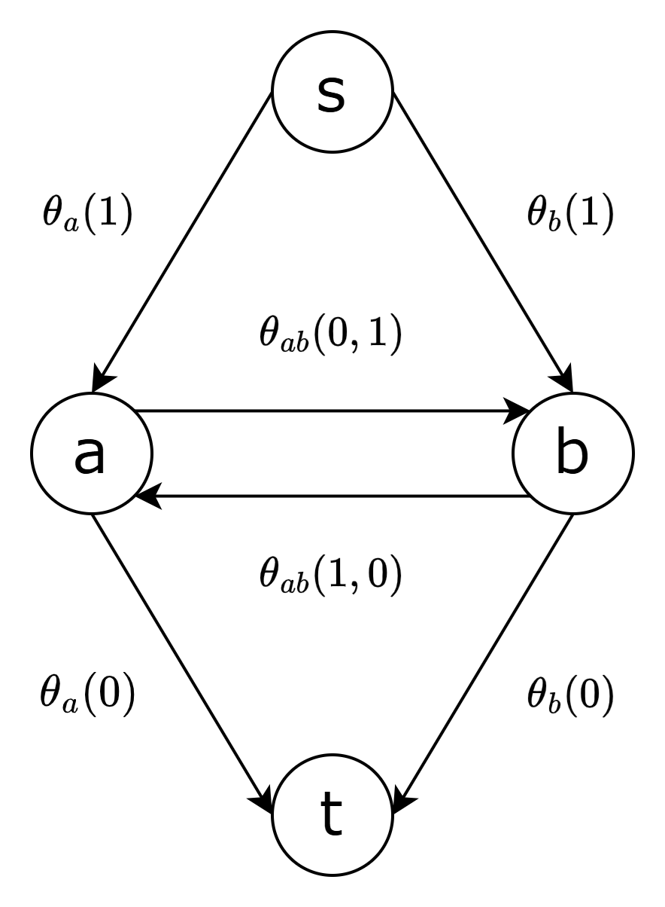

$S = \lbrace s, a, b \rbrace$ とします．この s-t cut の容量は $\theta_{a}(0) + \theta_{b}(0)$ です．  
また，$a = 0$，$b = 0$ としたとき $E(\bold x)$ の値は $\theta_{a}(0) + \theta_{b}(0)$ です．  
よって，$S = \lbrace s, a, b \rbrace$ としたときの s-t cut の容量と，$a = 0$，$b = 0$ としたときの $E(\bold x)$ の関数値は一致しています．

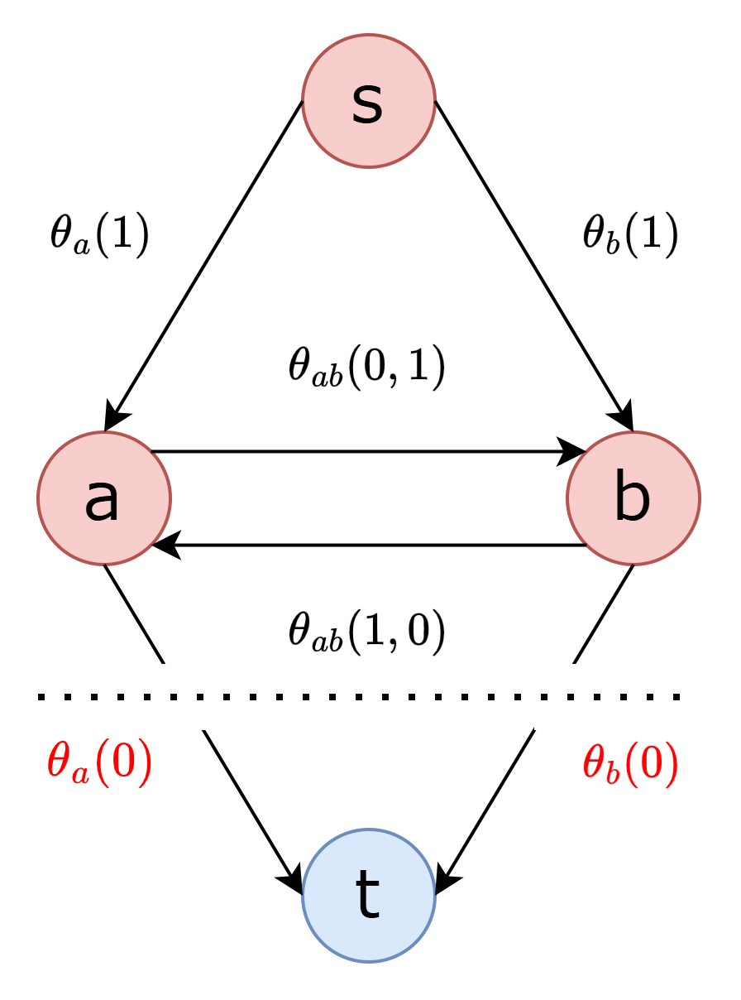

別の s-t cut の例をみます．  
$S = \lbrace s, a \rbrace$ とします．この s-t cut の容量は $\theta_{a}(0) + \theta_{b}(1) + \theta_{ab}(0, 1)$ です．  
また，$a = 0$，$b = 1$ としたとき $E(\bold x)$ の値は $\theta_{a}(0) + \theta_{b}(1) + \theta_{ab}(0, 1)$ です．  
よって，$S = \lbrace s, a \rbrace$ としたときの s-t cut の容量と，$a = 0$，$b = 1$ としたときの $E(\bold x)$ の関数値は一致しています．

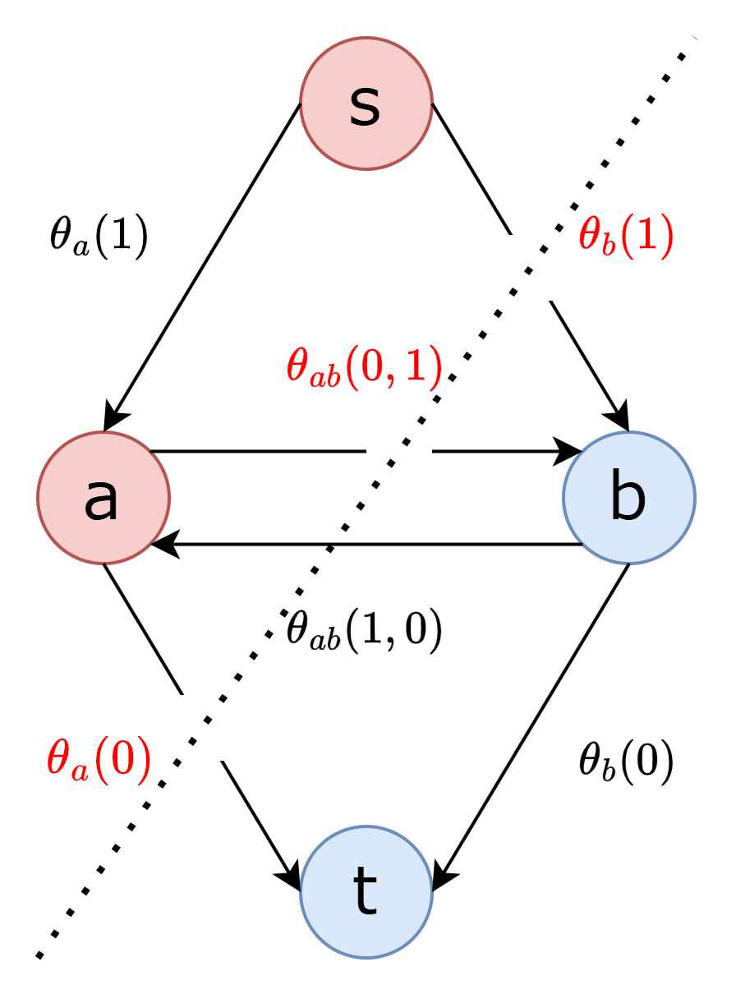

変数が 2 つの場合は s-t cut は $2^2$ 通りあります．すべてのパターンは以下の通りです．

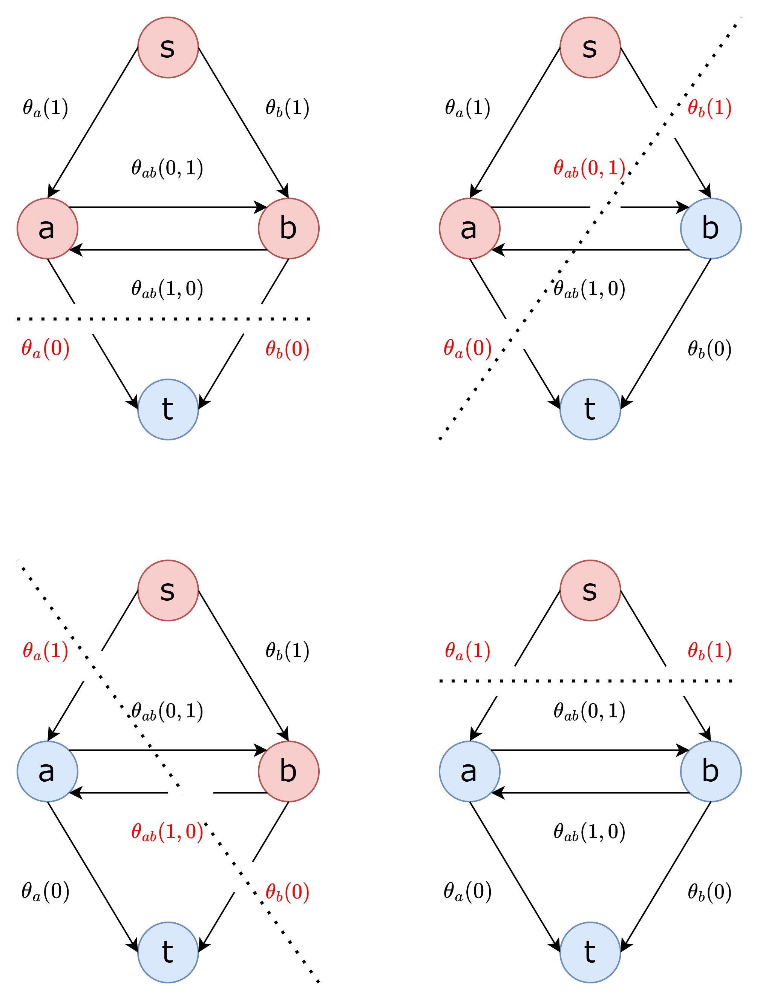

このように s-t cut の構成と $E(\bold x) $ の構成が 1 対 1 対応するため，minimum s-t cut を計算することで $E(\bold x)$ の最小値を求めることができます．  
minimum s-t cut を計算し，$S$ に属する頂点に対応する変数の値を $0$，$T$ に属する頂点に対応する変数の値を $1$ と設定することで最適な $\bold x$ を構成できます．

## 3. 劣モジュラ関数の場合

「[2. 単純な関数の場合](#2-単純な関数の場合)」では，$\theta_{pq}(0, 0) = \theta_{pq}(1, 1) = 0$ とし，どの関数も $0$ 以上の値を返すことを仮定していました．  
この節ではこの仮定を排除し，関数は劣モジュラであることのみを仮定します．今回は 2 値変数を考えているので，$\theta_{pq}(0, 1) + \theta_{pq}(1, 0) \ge \theta_{pq}(0, 0) + \theta_{pq}(1, 1)$ を満たすことになります．

$\theta_{pq}(0, 0)$ や $\theta_{pq}(1, 1)$ が $0$ 以外の値をとったり関数値が負の値をとる場合があるので，今回はルール通りにグラフを作ることはできません．そこで再パラメータ化という操作を行います．再パラメータ化とは，$E(\bold x)$ の関数値を保ちつつ $\theta_{pq}(1, 0)$ などの各関数値を変化させる操作です．  
再パラメータ化を行うと標準形とよばれる以下の条件を満たす形になります[^3]．標準形ではどの関数も $0$ 以上の値をとります．

- $min \lbrace \theta_{p}(0), \theta_{p}(1) \rbrace = 0$
- $min \lbrace \theta_{pq}(0, 0), \theta_{pq}(1, 0) \rbrace = 0$
- $min \lbrace \theta_{pq}(0, 1), \theta_{pq}(1, 1) \rbrace = 0$

再パラメータ化をすると，関数 $\theta_{pq}(x_{p}, x_{q})$ が劣モジュラの場合は $\theta_{pq}(0, 0) = \theta_{pq}(1, 1) = 0$ に，関数 $\theta_{pq}(x_{p}, x_{q})$ が優モジュラの場合は $\theta_{pq}(0, 1) = \theta_{pq}(1, 0) = 0$ になります[^4]．  
よって，すべての $\theta_{pq}(x_{p}, x_{q})$ が劣モジュラ関数の場合は，再パラメータ化をすることで「[2. 単純な関数の場合](#2-単純な関数の場合)」に帰着することができます．  
再パラメータ化の手続きは以下の通りです．

- step1
  - すべての (p, q) の各 $j \in \lbrace 0, 1 \rbrace$ について
    - $\delta = min \lbrace \theta_{pq}(0, j), P_{pq}(1, j) \rbrace$
    - $\theta_{pq}(0, j) = \theta_{pq}(0, j) - \delta$
    - $\theta_{pq}(1, j) = \theta_{pq}(1, j) - \delta$
    - $\theta_{q}(j) = \theta_{q}(j) + \delta$
- step2
  - $\delta = min \lbrace \theta_p(0), \theta_p(1) \rbrace$
  - $\theta_{p}(0) = \theta_{p}(0) - \delta$
  - $\theta_{p}(1) = \theta_{p}(1) - \delta$
  - $\theta_{const} = \theta_{const} + \delta$

再パラメータ化をしたとき，目的関数値が変化しないことを確認します．  
step 1 の $j = 0$ では，$\theta_{pq}(0, 0)$ と $\theta_{pq}(1, 0)$ から $\delta$ を引き，$\theta_{q}(0)$ に $\delta$ を加えます．  
この操作を行うと $E(\bold x)$ は以下の表のように変化します．$\delta$ が打ち消し合って，目的関数値が保たれていることが確認できます．  
また，$\delta$ として $min \lbrace \theta_{pq}(0, 0), P_{pq}(1, 0) \rbrace$ を選んでいるので，$min \lbrace \theta_{pq;00}, \theta_{pq;10} \rbrace = 0$ を満たすようになります．

| p   | q   | $E(\bold x)$                                                         | $E^{\prime}(\bold x)$                                                                      |
| --- | --- | -------------------------------------------------------------------- | ------------------------------------------------------------------------------------------ |
| 0   | 0   | $\theta_{const} + \theta_{p}(0) + \theta_{q}(0) + \theta_{ab}(0, 0)$ | $\theta_{const} + \theta_{p}(0) + (\theta_{q}(0) + \delta) + (\theta_{ab}(0, 0) - \delta)$ |
| 0   | 1   | $\theta_{const} + \theta_{p}(0) + \theta_{q}(1) + \theta_{ab}(0, 1)$ | $\theta_{const} + \theta_{p}(0) + \theta_{q}(1) + \theta_{ab}(0, 1)$                       |
| 1   | 0   | $\theta_{const} + \theta_{p}(1) + \theta_{q}(0) + \theta_{ab}(1, 0)$ | $\theta_{const} + \theta_{p}(1) + (\theta_{q}(0) + \delta) + (\theta_{ab}(1, 0) - \delta)$ |
| 1   | 1   | $\theta_{const} + \theta_{p}(1) + \theta_{q}(1) + \theta_{ab}(1, 1)$ | $\theta_{const} + \theta_{p}(1) + \theta_{q}(1) + \theta_{ab}(1, 1)$                       |

step 1 の $j = 1$ では，$\theta_{pq}(0, 1)$ と $\theta_{pq}(1, 1)$ から $\delta$ を引き，$\theta_{q}(1)$ に $\delta$ を加えます．  
$\delta$ として $min \lbrace \theta_{pq}(0, 1), P_{pq}(1, 1) \rbrace$ を選んでいるので，$min \lbrace \theta_{pq;01}, \theta_{pq;11} \rbrace = 0$ を満たすようになります．

| p   | q   | $E(\bold x)$                                                         | $E^{\prime}(\bold x)$                                                                      |
| --- | --- | -------------------------------------------------------------------- | ------------------------------------------------------------------------------------------ |
| 0   | 0   | $\theta_{const} + \theta_{p}(0) + \theta_{q}(0) + \theta_{ab}(0, 0)$ | $\theta_{const} + \theta_{p}(0) + \theta_{q}(0) + \theta_{ab}(0, 0)$                       |
| 0   | 1   | $\theta_{const} + \theta_{p}(0) + \theta_{q}(1) + \theta_{ab}(0, 1)$ | $\theta_{const} + \theta_{p}(0) + (\theta_{q}(1) + \delta) + (\theta_{ab}(0, 1) - \delta)$ |
| 1   | 0   | $\theta_{const} + \theta_{p}(1) + \theta_{q}(0) + \theta_{ab}(1, 0)$ | $\theta_{const} + \theta_{p}(1) + \theta_{q}(0) + \theta_{ab}(1, 0)$                       |
| 1   | 1   | $\theta_{const} + \theta_{p}(1) + \theta_{q}(1) + \theta_{ab}(1, 1)$ | $\theta_{const} + \theta_{p}(1) + (\theta_{q}(1) + \delta) + (\theta_{ab}(1, 1) - \delta)$ |

step 2 では，$\theta_{p}(0)$ と $\theta_{p}(1)$ から $\delta$ を引き，$\theta_{const}$ に $\delta$ を加えます．  
$\delta$ として $min \lbrace \theta_p(0), \theta_p(1) \rbrace$ を選んでいるので，$min \lbrace \theta_{p;0}, \theta_{p;1} \rbrace = 0$ を満たすようになります．

| p   | q   | $E(\bold x)$                                                         | $E^{\prime}(\bold x)$                                                                      |
| --- | --- | -------------------------------------------------------------------- | ------------------------------------------------------------------------------------------ |
| 0   | 0   | $\theta_{const} + \theta_{p}(0) + \theta_{q}(0) + \theta_{ab}(0, 0)$ | $(\theta_{const} + \delta) + (\theta_{p}(0) - \delta) + \theta_{q}(0) + \theta_{ab}(0, 0)$ |
| 0   | 1   | $\theta_{const} + \theta_{p}(0) + \theta_{q}(1) + \theta_{ab}(0, 1)$ | $(\theta_{const} + \delta) + (\theta_{p}(0) - \delta) + \theta_{q}(1) + \theta_{ab}(0, 1)$ |
| 1   | 0   | $\theta_{const} + \theta_{p}(1) + \theta_{q}(0) + \theta_{ab}(1, 0)$ | $(\theta_{const} + \delta) + (\theta_{p}(1) - \delta) + \theta_{q}(0) + \theta_{ab}(1, 0)$ |
| 1   | 1   | $\theta_{const} + \theta_{p}(1) + \theta_{q}(1) + \theta_{ab}(1, 1)$ | $(\theta_{const} + \delta) + (\theta_{p}(1) - \delta) + \theta_{q}(1) + \theta_{ab}(1, 1)$ |

# 4. 一般の関数の場合

関数に何も仮定を置かない場合は $E(\bold x)$ の最小化は NP-hard なので，minimum s-t cut 問題に帰着できない場合があります．  
この場合でも最適解はだせなくても問題を解けるだけ解く QPBO 法というアルゴリズムがあります[^5]．QPBO 法は解として $x_p = \lbrace 0, 1, \emptyset \rbrace$ のいずれかを与えます．$\emptyset$ は解が不明であることを表します．$x_p$ に $0$ か $1$ の値が与えられたとき，$x_p$ はラベル付けされたといいます．  
このアルゴリズムは次のような性質があります．

1. アルゴリズムの出力を $\bold x$ とする．完全にラベル付けされた任意の解 $\bold y$ があるとき，以下のように $\bold z$ を定めると常に $E(\bold z) \le E(\bold y)$ を満たす．

$$
z_p = \left\{
\begin{array}{ll}
x_p & \text{if} \space x_p \in \lbrace 0, 1 \rbrace \\
y_p & \text{if} \space x_p = \emptyset
\end{array}
\right.
$$

2. 関数のすべての項が劣モジュラのとき最適解が求まる．
3. アルゴリズムはフリップ操作に対して不変である．

性質 1 で $\bold y$ に最適解を選べば $\bold x$ は常に最適解の一部となることがわかります．  
競プロで役に立つのは性質 2 と 3 です．この 2 つの性質から，すべての項を劣モジュラにするようなフリップ操作がある場合に QPBO 法は最適解を求めることがわかります．

QPBO 法を説明します．  
以降は表記が煩雑になるのを避けるためこの節では関数値を以下のように表記することがあります．

|                    |                  |
| ------------------ | ---------------- |
| $\theta_{p}(0)$    | $\theta_{p;0}$   |
| $\theta_{p}(1)$    | $\theta_{p;1}$   |
| $\theta_{pq}(0,0)$ | $\theta_{pq;00}$ |
| $\theta_{pq}(0,1)$ | $\theta_{pq;01}$ |
| $\theta_{pq}(1,0)$ | $\theta_{pq;10}$ |
| $\theta_{pq}(1,1)$ | $\theta_{pq;11}$ |

各変数 $x_p$ に対して，$x_{\bar{p}} = 1 - x_{p}$ を導入し，$E(\bold x) = \sum \theta_{p}(x_p) + \sum \theta_{pq}(x_p, x_q)$ を変形します．

$$
\begin{alignedat}{2}
E(\bold x)
&= \theta_{const} + \sum \theta_{p}(x_p)
     &&+ \sum \theta_{pq}(x_p, x_q) \\
&= \theta_{const} + \sum \big(
      \theta_{p;1} x_{p} + \theta_{p;0}(1 - x_{p})
    \big) \\
&\quad &&+
   \sum \big(
      \theta_{pq;00} (1 - x_{p})(1 - x_{q}) \\
&\quad &&\quad +
      \theta_{pq;01} (1 - x_{p}) x_{q} \\
&\quad &&\quad +
      \theta_{pq;10} x_{p}(1 - x_{q}) \\
&\quad &&\quad +
      \theta_{pq;11} x_{p} x_{q}
    \big) \\
&= \theta_{const} + \sum \bigg(
       \frac{\theta_{p;1}}{2}(x_p + (1 - x_{\bar{p}})) &&
       + \frac{\theta_{p;0}}{2}(x_{\bar{p}} + (1 - x_p))
       \bigg) \\
&\quad &&+
       \sum \bigg(
       \frac{\theta_{pq;00}}{2} \big(x_{\bar{p}} (1 - x_q) + (1 - x_p) x_{\bar{q}} \big) \\
&\quad &&\quad +
       \frac{\theta_{pq;01}}{2} \big((1 - x_p) x_q + x_{\bar{p}} (1 - x_{\bar{q}}) \big) \\
&\quad &&\quad +
       \frac{\theta_{pq;11}}{2} \big(x_p (1 - x_{\bar{q}}) + (1 - x_{\bar{p}}) x_q \big) \\
&\quad &&\quad +
       \frac{\theta_{pq;10}}{2} \big(x_p (1 - x_q) + (1 - x_{\bar{p}}) x_{\bar{q}} \big)
       \bigg)
\end{alignedat}
$$

ここで，$x_{\bar{p}} = 1 - x_p$ という制約を緩和し，$x_p$ と $x_{\bar{p}}$ が独立に値をとれる緩和問題を考えます．  
各変数の係数を比較すると下の関数に分割できることがわかります．
再パラメータ化をしてから関数を分割することですべての関数値が $0$ 以上であることが保証されます．これらの関数は劣モジュラ関数なので「[3. 劣モジュラ関数の場合](#3-劣モジュラ関数の場合)」に帰着することができます．

| $x_p$ |                           |
| ----- | ------------------------- |
| 0     | $\frac{1}{2}\theta_{p;0}$ |
| 1     | $\frac{1}{2}\theta_{p;1}$ |

| $x_{\bar{p}}$ |                           |
| ------------- | ------------------------- |
| 0             | $\frac{1}{2}\theta_{p;1}$ |
| 1             | $\frac{1}{2}\theta_{p;0}$ |

| $x_p$ | $x_q$ |                             |
| ----- | ----- | --------------------------- |
| 0     | 0     | 0                           |
| 0     | 1     | $\frac{1}{2}\theta_{pq;01}$ |
| 1     | 0     | $\frac{1}{2}\theta_{pq;10}$ |
| 1     | 1     | 0                           |

| $x_p$ | $x_{\bar{q}}$ |                             |
| ----- | ------------- | --------------------------- |
| 0     | 0             | 0                           |
| 0     | 1             | $\frac{1}{2}\theta_{pq;00}$ |
| 1     | 0             | $\frac{1}{2}\theta_{pq;11}$ |
| 1     | 1             | 0                           |

| $x_{\bar{p}}$ | $x_q$ |                             |
| ------------- | ----- | --------------------------- |
| 0             | 0     | 0                           |
| 0             | 1     | $\frac{1}{2}\theta_{pq;11}$ |
| 1             | 0     | $\frac{1}{2}\theta_{pq;00}$ |
| 1             | 1     | 0                           |

| $x_{\bar{p}}$ | $x_{\bar{q}}$ |                             |
| ------------- | ------------- | --------------------------- |
| 0             | 0             | 0                           |
| 0             | 1             | $\frac{1}{2}\theta_{pq;01}$ |
| 1             | 0             | $\frac{1}{2}\theta_{pq;10}$ |
| 1             | 1             | 0                           |

上記関数について，ルールに従ってグラフを構築します．
整理すると以下のルールに従ってグラフを構築すればいいことがわかります．

| $\theta$         | edge                                             | capacity[^6]                 |
| ---------------- | ------------------------------------------------ | ---------------------------- |
| $\theta_{p;0}$   | $(p \rightarrow t), (s \rightarrow \bar p)$      | $\frac{1}{2} \theta_{p;0}$   |
| $\theta_{p;1}$   | $(s \rightarrow p), (\bar p \rightarrow t)$      | $\frac{1}{2} \theta_{p;1}$   |
| $\theta_{pq;01}$ | $(p \rightarrow q), (\bar q \rightarrow \bar p)$ | $\frac{1}{2} \theta_{pq;01}$ |
| $\theta_{pq;10}$ | $(q \rightarrow p), (\bar p \rightarrow \bar q)$ | $\frac{1}{2} \theta_{pq;10}$ |
| $\theta_{pq;00}$ | $(p \rightarrow \bar q), (q \rightarrow \bar p)$ | $\frac{1}{2} \theta_{pq;00}$ |
| $\theta_{pq;11}$ | $(\bar q \rightarrow p), (\bar p \rightarrow q)$ | $\frac{1}{2} \theta_{pq;11}$ |

このグラフの s-t minimum cut を計算します．各変数の値は，$S$ に属する場合は 0，$T$ に属する場合は 1 をとります．ただし，$x_{\bar{p}} = 1 - x_{p}$ という制約を満たす必要があります．よって，$\bold x$ は次のように構成されます．

$$
x_{p} = \left\{
\begin{array}{ll}
0 & \text{if} \space p \in S, \bar p \in T \\
1 & \text{if} \space p \in T, \bar p \in S \\
\emptyset & \text{otherwise}
\end{array}
\right.
$$

具体例として，変数が $a$ と $b$ の 2 つだけの場合を考えます．  
各変数の値に対応する $E(\bold x) = \theta_a(a) + \theta_b(b) + \theta_{ab}(a, b)$ の値は以下のようになります．

| a   | b   | $E(\bold x)$                                        |
| --- | --- | --------------------------------------------------- |
| 0   | 0   | $\theta_{a}(0) + \theta_{b}(0) + \theta_{ab}(0, 0)$ |
| 0   | 1   | $\theta_{a}(0) + \theta_{b}(1) + \theta_{ab}(0, 1)$ |
| 1   | 0   | $\theta_{a}(1) + \theta_{b}(0) + \theta_{ab}(1, 0)$ |
| 1   | 1   | $\theta_{a}(1) + \theta_{b}(1) + \theta_{ab}(1, 1)$ |

対応するグラフは以下のようになります．表記が煩雑になるので図では $\frac{1}{2}$ を除外しています．このグラフの s-t cut の例をいくつか見ていきます．

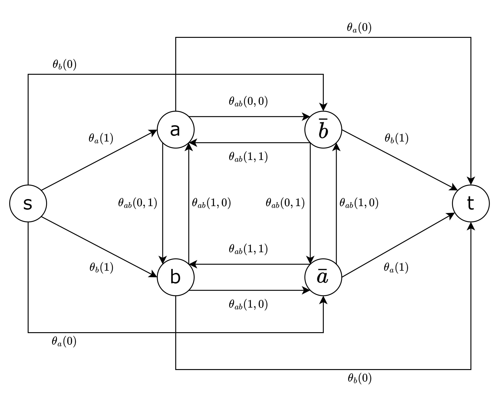

$S = \lbrace s, a, b \rbrace$ とします．この s-t cut の容量は $\frac{1}{2} (\theta_{a}(0) + \theta_{a}(0) + \theta_{b}(0) + \theta_{b}(0) + \theta_{ab}(0, 0) + \theta_{ab}(0, 0))$ です．  
この値は $a = 0$，$b = 0$ としたときの $E(\bold x)$ の目的関数と一致します．

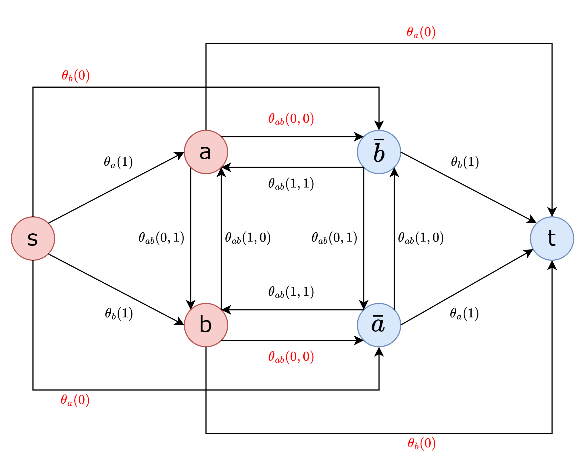

$S = \lbrace s, a \rbrace$ とします．この s-t cut の容量は $\frac{1}{2} (\theta_{a}(0) + \theta_{a}(0) + \theta_{b}(1) + \theta_{b}(1) + \theta_{ab}(0, 1) + \theta_{ab}(0, 1))$ です．  
この値は $a = 0$，$b = 0$ としたときの $E(\bold x)$ の目的関数と一致します．

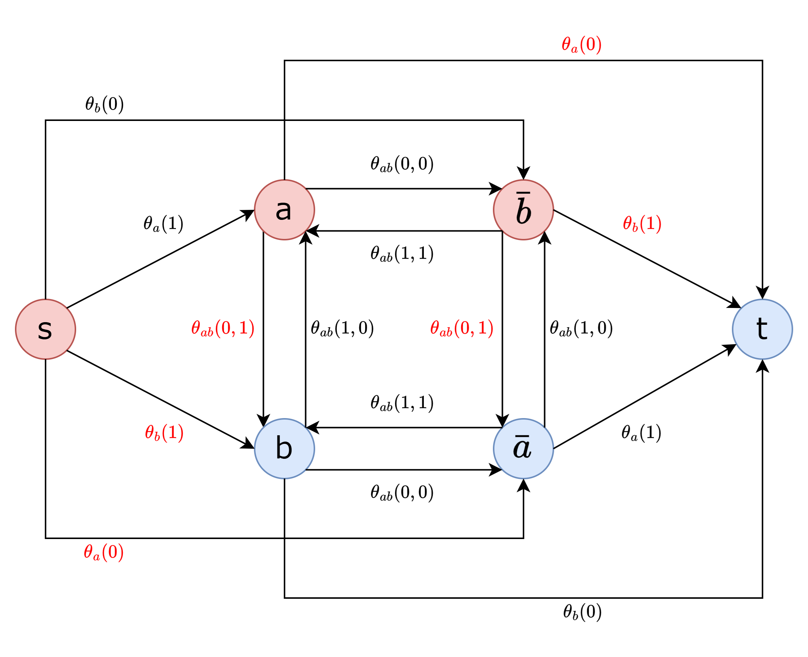

$S = \lbrace s, a, b, \bar{b} \rbrace$ とします．この場合，$a = 0$，$b = \emptyset$ とし，$b$ のラベルは未定となります．

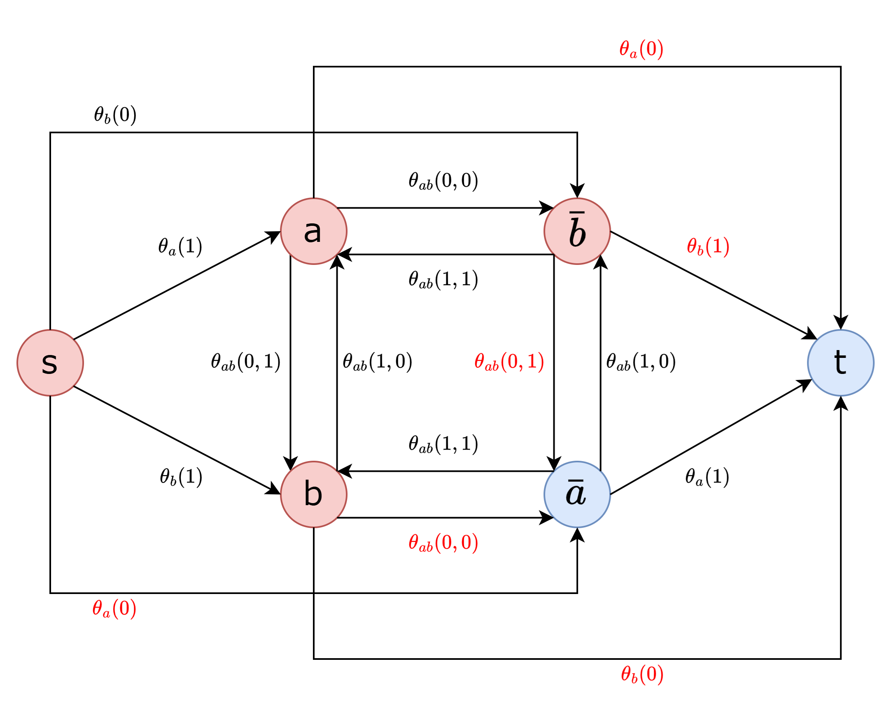

# 5. 問題

QPBO を使って競プロの問題を解いていきます．

## [ARC085 E - MUL](https://atcoder.jp/contests/arc085/tasks/arc085_c)

> 宝石が $N$ 個あり，それぞれ $1,2,\cdots,N$ と数が書かれています。  
> あなたは，以下の操作を好きなだけ行うことが出来ます(一度も行わなくてもよいです)。
>
> - 正整数 $x$ を選ぶ。$x$ の倍数が書かれた宝石を全て叩き割る。
>
> そして，$i$ が書かれていた宝石が割られずに残っていた場合，$a_i$ 円貰います。 ただし，この $a_i$ は負の場合もあり，その場合はお金を払わなくてはいけません。  
> うまく操作を行った時，あなたは最大で何円お金を貰えるでしょうか？

まず変数を定義します．  
宝石 $i$ が残っているかどうかを $x_i$ で表します．宝石が割る場合 $1$ を，残す場合は $0$ をとります．

次に関数を定義します．  
QPBO は目的関数値の最小化を目指すのでコストがいくらかかるかで表します．  
宝石 $i$ が残っている場合 $a_i$ 円貰えます．これは $-a_i$ 円のコストを払うということなので，次のように定義できます．

- $\theta_{i}(0) = -a_i$
- $\theta_{i}(1) = 0$

また，宝石 $i$ を割るにもかかわらず $i$ で割り切れる値が書かれた宝石 $j$ を残すことは許されないので，この場合は無限のコストがかかるとします．よって，次のように定義できます．

- $\theta_{ij}(0, 0) = 0$
- $\theta_{ij}(0, 1) = 0$
- $\theta_{ij}(1, 0) = \infty$
- $\theta_{ij}(1, 1) = 0$

この関数は $\theta_{ij}(0, 1) + \theta_{ij}(1, 0) \ge \theta_{ij}(0, 0) + \theta_{ij}(1, 1)$ を満たしているので劣モジュラ関数です．  
あとは，すべての $i$ と $i$ で割り切れる $j$ について上記関数を定義すれば問題を解くことができます．

[提出コード](https://atcoder.jp/contests/arc085/submissions/61474030)

## [ABC193 F - Zebraness](https://atcoder.jp/contests/abc193/tasks/abc193_f)

> 縦 $N$ マス、横 $N$ マスのマス目があります。上から $i$ 行目、左から $j$ 列目のマスをマス $(i,j)$ と表すことにします。 マス $(i,j)$ の色の情報が文字 $c_{i,j}$ により与えられます。  
> $B$ はマスが黒で塗られていることを、 $W$ はマスが白で塗られていることを、 $?$ はマスにまだ色が塗られていないことを表します。  
> 高橋くんは、まだ色が塗られていないマスをそれぞれ黒または白で塗り、白黒のマス目を作ります。マス目のしまうま度を、辺で接する黒マスと白マスの組の個数と定義します。高橋くんが達成できるしまうま度の最大値を求めてください。

まず変数を定義します．  
マスを $(i, j)$ で表すとすると関数が見にくいので $p = i \times N + j$ で表します．
マス $p$ の色を変数 $x_{p}$ で表します．白の場合 $0$ をとり，黒の場合 $1$ をとります．

次に関数を定義します．  
与えられている色の変更はできないので白から黒や黒から白に変更すると無限のコストがかかるとします．次のように定義できます．

- マス $p$ の色が黒の場合

  - $\theta_{p}(0) = \infty$
  - $\theta_{p}(1) = 0$

- マス $p$ の色が白の場合
  - $\theta_{p}(0) = 0$
  - $\theta_{p}(1) = \infty$

マス $p$ と辺で接するマス $q$ が異なる色だと -1 のコストがかかります．

- $\theta_{pq}(0, 0) = 0$
- $\theta_{pq}(0, 1) = -1$
- $\theta_{pq}(1, 0) = -1$
- $\theta_{pq}(1, 1) = 0$

これは劣モジュラ関数ではないのですが，変数フリップすることで劣モジュラ関数にすることができます．
QPBO 法では変数フリップを考慮しなくていいのでそのまま定義することができます．

[提出コード](https://atcoder.jp/contests/abc193/submissions/61474153)

## その他の問題

- [No.2713 Just Solitaire](https://yukicoder.me/problems/no/2713)
  - [提出コード](https://yukicoder.me/submissions/1034571)
- [AOJ - Board](https://judge.u-aizu.ac.jp/onlinejudge/description.jsp?id=2903)
  - [提出コード](https://judge.u-aizu.ac.jp/onlinejudge/review.jsp?rid=10082476#1)
- [AOJ - Ghost](https://onlinejudge.u-aizu.ac.jp/challenges/sources/UOA/UAPC/3058)
  - [提出コード](https://onlinejudge.u-aizu.ac.jp/solutions/problem/3058/review/10082488/MitI7/C++23)
- [競プロ典型 90 問 040 - Get More Money（★7）](https://atcoder.jp/contests/typical90/tasks/typical90_an)
  - [提出コード](https://atcoder.jp/contests/typical90/submissions/61474485)
- [ABC259 G - Grid Card Game](https://atcoder.jp/contests/abc259/tasks/abc259_g)
  - [提出コード](https://atcoder.jp/contests/abc259/submissions/61474556)

# 参考

- [Minimizing non-submodular functions with graph cuts – a review](https://ieeexplore.ieee.org/document/4204169)
- [劣モジュラ最適化と機械学習](https://www.kspub.co.jp/book/detail/1529090.html)
- [Graph cut optimization](https://en.wikipedia.org/wiki/Graph_cut_optimization)
- [Quadratic pseudo-Boolean optimization](https://en.wikipedia.org/wiki/Quadratic_pseudo-Boolean_optimization)

[^1]: たぶんです．できない例があったら教えてください
[^2]: この数値例は[最大フロー最小カット定理](https://ja.wikipedia.org/wiki/%E6%9C%80%E5%A4%A7%E3%83%95%E3%83%AD%E3%83%BC%E6%9C%80%E5%B0%8F%E3%82%AB%E3%83%83%E3%83%88%E5%AE%9A%E7%90%86#/media/%E3%83%95%E3%82%A1%E3%82%A4%E3%83%AB:Max_flow.svg)から引用しています
[^3]: 標準形は一意に定まるとは限りません
[^4]: 単純な関数の場合は劣モジュラ関数を(ほぼ)標準化したものでした．厳密には $min \lbrace \theta_{p;0}, \theta_{p;1} \rbrace = 0$ を満たしていませんが．
[^5]: Minimizing non-submodular functions with graph cuts – a review
[^6]: 実装では容量に $\frac{1}{2}$ をかけるのではなく，最後に目的関数値に $\frac{1}{2}$ を掛ければいいです
